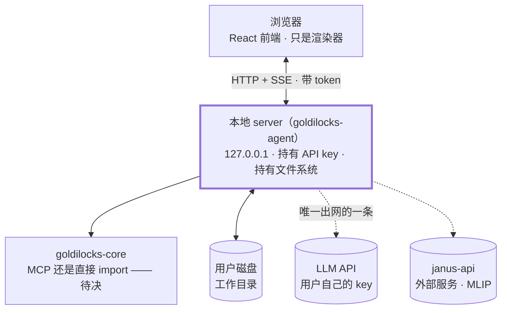
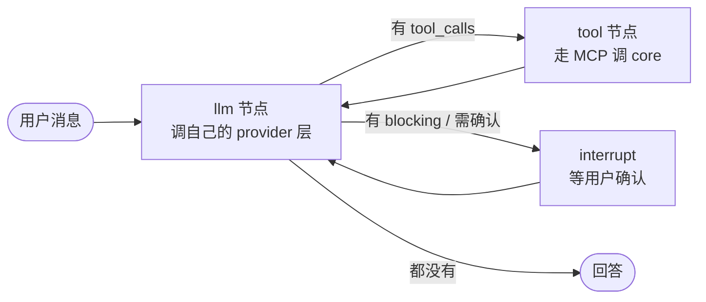

# goldilocks-agent 设计文档

> **状态**：⚠️ **部分已实现**——`graph.py`/`server.py`/`store.py`/`config.py` 和 `app/` 前端已经有一条真实跑通的本地+云端模型对话路径（细节见 `goldilocks-agent-implementation-plan.md` 第三节），但没有 tool 节点、没有接 core 的 MCP、六张表只建了两张。这份仍是先于大部分实现写就的设计文档，读的时候把"已定"当"设计决定"而不是"已完成"。
> **最后更新**：2026-09-17（新增十九节：共享部署）
> **与其他文档的关系**：[`goldilocks-ecosystem-design.md`](goldilocks-ecosystem-design.md)
> 定义四个包之间的事；这份定义 **agent 包自己**。
> core 侧的四档解析机制在 [`goldilocks-core-design.md`](goldilocks-core-design.md) 第二节，
> **这里不重复，只写 agent 要怎么配合它**。
> **结构**：**零～七是科学职责**（这个包干什么、怎么和 core 配合）；
> **八～十六是交付层**（本地应用怎么落地）。
> ⚠️ 照 core 文档的先例——`六、交付层` 也是写在 core 自己那份里的，**不另立一篇**。

## 零、这个包的一句话

> **core 把"能确定的事"做到底；agent 处理"要看情况的事"。**

判据只有一条，反复用得上：

> **中间要不要看上一步的结果再决定？**
> **要看 → agent。开头就能全定 → core 的一个 task。**

---

## 一、为什么必须是独立的包，而不是 `core[agent]`

这是「Core 内部不含 LLM / agent」那条不变量**在打包层面的同一件事**：

> agent 需要 LLM SDK（`anthropic` / `openai` / …）、需要 API key、需要网络。
> **这三样 core 一个都不能有。**

做成 extra 的话，依赖树上就会出现 LLM SDK；哪怕是可选的，也会带来
"core 的某些功能要联网"这种模糊地带。**独立成包，边界是硬的**：

> **core 的 `pyproject.toml` 里永远不会出现 LLM SDK 这个名字。**

这条同时保护了四件事（都在 core 文档第二节展开）：
core 可离线 · 不需要 API key · 每步确定可复现 · 测试不用 mock LLM。

⚠️ **边界判据**：以后有人提"在 core 里加个用 LLM 解释推荐的功能"——**归 agent 包**。
理由不是"core 不该有那个功能"，而是 **core 只做确定性、可复现的事**。

---

## 二、五项职责

此前散落在六七处，收拢在这里：

| # | 职责 | 来源 |
|---|---|---|
| **1** | **填 `llm` 档** —— 凭自己的 DFT 知识给参数出主意 | core 二、四档解析 |
| **2** | **科学工作流编排（反馈式）** —— 先 relax 再用弛豫结构算 bands、找最稳定磁构型、扫 cutoff 到收敛 | core 四、9 |
| **3** | **后处理：解析 + 画图**（v2 阶段 core 连 `results/` 目录都不建）| core 四、11 |
| **4** | **用自然语言解释推荐** —— "为什么给我这个 k_index" | core 二、不变量的边界判据 |
| **5** | **`.agents/skills/` 的 DFT 领域知识** | core 十、G2 |

### 2.1 职责 1 是唯一会**写进** core 的

其余四项都在 core 之外。**只有职责 1 把值送进 core 的解析链**——
所以它是唯一有正确性风险的，第三节整节在处理它。

### 2.2 职责 2 的形状：agent 编排多次 core 调用

```
agent: core.run(relax) → 人去跑 → agent 读输出结构
     → core.run(bands, structure=弛豫后的) → 人去跑 → agent 画能带图
```

⚠️ **core 每一次调用仍然是纯函数、无状态。** 反馈住在 agent 的循环里，
**不住在 core 里**——这正是 core 拒绝做 workflow engine 的边界。

#### ⚠️⚠️ 2026-09-15 补：**"人去跑"不再是唯一的执行方式**

上面这张图先前默认"人去跑"是反馈循环里唯一的执行手段。**已定：agent 接入
AiiDA 之后，"agent 自己去跑"是第二种执行方式**，两者并存、由用户当场的
要求决定走哪条——机制详见十五之一「一份参数、两个 sink」。这不改变本节
开头那条边界（core 仍然是纯函数、无状态，反馈仍然只住在 agent 的循环里）：
AiiDA 只是把"人去跑"那一步换成"agent 通过 AiiDA 去跑"，**反馈循环的形状不变，
变的只是谁来执行 core 给出的那份参数**。

### 2.3 职责 3 有长期归属问题

| | 短期 | 长期 |
|---|---|---|
| **画图 / 报告 / 解释** | agent | **一直留在 agent**——这是展示层 |
| **解析输出文件** | agent（用 ASE / pymatgen）| ⚠️ **可能回迁 core** |

回迁的四个理由（都是 agent 天然做不好的）：**确定性**（同一份 `pw.out`
今天和明天解析结果要一致，论文数字不能靠临时生成的代码）·**可测试**·
**单位陷阱**（Ry / Hartree / kbar 混用，错了没人发现）·**XML schema 是沉淀知识**。

⚠️ **无论放哪边都适用**：**优先解析 `data-file-schema.xml`，不要啃 `pw.out` 文本**——
文本格式随 QE 版本变。**agent 侧现在写解析也照此办理**，否则回迁时全部重写。

### 2.4 职责 5：skills —— ⚠️ **有两套，先前混成了一套**

`.agents/skills/` 里的 `dft-basics/`（k-points · pseudopotentials ·
smearing-soc-convergence 三篇）+ `use-goldilocks/`（`qe-scf-template.md` ·
`workflows.md`）。

> **这些是写下来的 DFT 领域知识，比代码更难重建。**

→ **迁移时别丢。** 这是 v2 落地清单里容易被忽略的一项——
它们不在 `src/` 下，重构时不会有人注意到。

#### ⚠️⚠️ 修正（2026-09-10）：**v1 的 `.agents/skills/` 是给_开发者_用的**

先前把职责 5 写成"`.agents/skills/` 的 DFT 领域知识归 agent"，**这是混了两套东西**：

| | 读者 | 目的 | 归属 |
|---|---|---|---|
| **开发者 skills**（`.agents/skills/`）| **写 goldilocks 代码的 AI 助手** | 让它**写对代码** | 留在各自仓库，**不迁** |
| **agent 运行时 skills** | **`goldilocks-agent` 跟用户对话时** | 让它**对用户讲对科学** | ✅ **职责 5 说的是这一套** |

★ **所以职责 5 不是"迁移"，是"另写一套"。**

`dft-basics/` 那三篇对两者都有用，但**用法不同** ——
开发者版是"实现时别搞错"，运行时版是"**怎么跟用户解释**"。
→ **可以借鉴内容，不能直接搬形式。**
⚠️ 原来那句"最难重建的资产"仍然成立，**但它现在是_素材_，不是 agent 拥有的东西**。

#### 运行时 skills 该装什么 / 不装什么

| | |
|---|---|
| ✅ **DFT 领域知识**（面向解释，不面向实现）| 职责 4 的弹药 |
| ✅ **3.1 的 relay / suggest 自检口诀** | 它是**判断**，MCP schema 表达不了 —— **每次调用都要用** |
| ✅ 5.2 的三层措辞与禁语 | 同上，是判断不是 API |
| ❌ **"怎么调 core"（参数名 · schema）** | MCP 工具**自带描述与 schema**；抄进 skills 就是**第二份会漂的文本** |

> ★ **可验规则**：**skills 里可以写顺序和判断，不许抄参数名和 schema。** grep 一下就知道。
> —— 与十三对"第三个漂移源"的警惕同一路数。

#### ⚠️ 外部参考（2026-09-15）：[`JCLiuGroup/AI-Computational-Chemist`](https://github.com/JCLiuGroup/AI-Computational-Chemist)

实测查过这个仓库，是**格式与原则的参考，不是内容的参考**：

| 能借的 | 不能直接借的 |
|---|---|
| **skill 文件的三段式结构**：`SKILL.md` 是目录、细节在 `references/`、
  验证过的案例在 `examples/`、确定性辅助脚本在 `scripts/`——与运行时 skills
  该装什么（上表）是同一种分层思路 | ⚠️ **它的 `tools/` 覆盖 VASP · CP2K ·
  Gaussian · GROMACS · LAMMPS · Phonopy 等，唯独没有 AiiDA，也没有
  Quantum ESPRESSO**——它包的知识是"怎么调这些代码原生 CLI/输入文件"，
  而 goldilocks-agent 走的是 AiiDA WorkChain 这层抽象（十五之一），
  两者假设的执行模型不一样 |
| **"路由靠 frontmatter 描述，不建中心路由树"**——与 3.3 节"报错要会教人，
  不建枚举"是同一种"不手搓一份会漂的索引"的态度 | 它面向的场景是"审稿意见
  → 判断要不要补算 → 执行 → 核对 → 写回复"，与 goldilocks-agent 面向的
  "用户问 DFT 该怎么设 → 出参数 → （可选）执行 → 解释结果"结构相似但
  不是同一个产品，procedures/ 里的编排逻辑不能整段照搬 |
| **"技能里只写模型推不出来的知识"、"安全机制集中写在一个顶层文件里
  （出处 · 不许编参数 · 昂贵或危险操作前要停下确认）"**——与本项目
  `human > ml > llm > heuristic` + interrupt 确认（17.10）是同一条设计哲学，
  是外部独立验证，不是新信息 | — |

→ **用法：写运行时 skills 时照它的三段式文件结构搭骨架，`knowledge/`
（工具无关的科学参考）那部分内容可以按需改写借用；`tools/` 那部分因为
不覆盖 AiiDA / QE，需要自己从头写。**

---

## 三、★ 把「盖章规则」做成 API 形状，而不是文档里的一句话

**这是 agent 包最关键的一个设计决定。**

四档解析里最容易搞错、后果最重的是那条判据：

> **`human` vs `llm` 的分界不是「LLM 有没有参与传递」，而是
> 「这个值是用户的知识决定的，还是 LLM 的知识决定的」。**

两个方向的误判，各打掉一条防线，症状完全相反：

| 误判 | 打掉了什么 | 症状 |
|---|---|---|
| 用户的知识被降级成 `llm` | **`human > ml`** | 用户说"我测过这是金属"，**模型照样判成非金属**。"我明明说了，系统不听" |
| LLM 的猜测被升级成 `human` | **`ml > llm`**（防幻觉那条线）| agent 编的 `ecutwfc` 盖掉训练好的模型，**而且顶着"用户负责"的标签**，没人复核 |

⚠️ **core 校验不了这个章**——决定发生在 core 之外，core 只能相信调用方。
**但 agent 包是自己写的，可以让它在 API 形状上就难写错：**

```python
gl.relay(functional="PBE")      # 用户说的,我只转述     → human
gl.suggest(ecutwfc=80)          # 我自己凭 DFT 知识定的  → llm
```

**两个有名字的方法**，比一个 `source=` 参数靠谱得多——后者迟早有人忘了传，
或者图省事全填一个值。**方法名逼着调用点每次都做一次显式选择。**

### 3.1 自检口诀（写进 skills）

> **把这个值念给用户听，他会说"对，我说的就是这个"，还是"哦？为什么是这个数"？**
> 前者 `relay`，后者 `suggest`。

边界上的两行，最容易错：

| 场景 | 用哪个 |
|---|---|
| 用户说"我要高精度"，agent 转成 `pseudo_accuracy=precision` | ⚠️ **`suggest`**（2026-09-10 修正，先前写的是 `relay`）—— 生态里有**两个** accuracy：data 的收敛档 / SSSP 的赝势档。"高精度"指哪一个，是 **agent 替用户选的**，不是术语映射 |
| 用户说"我要高精度"，agent 据此**自己挑了** `ecutwfc=100` | `suggest` —— **这个数字是 LLM 出的** |

> ⚠️ **`relay` 的门槛（2026-09-10 定）**：只有**明确的术语对应**或**事先定义好的映射**才算转述。
> **模糊意图被解释成具体科学设置，一律 `suggest`**——因为"解释"这一步是 agent 做的，
> 而 core 那边 `human` 档意味着"用户自己负责"，把 agent 的解释盖成 `human` 会让用户
> 为一个自己没做过的选择负责。
> ★ **`relay` 必须带用户原话或消息引用**，否则事后无法区分"用户说的"和"agent 理解的"。

### 3.2 三条配套约定

| # | 约定 | 理由 |
|---|---|---|
| **1** | **agent 不要自己调 ml 模型** | 直接让 core 调 → 干净的 `source="ml"`，`model_id` / `target_contract` 自动完整，也不会被 core 的 ml 档覆盖。agent 自己调的结果只能记成 `llm`，**而且会被 core 的 ml 预测盖掉** |
| **2** | **被 ml 盖掉的 `llm` 值，agent 要能看见** | core 已定"不能静默"，`explain` 会显示"llm 建议 12，被 ml 覆盖"。**agent 要把这条转述给用户**，否则它自己也不知道建议没被采纳 |
| **3** | **`suggest` 的每个值都要能说出理由** | 职责 4 的前提。给不出理由的值就不该 suggest |

---

### 3.3 ★★ 已定（2026-09-10）：两个工具的具体形状

#### ⚠️⚠️ 修正（2026-09-10 外部 review 后）：**它们是 _agent_ 的工具，不是 core 的 MCP 工具**

**先前这里写错了。** 原文说它们是 core 的 MCP 工具，同时 §14.3 又定了
**一个无状态 core 子进程服务所有会话** —— 两者直接冲突：

| 答不上来的问题 | |
|---|---|
| `suggest` "只是暂存" —— **暂存在哪个会话**？ | 工具参数里**没有工作区标识** |
| core 凭**哪一次计算**判断字段是不是 `blocked`？ | core 无状态，它不记得上一次 |
| 两个浏览器标签页同时改参数，**谁覆盖谁**？ | 参数里**没有版本** |

**→ 已定：草稿归 agent，core 每次收完整快照。**

```
LLM  ──relay/suggest──▶  agent 的工作区草稿（带 draft_revision）
                              │
                              ▼  每次传【完整快照】，含逐字段 source
                         MCP ──▶ core（保持无状态，从快照重新算）
```

⚠️ **这不违反已定的「全部走 MCP」** —— 那条约束的是**对 core 的调用**，
而 `relay/suggest` 更新的是 agent 自己的草稿，**本来就不是 core 调用**。

★ **顺带解掉一个时序反驳**：「字段在第一次诊断前还没被标成 `blocked`，
LLM 提前填入岂不是绕过检查？」—— **core 每次从完整快照重新算，就没有"提前"可言。**

**`draft_revision` 是必须的**：预览结果、LLM 建议、生成操作**都绑定某一版草稿**，
⚠️ **过期结果不得覆盖新状态**（迟到的预览是本地应用里必然发生的事）。

#### ⚠️ 另一处措辞错误：**kwargs 不是"过不了 MCP"**

原文写 "`gl.suggest(ecutwfc=80)` 这种 kwargs 形式过不了 MCP"。
**JSON Schema 当然能描述具名参数。** 批量是**设计选择**（理由见下），不是被迫。

#### ★ 大半已经被 `values` 表定死了

对着十六之五那张表看，参数几乎是抄出来的：

| `values` 的列 | 在 API 里是什么 |
|---|---|
| `field` · `value` | 工具参数 |
| `step` | 工具参数。⚠️ **省略的含义取决于字段类别**（2026-09-10 修正，先前一处写"体系级"、一处写"落到多个步骤"，是两回事）：**体系级字段**（`functional`/`pseudos`…）**根本没有 step**，表里恒为 NULL；**逐步字段**（`k_index`/`ecutwfc`…）省略 `step` = **应用到本次任务的所有步骤**，core 因此发 warning |
| `source` | ⚠️ **不是参数** —— **调的哪个工具就是哪一档** |
| `status` · `blocked_by` | core **返回**的，不是传进去的 |
| `origin_message_id` | ⚠️ **只有 `relay` 要**（3.1 已定：必须带用户原话或消息引用）|
| `llm_call_id` | ⚠️ **只有 `suggest` 要**（哪次 LLM 调用出的这组数）|

> ★ **两个工具的不对称，正好就是审计上要区分的那件事**：
> `relay` 要能追回**用户哪句话**，`suggest` 要能追回**哪次模型调用**。

##### ⚠️⚠️ 但这两个 id **不能由 LLM 填**（2026-09-10 外部 review 后补）

**先前把它们列成了工具参数 —— 那是个洞。** 第三节整节的立意是"让盖章难写错"，
结果**把审计凭证做成了由被审计方填写的字段**：LLM 编一个 `origin_message_id`
就能给自己的猜测盖上 `human` 章。

| id | 规则 |
|---|---|
| `llm_call_id` | ✅ **由运行时注入** —— LLM 根本不该看见它 |
| `origin_message_id` | ✅ 由运行时注入，且**必须校验它确实是_本会话_的一条_用户_消息** |

★ 与 §5.1 那条同一路数：**能机械校验的就不要留给自觉。**

⚠️ **这套机制堵的是哪种错，不堵哪种错，要说清楚**（2026-09-11 补，此前没写，
容易让人以为审计凭证=万无一失）：**它堵的是"LLM 编一条不存在的用户发言"**——
校验"这条消息确实是本会话真实的用户消息"做得到。**它堵不住"LLM 引用了一条真实的
用户消息，但转录/理解错了内容"**（用户说"用 PBE"，LLM 记成 `functional=PBEsol` 却
仍然合法引用那条真实消息）——这是**已知且接受**的残余风险，不是遗漏：`relay`/
`suggest` 产出的都是**草稿**，表单会先把值**展示出来**、由用户**点击生成**才真正
交付（十四之一已定的门槛："展示出来、点击生成……都不改变该字段的来源"——同一套
"先展示再确认"的界面行为），转录错误在这一步能被用户自己发现并改掉，和任何 LLM
辅助填表工具面对的风险是同一类，不需要专门机制去堵。**审计凭证机制只保证"这确实
来自一次真实的人类发言"，不保证"LLM 理解对了那句话"——两者是不同的保证。**

#### 已定形状：**批量（B）**
（2026-09-11 补：这里从来没写出过"A"是什么——A 是**逐字段单独调用**
`suggest`/`relay`，一次一个 `field`/`value`。没有采纳，理由见下方
"批量的理由"那段：一次推理本来就该产出一组值，拆成多次调用会把
"一个决定"人为切成看不出关联的好几条 provenance 记录）

```json
suggest {
  "llm_call_id": "…",
  "values": [
    { "field": "ecutwfc", "value": 80 },
    { "field": "k_index", "value": 12, "step": "nscf" }
  ]
}

relay {
  "origin_message_id": "…",
  "values": [ { "field": "functional", "value": "PBE" } ]
}
```

**批量的理由不是省往返**，是**一次推理产出的值本来就是一组**：
agent 想清楚"这个体系要提截断能、同时 nscf 加密网格"，那是**一个决定**。
拆成两次调用，事后回看会以为是两个独立决定 ——
★ **而 `llm_call_id` 这一列正是用来记"哪次调用出的这些数"，一组值本就该共享一个。**

#### 部分失败：**全或无**

五个字段里错一个，**整批退回**，报错点名是哪个。

> 理由：`suggest` 只是**暂存** —— 十六已定「`advise` 不写行，`generate` 才写行」。
> **没提交就没代价，重发五个是免费的**；
> ⚠️ 而收下四个会让 LLM **以为五个都进去了**。

#### `field` 用**自由字符串**，不用枚举 —— 但 ★ **报错要会教人**

考虑过让 schema 里的 `field` 是枚举（从 `capabilities` 动态生成），
好处是 LLM 直接在工具定义里看见合法字段。**不选它**，因为工具列表会随 code/task 变形，
要多一套 `tools/list_changed`，对外部 agent（Claude Desktop）也别扭。

**枚举的好处改成白拿 —— 做进报错里：**

```
未知字段 "ecut_wfc"。
你是不是想写 "ecutwfc"？
当前 code=qe · task=scf 下可填：ecutwfc · ecutrho · k_index · smearing · …
```

> ★ **一个会教人的报错，效果几乎等于枚举，成本接近零** ——
> 而且它**对人和对 LLM 一样有用**。

#### ⚠️ 升级到枚举的**可证伪触发条件**

> **若实际用起来发现 LLM 反复猜错字段名、教学式报错纠正不过来**，
> 就从 `capabilities` 生成枚举。

★ 那个枚举是**生成**的、不是手写的，**所以不构成十三那条"第三个漂移源"**
—— 生成物不会漂移，手抄的才会。**因此 C 随时可以后加，现在不必赌。**

#### 连带：扁平 `--set` 落到多步的 warning

`step` 省略时值会落到多个步骤，core 已定要发 warning。
→ **工具返回值必须带 `warnings` 数组，agent 必须转述**，与已定约定 ② 同类：

> "你这一个 `k_index=12` 压住了三步里的两步，而 nscf 出 DOS 通常要更密的网格"

---

## 四、agent 怎么调 core

**已定：MCP 归 core**，agent 通过 MCP 调用。
**MCP 的 strict schema（`additionalProperties: false`，v1 已有）
正是该放在 LLM 和 core 之间的那道闸。**

⚠️ **待决：agent 是只走 MCP，还是也直接 `import goldilocks_core`？**

| | 只走 MCP | 也可直接 import |
|---|---|---|
| MCP 这条路 | **被主力消费者天天跑**，不会腐烂 | 少有人走，容易悄悄坏掉 |
| 版本耦合 | 只依赖 MCP 契约 + `vocabulary_version` | 依赖 Python 内部结构 |
| 能指向远端 core 吗 | ✅（容器 / 另一台机器）| ❌ |
| 调试 | 隔一层序列化 | 直接 |
| 拿契约类型 | 从 capabilities 的 schema 生成 | 直接 import |

→ **倾向"只走 MCP"**，理由是 dogfooding：**MCP 是 core 对所有 agent 的门面，
让自家 agent 走同一条路，它才会一直是对的。** core 的 pipeline 是毫秒级，
多一层序列化不构成问题。

### 4.1 agent 需要 core 的哪些入口

| 用途 | core 入口 |
|---|---|
| 知道能设哪些 key、每个此刻有哪几档可用 | `capabilities`（`settings[].approaches`）|
| 看结构 | `inspect` |
| 只要 k 网格（**不能被赝势没装阻塞**）| `advise_k_sampling` |
| 全套参数，不生成不打包 | `advise_all` |
| 完整交付 | `run` |

⚠️ **已定：以全套为主，同时给 agent 留明确的小入口。**
**不恢复任意 `RecordSelection`**——只是把少数几个本来就是纯函数的领域能力公开出来。

---

## 五、⚠️ 职责 4 的新前提：解释推荐时必须说清**判据**与**训练条件**

ml 模型是在一组固定条件下训练的（PBEsol · 一律金属 + smearing ·
`nspin=1` · 不移位网格 · **只判总能不判受力**）。agent 解释推荐时，
**"为什么给我这个 k_index"的诚实答案里必须带上这个范围**：

| ❌ 不该说 | ✅ 该说 |
|---|---|
| "这个网格已经收敛了" | "在 goldilocks 数据集的判据下——**总能**收敛到 1 meV/atom——这个网格达到 ultra 档" |
| "这个值可以放心用" | "模型给 14。⚠️ 它训练时**没有见过自旋极化体系**，这个值**未经验证**，建议复核" |

⚠️⚠️ **第二行 2026-09-10 晚改回来了**（中途曾作废）：
它先前被作废的理由是"适用域闸会让 AFM 体系根本拿不到模型的值"——
**而那道闸已经取消**（见 5.2 / [core 三](goldilocks-core-design.md)）。
★ **模型照常给值，agent 照常讲训练条件——只是它是_提示_不是_判决_。**

→ **这是 agent 相对 CLI 输出的真正增量**：core 的 `explain` 给出结构化的
`source` / `derived_from` / warning，**agent 把它翻成人话，且不能翻丢限制条件**。

### 5.1 ★★ 已定（2026-09-10）：`blocked` 怎么讲，以及**agent 绝不能做什么**

机制在 core 侧已定（字段三态，core 文档「二、承诺②」）。本节定的是 **agent 的行为规则**。

典型场景：Ce + SOC，SSSP 只有标量相对论赝势 ——

```
advise_pseudos → ❌ unavailable                       ← 根因，一个
   └─ nelec → nbnd → size → job → parallel → mem_per_proc
              全部 blocked，blocked_by 指回去           ← 传染，六个
```

#### ① `blocked_by` 指**直接上游**，不是根因

```
size.blocked_by = ["nelec"]      ✅ 已定 —— 直接上游，agent 自己往上走
size.blocked_by = ["pseudos"]    ❌ 不采用
```

理由：

- **它是机制的真实形态**，而"根因"是一个可以推导出来的派生量
- **走这条链是安全的** —— ★ `size → job → parallel → mem_per_proc` 那次拆分
  本来就是**为了消掉一个表观环**，所以这张图**按设计无环**，不会走进死循环
- **保留完整路径以后有用** —— "为什么内存估不出来"要能答出中间是怎么传过来的

#### ⚠️⚠️ ② 覆盖权限：**「能不能设」和「现在算不算得出」是两根轴**

**先前这里写错了**：原文规定"`blocked` 禁止 `suggest`、但 `relay` 允许"，
并举 `relay(nelec=44)` 为例。⚠️ **这与 core 直接冲突** ——
core 的产物依赖表明写着 **`nelec` … 不可直接覆盖**。

根子上是**两根轴被混成了一根**（2026-09-10 外部 review 后修正）：

| 轴 | 回答什么 | 什么时候定的 |
|---|---|---|
| **权限轴** | **这个量允许人或 LLM 直接设置吗？** | **静态** —— 由 core 的字段表决定 |
| **状态轴** | **当前能不能求出这个量？** | **动态** —— 每次诊断的结果 |

#### ★ 修正后的规则

**A. 派生量：任何档都不能设，`human` 也不行。**

`nelec` 由赝势的价电子数 + `tot_charge` 算出，**它不是一个"意见"**。
> 用户说"我知道 `nelec` 是 44" —— 若与赝势算出来的不符，
> **错的不是 core，是那组赝势或那个电荷**。让人覆盖它只会把矛盾藏起来。

**B. 可设置字段：按档接收候选值 —— 但 ⚠️ 填了候选值_不能消除未满足的科学前提_。**

`human` 仍然最高，可以设一个 `blocked` 的**可设置**字段；
但**根因不因此消失**，其他被同一根因拖累的字段照样 `blocked`。

**C. 「`blocked` 就别 `suggest`」降级为 skills 里的_判断_，不是硬规则。**

原文说"core 校验得了所以做成硬拒绝" —— ⚠️ **这句要收回**。
core 能硬拒的是 **A（派生量不可设）**，那条与状态无关、任何时候都成立；
而"某个**可设置**字段此刻是不是 `blocked`"**不构成禁止设置的理由**（`human` 就能设）。

> 保留的仍是真话，只是分量变了：**给一个上游失败的字段硬填数，
> 通常意味着 LLM 在掩盖根因而不是报告它。**
> —— 这是**质量判断**，写进运行时 skills（2.4），不是 API 闸。

★ **A 是闸，C 是判断。先前把 C 说成了闸。**

#### ③ 解释的形状：三句，不是六条

> **① 问题在哪**（根因，通常一个）
> **② 为什么带塌了别的**（**一句话，不列举**）
> **③ 你能做什么** ← **重点**

第三句已经有依据 —— core 文档把赝势"缺失"分了三类
（**全网没有 / 有但没装 / 装了但不兼容**），三类的可操作建议完全不同，
**只有第一类才是真的没辙**。⚠️ **agent 不查这个分类就讲"没有兼容赝势"，等于把可修的说成不可修。**

#### ④ 多根因：全列，按**塌了多少字段**排序

根因可能不止一个（例：同时缺赝势 + 泛函不支持）。
→ **全部列出，按影响面排序** —— 先修带塌字段最多的那个。

### 5.2 ★★ 训练条件怎么讲（2026-09-10 晚重写，⚠️ 推翻同日早先的整节）

**先前这一节定的是"agent 怎么拿到适用域"**：静态走 `capabilities`、动态随值返回、
出域三层措辞（不适用 → 降级 heuristic → 但 heuristic 同样未验证）。
⚠️ **整节作废，因为 core 那道适用域闸取消了**
（见 [core「三、为什么这里没有第三道闸」](goldilocks-core-design.md)）。

> **★★ 定：core 不判断模型出没出域，所以 agent 也不会收到"出域"这个状态。**
> **"模型答得准不准"是模型质量问题，归 ml。**

#### ① 那 agent 还讲不讲训练条件——讲，但它是**提示**不是**判决**

模型仍然是在一组固定条件下训出来的（PBEsol · 一律 metal + smearing ·
`nspin=1` · 不移位网格 · **只判总能不判受力**），这些事实一条没变。
变的是**它不再触发降级**。

| ❌ 作废的讲法（三层措辞）| ✅ 现在的讲法 |
|---|---|
| "模型**不适用**于你这个 AFM 体系 → 已降级 heuristic → 但 heuristic 同样未验证" | "模型给 14。⚠️ 它训练时**没有见过自旋极化体系**，这个值**未经验证**，建议复核。" |

★ **信息一点没少，但不再假装"降级让事情变好了"** ——
而那正是先前要求 **2-c** 自己承认的（*"退回 heuristic ≠ 科学可靠性提高"*）。
**这反而更贴合本项目"诚实"那条主线。**

#### ② 措辞规则（从旧节保留下来的，仍然有效）

| # | 规则 | 依据 |
|---|---|---|
| **1** | 用「**尚未验证**」，不用「**不支持**」 | 前者能靠加数据翻案，后者听起来像永久判决 |
| **2** | 不能说「**已收敛**」，只能说「在 goldilocks 数据集的判据（**总能** 1 meV/atom）下达到 ultra 档」 | 判据的诚实，与闸无关，**不受本次作废影响** |
| **3** | ⚠️ **不许把警告翻译成安慰** | LLM 一定会写成"可以放心使用"。这条现在**更要紧**了——没有降级动作可讲，全靠措辞 |

#### ③ 训练条件从哪来：**模型卡**，不是一个供机器读的字段

core 的 provenance 记 **`model_id` + `target_contract`**，
**训练条件住在 ml 的模型卡里**。agent 讲解时顺着 `model_id` 去引模型卡即可。
⚠️ **core 不转载训练条件**（转载 = 第二份会漂的文本），
所以 **`capabilities` 里也没有"静态适用域"这一块** —— 先前那条作废。

#### ④ ⚠️ 一个仍然要讲清楚的：**判据**

**这一条不是质量问题，是语义问题，所以它留下来了。**

数据集的 `ultra` 意思是"**总能**收敛到 1 meV/atom"。用户拿它做 relax 或声子时，
**受力还远没收敛** —— k 网格对力的收敛远慢于对能量。
→ **agent 必须说清判据是能量还是受力**，这与"模型好不好"无关，
是"**这个数字什么意思**"。（机制上它会进契约，见 [ml 4.5 末](goldilocks-ml-design.md)。）

## 六、连带影响：词汇表现在有三个消费者

agent 需要知道有哪些 setting key 才能填值 → **它也要读 capabilities**。
于是约束方从两个变成三个：

```
goldilocks-ml     target 名（parameter.quantity）
goldilocks-core   setting / fact 名 + k 点语义
goldilocks-agent  上面两套它都要用
```

→ **词汇校验机制的优先级因此进一步上升。** 跨仓库漂移，参与方越多越难收。

---

## 七、包的工程约定（直接继承，不另起炉灶）

三个现有仓库的 `AGENTS.md` 已经独立收敛出一套，**新包照搬**：

- 领域模块，**不建 `utils/` / `helpers/` / `processing/`**
- `from __future__ import annotations` · `slots=True` · 不可变值对象 `frozen`
- **不加兼容 shim / 别名 / 包装模块**，除非明确要求向后兼容
- 测试优先钉行为，不追行覆盖
- 每个 PR 关一个 issue；**agent 不写 PR body**
- 用 `uv`

⚠️ **一条 agent 包特有的**：它是四个包里唯一**输出不确定**的。
→ **测试策略必须不同**：不能断言 LLM 的输出，只能断言
**`relay` / `suggest` 的盖章正确**、**MCP 调用的参数正确**、**解释里没丢限制条件**。

### 7.1 ★★ 已定（2026-09-10）：三层测试 + 一次端到端冒烟
（2026-09-11 补标题：下表其实是四行，①-③ 是"三层"这个概念本身——
断言强度依次递增的三种 LLM 行为检查；④ 是外挂的端到端冒烟，检验的是
"管路接没接对"而不是"LLM 答得好不好"，性质不同所以不算进"三层"里，
和「十八、已定/待决」里"三层 + 禁语表"的记账方式是同一种做法）

| 层 | 断言什么 | LLM |
|---|---|---|
| **① 确定性层** | **字段权限**（派生量拒设）· **来源标注**（谁进 `human`）· **状态流转**（`draft_revision` · blocking）· 参数正确 · warning 转述了没 | **stub 假 LLM** —— 不花 token、不上网、CI 能跑 |
| **② 分类评测** | 3.1 那条判据是**有标准答案的分类题**：这个场景该 `relay` 还是 `suggest` | 真模型，小评测集 |
| **③ 语义评测** | **解释里限制条件保住了没**（判据 · 未验证状态 · blocking 根因）| 真模型 |
| **+ 端到端冒烟** | 一条 QE SCF（正好是 12.1 的里程碑）| 真模型，少量 |

#### ⚠️⚠️ 两处先前说得过强，2026-09-10 收回

**① "MCP 调用轨迹是确定的"** —— **只在 stub LLM 下成立**。
换成真模型，**它选哪些工具、按什么顺序调，本来就不确定**。
→ 所以①层必须用 stub；真模型那几层断言的是**分布与语义**，不是轨迹。

**② "禁语表"不能当主力**，它两头都漏：

| 漏法 | 例 |
|---|---|
| **误伤** | 禁「已收敛」会打掉**正确**的表达：*"这**不表示**该网格已收敛。"* |
| **绕过** | *"这个设置肯定够用了"* —— 一个禁语都没碰，意思一模一样 |

> ★ **正确做法：把必须披露的东西做成_结构化 UI 元素_，不靠 LLM 记得说。**
> **来源档位 · 未验证状态 · blocking 根因** —— 由界面渲染，
> **LLM 只负责解释它们**，不负责决定要不要提。

→ **禁语表降级为①层的_辅助_检查**（抓明显退步），不是保证手段。
★ 这和 5.2 的立意一致：**能机械保证的就不要指望 LLM 的自觉** ——
只是"机械保证"的落点是 **UI 渲染**，不是**字符串黑名单**。

---

---

## 八、交付层的来历：旧 webapp 与为什么改主意

`old-goldilcoks-webapp` 是一次**线上版**的尝试，包含：

| | 规模 | 关键事实 |
|---|---|---|
| `goldilocks-web` | **App.jsx 7,421 行** | React 19 + Vite + WEAS(3D) + three.js。**样式全在一个 `<style>` 块里**，CSS 变量做 token，深色打底 + `.app.light` 覆盖 |
| `goldilocks-api` | 10 个端点 | agent 是 `POST /api/chat`，SSE 流式 + 最多 5 轮 tool loop，只有 3 个 tool |
| `goldilocks-core` | v1，vendor 进来 | api 直接 `from goldilocks_core.kpoints.kmesh import …` |
| `janus-core` / `janus-api` | 外部项目 | MLIP 计算服务，被整个搬了进来 |
| `docs/architecture.zh.md` | 1,120 行 | 轴 A–G **全是为线上部署定的**（前端框架 · TS 迁移 · 认证 · CI）|

> **★ 已定（2026-09-10）：不做线上版，做本地版。**
> 那 1,120 行架构文档里**关于部署、认证、CI 的部分整体作废**；
> **产品与交互设计（`goldilocks-web/design.md`）继续沿用**。

---

## 九、形态：本地 server + 浏览器开 localhost

> **★ 已定**：第一阶段做**本地起 server、浏览器开 `127.0.0.1`**。
> **Tauri / Electron 桌面应用以后再考虑**，那只是换个壳。

理由不是"省事"，而是**这个形态本身就把两件要害的东西留在了服务端**：

| 要害 | 为什么必须在服务端 |
|---|---|
| **API key** | 一旦进浏览器，它就在 localStorage、在页面源码、在任何一张截图里 |
| **文件系统** | 浏览器读不了磁盘，**但本地 server 能** |

而且旧 webapp 那 7,421 行前端**大部分能沿用**——SSE 流式、WEAS 3D 结构视图、主题 token 都白拿
（⚠️ 2026-09-11 更正："100% 沿用"是这里写下时的粗略印象，13.x 实读代码后已经推翻：
八组硬编码科学选项要删、`buildMockReply` 和手搓 5 轮 tool loop 要删，
不是原样照搬——**具体到"哪些直接拿、哪些要改、哪些要删"，见 13.x 的四类清单**）。

### 9.1 ⚠️ 接口边界现在就要划对：**传路径，不传内容**

旧 webapp 的接口是为「浏览器上传给远程服务器」设计的：

```python
class KpointsRequest(BaseModel):
    structure_content: str      # ← 整个文件内容塞进 JSON
    structure_name: str
```

**本地版应该直接传路径**，由 server 去读：

```python
class KpointsRequest(BaseModel):
    structure_path: str         # ← 用户磁盘上的真实路径
```

> ⚠️ **这一条现在改，比以后改便宜得多**，因为它决定了 core 的 `bundle` 往哪写、
> `goldilocks.json` 里记的是什么路径。**用「内容」建起来的一整套接口，
> 迁到 Tauri 时要全部重做；用「路径」建的不用。**
>
> **★★ 2026-09-10 确认：desktop app 是最终形态**（不是"以后再考虑"，见生态文档四之二）。
> → **这条因此从"便宜的保险"升级为"已知的必经之路"** ——
> 迁移不是"如果"，是"什么时候"。**第一阶段就必须传路径，没有折中余地。**

→ 需要一个 **server 端的目录浏览端点**，前端只是个选择器。

#### ⚠️⚠️ 但「传路径」有**两个**边界，先前没分开（2026-09-10 外部 review 后补）

原文只说"传路径"，读起来像**路径一路传进 core**。
⚠️ **那与 core 的坑清单 D3 直接冲突** —— core 明写：
*"远程接口不接受本地路径：HTTP/MCP 只收内联结构 + 已注册表 ID"*。

**两个边界分别规定：**

```
浏览器 ──▶ agent server      传【路径】：选工作目录里的某个文件
agent  ──▶ core（MCP）        传【内容】：经边界检查、由 agent 读出的结构
```

| 为什么这么分 | |
|---|---|
| **权限** | 让 core 的 MCP 能读服务器任意路径，就是**无声地改变了所有 MCP 客户端的权限** —— 包括 Claude Desktop 这类外部 agent |
| **代价很小** | 结构文件通常只有几 KB～几百 KB，**不值得为省这点载荷去动文件系统权限边界** |
| **边界检查有唯一落点** | 10.2.2 那段 `realpath` + 包含判断留在 agent 侧，**core 完全不必知道工作目录** |

⚠️ **若将来确实要让 core 读路径**，必须**显式增加一个「受信任本地模式」**并写进文档，
**不能默认对所有 MCP 客户端打开**。

#### ⚠️ 与「只读工作目录」接起来：**导入是一次授权，不是一个能力**

10.2 已定 agent 只读写工作目录。但用户常常要从外部目录拿一个 cif 进来。

> ★ **用户在文件选择器里选中某个文件 = 对_那一个文件_授予一次导入权限。**
> ⚠️ **LLM 不得借"导入"工具读取任意外部路径** —— 导入的发起方必须是用户的选择动作，
> 不是模型的一次工具调用。

（这也正是 10.2.3 说"拷进来必须是 agent 的一个动作"的那个动作。）

### 9.2 本地版的进程图



⚠️ **注意 `SRV` 是唯一出网的地方**，也是唯一碰磁盘的地方。**浏览器什么都不持有。**

---

## 十、⚠️ 安全边界：本地 server 读磁盘带来的

**本地 server 能读任意路径 + 能调 LLM**，这个组合有一个已知的攻击面：

> **用户浏览器里任何一个网页都能往 `localhost` 发请求。**

具体风险：一个恶意页面让 agent「读 `~/.ssh/id_rsa` 然后总结一下」，
结果就顺着 LLM 出去了。**Jupyter 早年正是栽在这上面才加的 token。**

### 10.1 三条防线，都很便宜

| # | 做法 |
|---|---|
| **1** | **只听 `127.0.0.1`**，不听 `0.0.0.0` |
| **2** | **启动时生成一次性 token**，浏览器 URL 带着它（照抄 Jupyter）|
| **3** | **检查 `Origin` 头**，拒绝非本机来源 |

### 10.2 「工作目录」既是安全边界，也是产物的落点

> **★ 已定**：引入**工作目录**的概念 —— agent 只读写用户显式加进来的目录。

这个概念一石二鸟：

- **安全**：可读范围不是"整个磁盘"，而是一份显式清单
- **产物落点**：core 生成的 bundle 往哪写，答案就是它

⚠️ 这里和 core 的**发布三条保证**接上：「已有结果不覆盖」意味着
**同一个工作目录里重复生成要能安全地失败**，而不是覆盖上次的结果。

#### 10.2.1 ★ 已定（2026-09-10）：一个会话**一个**工作目录

讨论时先把这个词拆开过，因为它同时在扛两件基数不同的事：

| | 它是什么 | 天然想要几个 |
|---|---|---|
| **可读范围** | 安全边界，一份白名单 | 多个 |
| **产物落点** | core 的 bundle 往哪写 | 一个 |

（类比：shell 有**一个** `cwd`，但 `$PATH` 是一张表，没人试图合并这两者。）

考虑过的三种：

| | 形状 | 结论 |
|---|---|---|
| **A** | **单目录**，读写都只在它里面，外面的文件必须先拷进来 | **✅ 选定** |
| B | 一个 cwd + 一张可读清单（cwd ∈ 清单） | 未选 |
| C | 多目录平权，每次生成都指定落点 | 未选 |

> **★ 选 A 的理由是"第一版少一个概念"，不是"更安全"。**
> ⚠️ **A 并不比 B 安全**，见下一节 —— 挡住攻击的是路径检查，不是清单长度。
> 这一条写下来是为了防止以后有人误以为 A 有安全含量，
> 从而在需要 B 的时候不敢改。

`conversations.working_dir` 因此保持**单值一列**，语义是
"产物落点 **且** 可读范围 **且** 相对路径的基准"——三者在 A 里重合。

#### 10.2.2 ⚠️ 真正决定安全的是**先解析、再判断**

不管 A 还是 B，挡住攻击的都是同一段检查，且**顺序不能反**：

```
拿到路径 → realpath() 解析（吃掉符号链接和 ..） → 判断是否落在授权范围内
```

反过来写（先做字符串前缀匹配、再解析）的话，
`<workdir>/../../.ssh/id_rsa` 直接就过了 —— **A 一样会栽**。
工作目录里的一个符号链接指向 `~/.ssh` 也是同一类洞，`realpath()` 一并解决。

★ **这是 10.2 全节唯一有安全含量的部分，和选 A 还是 B 无关。**

**A 特有的一个反向风险**：A 强制"外面的文件必须先拷进来"，
而摩擦不会让人更小心，只会让人**一次性授权更大的范围**——
用户嫌拷贝麻烦，就直接把工作目录设成 `~`，`~/.ssh` 当场进了授权范围。

→ 便宜的对策：**拒绝把工作目录设成 `~` / `/` / `/Users` 这类根级目录**，
并在 UI 里常驻显示当前工作目录，随时可换。

#### 10.2.3 ⚠️ A 的代价：拷贝会切断出处 —— 除非拷贝本身被记录

`structures` 表存 `path` + `sha256` + `origin_kind` + `origin_ref`，
是为了半年后能回答"这个结构是哪来的"。
A 要求把 `~/structures/Fe2O3.cif` 拷进工作目录才能用，
**天真的做法会让 `origin_ref` 指向副本，原始路径就此丢失**。

→ **对策：把"拷进来"做成 agent 的一个动作，而不是让用户自己在 Finder 里拖。**
agent 执行拷贝时同时写：

```
origin_kind = "user_file"
origin_ref  = "/Users/…/structures/Fe2O3.cif"   ← 拷贝前的原始绝对路径
sha256      = 拷贝后校验的那份字节
```

⚠️ **用户手动拷进去的文件，出处是真的没了**，agent 无从知道它哪来的。
这是 A 接受的残余代价，不要假装能补。

#### 10.2.4 ★ 已定（2026-09-10）：产物的落点与命名

```
<workdir>/goldilocks/<结构名>_<code>_<task>_<时间戳>/
例：      ~/work/goldilocks/Fe2O3_qe_relax_20260910-143022/
```

**为什么有 `goldilocks/` 这一层** —— **是 A 逼出来的**。
A 要求结构文件拷进工作目录才能用，所以工作目录里**必然同时躺着输入和产物**：

```
~/work/
  Fe2O3.cif                ← 拷进来的
  notes.txt                ← 用户自己的
  goldilocks/              ← 生成的全在这儿
    Fe2O3_qe_relax_20260910-143022/
```

没有这一层，"哪些是 goldilocks 造的"只能靠认命名习惯；
有了这一层，删掉它目录就回到原样。
（⚠️ 若将来改成 B，这一层的必要性下降，但**不必回退**。）

**时间戳放后缀不放前缀** —— `ls` 先按结构聚拢，同结构内再按时间排。

**不把 `bundles.id` 塞进目录名** —— `bundles` 表有 `bundle_path` 列，
磁盘路径查回会话直接查库。**名字只服务人，不服务机器。**

##### ⚠️ 重名：为什么让名字_通常就唯一_，而不是撞了再加后缀

先明确 core 那边的行为：`os.mkdir()` 原子占坑，存在就抛 `FileExistsError`
——这是**发布保证 1「已有结果不覆盖」的实现，有测试保护，agent 拧不过它**。

所以问题不是"覆盖不覆盖"，是 **agent 撞上这个失败时做什么**。
而在 agent 里，**重新生成是极其正常的操作**（"ecutwfc 提到 80 再来一遍"
一小时能发生十次）——这是对话式工具存在的意义。

| | 做法 | 结论 |
|---|---|---|
| 1 | 撞了报错，让用户改名 | ❌ 十次撞十次，不可用 |
| 2 | 撞了加后缀 `_2` `_3` | ⚠️ **安全，但可读性差**，见下 |
| 3 | **名字_通常_唯一（时间戳）** | ✅ **选定** |

> ⚠️⚠️ **这里先前写错了一条论据，2026-09-10 收回**：
> 原文说做法 2 "把 check-then-write 又搬回来了"。**不对。**
> `mkdir` 失败后换个名字**再 `mkdir`**，**每一次都是原子的，没有检查-写入窗口** ——
> 它和 core 那段 ctypes 要堵的模式**形状相似、实质不同**。
> **反对做法 2 的唯一有效理由是可读性**：`_7` 是哪一次，事后根本认不出。

**残余情况（诚实记下）**：**时间戳并非"天生唯一"** —— 同一秒内连生成两次
（脚本驱动时可能）仍会撞。那时 core 的 `mkdir` 照常失败，agent 退一秒重试。
⚠️ **而重试意味着新时间戳、新目录** —— 见 17.6② 关于 `operation_id` 的那条。

→ ★ **在这个设计里，core 的保证 1 是兜底，不是主机制。**
   主机制是"名字通常就唯一"。⚠️ **两者都要在** —— 时间戳会撞（同一秒、重试），
   **不能因为有了时间戳就把 core 的 `mkdir` 那条去掉**。

---

## 十一、API key 与 LLM 的来源

> **★ 已定**：**key 只存用户本地，由用户自己提供，永远不进浏览器。**

三条约束：

| # | 约束 | 说明 |
|---|---|---|
| **1** | **永不进浏览器** | 前端只跟 localhost 说话，key 只活在 server 进程里 |
| **2** | **存 `~/.config/goldilocks/config.toml`** | 权限 `0600`，**不进任何 git**；环境变量作为覆盖。⚠️ 不用 OS keychain —— 跨平台复杂度不值 |
| **3** | ⚠️ **用了哪个 LLM 要进 provenance** | 至少记 **provider + model 名 + 时间** |

第 3 条的理由和 core 对 `ml` 档要求 `model_id` + `target_contract` 是**同一条**：
**事后要能查"这个 `ecutwfc=80` 是谁说的"**。v2 对 `llm` 档还没有对应要求，
**本地版必须补上** —— 因为本地版是第一个真正会大量产生 `llm` 档值的地方。

（TOML + `0600` 这个选择与 hpc profile 一致，见 core 文档「四之一 3」。）

### 11.1 ★★ 主力是**本地 fine-tuned LLM**，云端接口保留

> **★ 已定（2026-09-10）：agent 主要为「本地 fine-tuned LLM」设计，
> 同时保留 OpenAI / Claude / Gemini 接口。**
> 本地模型**由 `goldilocks-ml` 管理并发布到 PSDI** —— 和 k 点模型走同一套 release 机制。

#### ⚠️ 先分清两个角色，它们在 v2 里的地位完全不同

| | 是什么 | v2 现状 |
|---|---|---|
| **A · 契约模型** | fine-tuned LLM 回答**某个具体量**（如 `k_index`），有 `target_contract` | ✅ **已经处理了**：core 文档明写*"那个 LLM 住在 goldilocks-ml 里，对 Core 而言它只是一个有 id、有版本的注册模型"* |
| **B · 对话引擎** | 驱动 agent 的对话、编排、解释 | ❌ **先前一个字都没有 —— 本节补上** |

**本节说的是 B。** A 走 `ml` 档，B 是 agent 的运行时，**两者不要混**。

#### ⚠️⚠️ 这撞倒了「为什么 `ml` 排在 `llm` 前面」的旧论据

> **★★ 结论：「对该目标_经过评估_的契约输出」优先于「自由建议」**
> （这条论据 2026-09-10 前后改过两版才定型——最初以为理由是"`llm` 无从复现"，
> 但本地 fine-tuned 模型让这个理由自己塌了；改成"训练数据体裁差异"后，又发现
> 体裁不保证质量排序；最终落点是"经过评估"这件事本身可查，跟体裁、能不能
> 复现都无关）。

★ **而这恰好和「答的是不是同一个量」是同一条道理** —— 一个判**总能**收敛的模型
和一个判**受力**收敛的模型，哪怕给出同一个整数，**回答的也是两个问题**。
⚠️ **2026-09-10 晚注**：先前这里说的是"与三道闸的第一道（适用域）是同一个原则"——
**那道闸已作废**（模型质量归 ml）。**但这条类比的内核还在**，
只是它的落点从"闸"变成了**契约**（收敛判据要进 `ContractSpec`）。

#### ⚠️ 两条路的 provenance 质量不一样，必须亮出来

| | 可复现吗 | provenance 能记什么 |
|---|---|---|
| **本地 fine-tuned**（ml release）| ✅ | **release 名 + sha256 + 契约版本** |
| OpenAI / Claude / Gemini | ❌ **模型会在你脚下改** | 只能记 provider + model 名 + 时间 |

保留云端接口是必要的（没有本地模型的人也得能用），**但这两条路的 `llm` 档不是一个质量**。
→ **provenance 和 UI 都要能区分**，否则用户不知道自己拿到的建议是不是可追溯的。

#### 走 ml + PSDI 的三个后果

| # | 后果 |
|---|---|
| **1** | ⚠️ **ml 多了一个消费方** —— 生态四包表里 ml 的产物流向写的是 core，现在是 **core 和 agent**。★ **ecosystem 文档要改** |
| **2** | ★ **「下载归 core」要重新措辞** → 已定，见 11.2 |
| **3** | ★ **推理运行时是外部服务，和 janus 同类** —— Ollama / llama.cpp / vLLM 各有各的装法。**agent 只说"我要 release X"，不管它怎么跑** → 具体接哪个已定，见 11.4 |

---

### 11.2 ★★ 已定（2026-09-10）：**权重的下载归 agent 自己的 `assets/`**

> **一句话：下载归_消费方_；ml 只声明文件与 digest。**

⚠️ **这不是新原则，是现有原则的第二次应用。**
core 文档已经记着一条来自 ml `AGENTS.md` 的划分
（原话 *"Runtime downloading belongs in Core"*）：

> **ml 声明（`releases()` → 文件 + digest）+ 读取（`load()`）+ 内存缓存；
> core 下载（复用 `assets/`）+ 契约白名单 + 四档编排**

★ 关键在于 **ml 从来不取字节**，它只声明"有哪些文件、digest 是什么"。**取字节的是消费方。**

| 模型 | 消费方 | 谁下载 |
|---|---|---|
| 契约模型（`k_index` 等）| **core** | core 的 `assets/` |
| **对话引擎**（fine-tuned LLM）| **agent** | ✅ **agent 自己的 `assets/`** |

→ ⚠️ **原话 *"Runtime downloading belongs in Core"* 要理解成"不在 ml"，
   而不是"永远在 core"。正确的推广是「归消费方」。**

#### 为什么不是"agent 复用 core 的下载器"

那是先前的倾向，**作废**。两条理由：

| # | |
|---|---|
| **1** | ⚠️ **会给十四之三开口子** —— 已定"agent 全部走 MCP 调 core"。`import goldilocks_core.assets` 就是一次"工具函数不算调用"的豁免，**而这正是规则腐烂的起点** |
| **2** | ★ **两个 store 的约束本就不同** —— agent 的文件要交给**外部运行时（Ollama）**去用，**路径布局由运行时说了算**，不该迁就 core 的约定；core 那边则是许多小文件、licence 各异的赝势 |

**没有被复制的**：PSDI 的 release 解析——它在 ml 的 `releases()` 里，两边都调它。
**被复制的**：取字节 + 校验 sha256 + 原子安装那套通用机械（约数百行）。
⚠️ **这个代价接受**，理由是上表第 2 条：它们本来就该长得不一样。

#### 连带

- **`agent → ml` 是一条新依赖边**（此前只有"产物流向"）。无环：`data → ml → core`，agent 在 core 之上。
- ⚠️ **和 core 一样，ml 对 agent 也是可选依赖**。
  ⚠️⚠️ **但"没装就降级云端"是错的措辞**（2026-09-10 外部 review 后改）——
  **本地应用的用户未必有云端 key，也未必愿意把材料结构和对话发出去。**

  > **★ 正确的运行策略：**
  > | 情况 | 行为 |
  > |---|---|
  > | 用户**已配置云端且明确允许** | ✅ 切到云端 |
  > | 否则 | ✅ **保留表单、core 诊断与已有会话，只提示"本地模型不可用"** |
  >
  > ★ **依据仍是承诺 ①，但要读准：诊断可得_不要求_ LLM 对话始终可得。**
  > **core 本来就能给出结构化诊断** —— 那才是承诺 ① 保的东西。
  > ⚠️ **静默把结构和对话发去云端，是比"少一个功能"严重得多的问题。**

---

### 11.3 ★★ 已定：对话引擎**没有 `target_contract`，但有域声明**

这条待决混了两个字段：

| 字段 | 回答什么 | 谁有 |
|---|---|---|
| `target_contract` | **答的是哪个量**（`k_index`）| **只有契约模型** |
| **域声明**（`trained_on`）| **在什么世界里训的**（哪些 code / task）| ✅ **两者都要** |

对话引擎没有"某个量"可答，`target_contract` 对它无意义。
**但"它在什么世界里训的"照样有意义** —— 在 QE 上 fine-tune 的模型不该被信任去答 VASP。

⚠️⚠️ **2026-09-10 晚：这里要和 core 那道已作废的闸划清界限。**

| | `trained_on` 是什么 | 谁用它 |
|---|---|---|
| **契约模型** | ⛔ ~~core 拿去判出域~~ **作废** —— 模型质量归 ml（[core 三](goldilocks-core-design.md)）| **没人**。训练条件只出现在**模型卡**里，给人读 |
| **对话引擎** | ✅ **agent 自己选引擎时看的** —— 它是**选择**，不是**否决一个值** | **agent** |

★ **两者性质不同，所以一个作废另一个留下**：
core 的闸是**拿训练条件去推翻一个已经算出来的值**；
agent 这边是**决定加载哪个引擎**——后者本来就该看模型是干什么的。

#### 域外时的行为：**提示 + 可切云端，绝不拒绝对话**

> **依据是承诺 ①「诊断永远可得」。**
> **对话引擎要是能把自己关掉，用户就彻底没出路了** —— 连"为什么给不出"都问不着。

⚠️ **"可切云端"不是自动切**（2026-09-11 补，此前这里没重申 11.2 的门槛，
单独读这一节容易以为域外就无条件切换）——**域外只是"本地模型不可用"的又一种成因**，
走的是 11.2 已定的同一条门槛：已配置云端且用户明确允许才切，否则只提示、
留在本地引擎上，不静默把对话发出去。这里没有独立于 11.2 的第二套云端切换规则。

⚠️ 先前这里还有一行"契约模型域外 → 值不可得（`unavailable`）"，**随闸一起作废**：
**契约模型不会因为训练条件而拿不到值。**

---

### 11.4 ★★ 已定：第一阶段接 **Ollama**，但**不走它的 registry**

| 运行时 | 结构化输出 | 门槛 | 判断 |
|---|---|---|---|
| **Ollama** | JSON schema（够契约模型用）| 一个二进制；Mac 走 Metal，**不需要 GPU** | ✅ **第一阶段** |
| vLLM | `guided_json` | **要真 GPU + Linux** | 服务器路线，以后 |
| llama.cpp | **GBNF grammar，最精确** | 要自己装/编译 | **逃生口**，grammar 精度不够时走它 |

#### ⚠️ 坑：Ollama 自带 registry 会**切断与 PSDI 发布物的对应关系**

**先前这里的理由是错的**（2026-09-10 外部 review 后核实）：原文写
"`ollama pull` 之后你说不出这份权重的 sha256" —— **不对**。
Ollama 的 `/api/tags` **返回 `digest`**，官方描述为
*"SHA256 digest identifier of the model contents"*。

**但结论仍然成立，正确的理由是：**

> ★ **要保证的不是"有没有一个 digest"，是
> _PSDI 发布物_与_实际运行的模型_之间有可验证的对应关系。**

Ollama 的 digest 描述的是**它自己仓库里那份**的内容；
`ollama pull` 取来的东西**与 ml 在 PSDI 上声明的那份没有已核对的等同关系**。
两个都是 SHA256，**但不是同一条链上的**。

必须写死的顺序：

```
从 PSDI 下载（agent 的 assets/，ml 声明 digest，校验 sha256）
   ↓
本地 GGUF 文件
   ↓
Modelfile 的 FROM ./model.gguf  注册进 Ollama
```

> ★ **不用运行时自带的 registry。**
> ⚠️ 这一步不写下来，实现的人**一定会顺手 `ollama pull`** ——
> 那是阻力最小的路径，**而且从外面看不出哪里错了**。

#### ⚠️⚠️ 2026-09-15 补：这条规则的触发条件是"有 PSDI 发布物"，不是"用 Ollama"

用户当场指出这句话读起来像是"只要用 Ollama 就必须走这一整套"，容易让人
误以为多了一道不该有的工序。**准确的边界是**：

> **这条规则保护的是"goldilocks-ml 自己发布的那份权重"，不是"任何本地模型"。
> 没有 PSDI 发布物可保护的时候，这条规则没有对象，不适用。**

| 场景 | 走哪条路 |
|---|---|
| **当前默认**（§1.1：Qwen3.8-27B，**不是我们微调的**，是拿来就用的基座模型）| **直接 `ollama pull` 或从 HuggingFace 下 GGUF 加载**——没有"PSDI 声明的那份"需要对应，这套校验没有保护对象，用了反而是白花工夫 |
| **十一之一的"契约模型"/未来 fine-tuned 对话引擎**（`goldilocks-ml` 真的训练并发布到 PSDI 之后——composer 里现在占位的是 "Goldilocks LLM"，`disabled: true`，还没有实体；早先占位过的 "Goldilocks DFT"/"Goldilocks MLIP" 两个假条目已删除，见实施计划第 5 步）| **走本节这条 PSDI→assets/→校验→Modelfile 的链**——这时候才有一份"我们自己声明的权重"需要保证对应关系 |

⚠️ **对应到十六之五的 `model_identity_pinned` 列**：Qwen3.8-27B 这类没走
PSDI 链的模型，`model_identity_pinned` 应该记 **`false`**——跟云端模型
同一个诚实等级（"我知道用的是哪个名字，但不保证这份权重的身份被钉死"），
**不是"本地模型天然等于 pinned=true"**。等哪天真的换成走 PSDI 链的
fine-tuned 版本，那条记录才升级成 `true`。

★ **这不是推翻本节的决定，是把它的适用范围说准**——第一阶段用现成基座
模型时，**不需要现在就搭这套校验管线**，等 `goldilocks-ml` 真的有发布物
时再接，实施计划里第 5 步已经按这个顺序改过。

#### ★ 这正是 INCAR-SLM 那篇论文的形状，而且更强

那篇的架构是「**fine-tuned 小模型出草稿 + VASPGuard 做确定性后处理**」。
goldilocks 的形状正好是它：

| | INCAR-SLM | goldilocks |
|---|---|---|
| 草稿 | fine-tuned SLM | fine-tuned LLM → **`llm` 档** |
| 确定性层 | VASPGuard（硬编码规则）| **四档解析 + `check_all`** |
| 值从哪来 | 不记 | **provenance 逐字段记** |
| 给不出时 | 硬编码兜底 | **`heuristic` 档 + 三态** |

**差别在于：你们把那个确定性层做成了整个架构的骨架，而不是一个后处理器。**
⚠️ 这条同时是"**为什么值得 fine-tune 一个本地模型**"的最好论证 ——
因为草稿的错误有地方兜，模型不必完美。

---

## 十二、四个 MODE 与分期

> **★★ 已定（2026-09-15）：产品目标是"用户可以用它处理几乎一切 DFT 计算"**——
> 不是只服务 QE 的 scf。第一阶段只做 QE scf（12.1）是**分期**，不是**天花板**。
> ⚠️ 这条野心不是空话，它是十三"两个前端的控件都从 `capabilities` 渲染，
> 不硬编码"那条不变量存在的**理由**——如果目标真的是"几乎一切 DFT 计算"，
> 界面就绝不能写死 QE 特有的字段名，否则每加一个 code 就要重写一次前端。

> **★ 已定**：**四个 MODE 全部保留**（沿用旧 webapp 的产品划分），**但分阶段做**。
> ⚠️ **2026-09-15 补：又加了两个，现在是六个**——`Post Analysis` 与
> `AiiDA`，见表格后两行。这两个不是"重新想了四个不够"，是把已经在
> 别处定过的东西**升格成自己的入口**：`Post Analysis` 对应二节"职责 3：
> 后处理解析+画图"——先前这项职责一直挂在 DFT Workspace 的 Results 标签
> 页下面，现在独立出来，因为用户可能想解读**不是这个会话跑出来的**结果
> （比如别处手动跑的 `pw.out`）；`AiiDA` 对应十五节的执行能力，但作为
> 独立入口时，它管的是**跨会话浏览/监控你的 AiiDA profile**（进程列表、
> 状态、诊断失败），跟"某次计算要不要走 sink B"是两回事——后者仍然发生在
> DFT Workspace 内部，不因为多了这个入口而改变。
> ⚠️ **界面上这六个的显示名字统一叫 "Tool"**（不叫 "Mode"，2026-09-15 用户
> 定，见 App.jsx 的 `TOOLS` 数组）——**这条只管 UI 文案和内部变量名**，
> 本节及全文沿用已久的"MODE"这个说法留着不追溯改写，两者不矛盾。

| MODE（UI 上叫 "Tool"）| 旧 webapp 的定位 | 对 core 的依赖 |
|---|---|---|
| **Find in Databases** | 搜 Materials Project / JARVIS / Materials Cloud / NOMAD | 几乎没有 |
| **DFT Workspace** | DFT 工作流 · 输入 · 收敛 · 结果解读 | **全部** |
| **MLIP Playground** | MLIP 模拟与比较 | 无（走 janus）|
| **Beyond DFT**（2026-09-11 补：这是同一个 mode，先前在本表写成"Let's Go Cutting-Edge"，后文全部改用"Beyond DFT"但没回头改这里，两个名字从未指过两个不同的东西）| GW · BSE · QMC · TDDFT · Wannier · DMFT · QM/MM | ⚠️ **只用 `inspect`（结构分析），没有 advisor（无参数背书）**——2026-09-15 改，先前写"无"不准确，见 15.2 |
| **Post Analysis**（2026-09-15 新增）| 解析/画图/解读已有的计算结果，不限于本会话产出的 | 用 `inspect` + 十五之四的解析机制；**界面上先只是一个占位面板，功能待建**（见实施计划）|
| **AiiDA**（2026-09-15 新增）| 浏览/监控 AiiDA 进程、状态、provenance | 走十五之一已定的"外部服务，agent 自己的工具节点调"；**界面上先只是一个占位面板，功能待建**（见实施计划）|

### 12.1 ★ 先做 DFT Workspace，而且只做 scf

**不是因为它最容易 —— 它最难。是因为只有它能检验 v2 core 的契约。**

| MODE | 能检验到什么 | 风险 |
|---|---|---|
| Find in Databases | 什么也检验不到 | 最容易 |
| **DFT Workspace** | **字段优先级 · 三态 · 契约白名单 · 缺赝势诊断 · 磁性初值 · 打包保证** | 全在这里 |
| MLIP Playground | — | 要等 janus 接好 |
| Beyond DFT | — | ⚠️ **科学风险最高**：GW/BSE 建议错了很难发现，**而且没有 core 兜底** |

→ **UI 上六个 tool 都摆出来（2026-09-15 起是六个，不是四个），但第一阶段只接一个后端。**
这正好对上外部 review 提的里程碑：**"实现一条 QE SCF 端到端路径"**。

### 12.2 从旧 webapp 沿用什么

| 沿用 | 理由 |
|---|---|
| **四个 MODE 的划分** | 想过的，不是随便切的 |
| **★ onboarding 只问身份、两个选项** | 见下 |
| **主题 token（CSS 变量）** | 视觉身份可移植，没和组件库缠在一起。⚠️ 实测已成体系，见 13.x —— **共享名字不共享值** |
| **聊天 + 右侧面板双栏** · 项目 / 会话 | 交互形态成熟 —— 具体长什么样、右侧面板有哪几种，见 12.3 |
| SSE 流式 + tool loop 的骨架 | 形状对，内容要换（见第十四节）|

⚠️ **onboarding 那条要单独说**，它是旧设计里最好的一个决定：

> `I'm new to computational materials` / `I know computational materials`
> —— **只影响回答方式，不分叉 UI**。
> *"This distinction should remain invisible to the user in the UI."*

它和 v2 完全兼容：**`experience_level` 只改变解释深度，不改变任何科学值**。
⚠️ 反过来说也成立 —— **它绝不能影响推荐的参数，否则就成了"新手拿到不同的物理"**。

### 12.3 ★★ 已定（2026-09-15）：聊天区与右侧面板怎么分工

⚠️ 这条填的是 12.2 那张表里"聊天 + 右侧面板双栏"一行留下的空——先前那行写着
"见 17.7 的实测原型截图（2026-09-14）"，但 17.7 全文查过，**那份截图不存在**，
是一处悬空引用（没有代码、没有图片文件与之对应）。这里补上实际内容。

判据不是新的，是十三之 x「必须披露的东西做成结构化 UI 元素，LLM 只负责解释」
这条已定原则，在**聊天区和右侧面板怎么分工**这件具体事上的落地：

> **聊天区只放叙事** —— 为什么给这个值、blocked 的三句话解释（5.1）、
> 工具在跑的状态提示；
> **结构化的东西（来源档位 · blocked · warning）只在右侧面板渲染**。

#### 依据是旧 webapp 已经跑出来的一个模式，只是先前没写下来过

`goldilocks-api/app/routes/chat.py` 每次工具调用只发一个 `tool_status`
SSE 事件（如 `"Calculating k-points…"`），`goldilocks-web/src/App.jsx`
（约 6624 行）把它渲染成打字动画位置的一行文字——**工具的入参 / 出参从不
出现在聊天记录里**。这与 ChatGPT / Claude 的 "Searching the web…" 是同一形状。

> **★ 这个模式保留，不重新发明**——但要接上 v2 的 `suggest` / `relay`：
> 工具调用落地那一刻，**右侧面板里对应字段的来源徽章跟着变**
> （例如 `Heuristic default` → `LLM suggestion`）并做一次短暂高亮，
> 把"刚才那句话"和"这个格子变了"在视觉上连起来，
> **不需要在聊天里另画一张卡片去重复这件事**。

#### 来源徽章不是空想，`goldilocks-core/web` 已经有一份跑得通的实现

`ScientificRecord.tsx` 的 `SOURCE_NAMES`（`human` → "Your override" ·
`ml` → "Model prediction" · `llm` → "LLM suggestion" ·
`heuristic` → "Heuristic default"）+ `blocked` / `unavailable` 单独态，
是十六节三轴表在界面上的现成样板，2026-09-15 实测代码确认过。

> ⚠️ **不是共享组件代码**——十三已定"两个前端视觉身份不共享"，这里共享的是
> **模式**（哪个状态配哪种视觉处理），agent 的右侧面板照这个模式**重新实现**，
> 用自己的视觉语言（沿用旧 webapp 的主题 token，见 13.x），不是
> `import` `goldilocks-core/web` 的组件。

### 12.4 ★★ 已定（2026-09-15）：四个 MODE 不是并列的四块，是一条管线

先前 12.1 那张表已经隐约看得出四个 MODE 风险不均，但没说清楚**它们彼此是
什么关系**。今天从头理一遍"agent 要做什么"，这条关系被讲清楚了：

> **Find in Databases 和 MLIP Playground 都是"预调研"**——查数据库看这个
> 材料有没有现成结果、用 MLIP 快速弛豫 / 筛一遍，都是在真正花算力做 DFT
> **之前**的便宜步骤，不是各自独立的终点。
> **DFT Workspace 是"真正算"的地方**，而且现在（十五之一）它不止出建议，
> 还能自己通过 AiiDA 把计算跑完、把结果解释回来。
> **Beyond DFT 维持原样**——纯文献指导，不执行，因为 `capabilities` 里
> 根本没有 GW 这类字段可写（十八已定的老结论不变）。

```
Find in Databases ─┐
                    ├─→ DFT Workspace（core 出参数 + agent 经 AiiDA 执行）─→ 结果解释
MLIP Playground ────┘
Beyond DFT（独立分支，纯建议，不进这条管线）
```

⚠️ **这不改变 12.1 的分期结论**——DFT Workspace 仍然最难、仍然第一阶段先做，
**只是现在更清楚"先做它"不只是因为它能检验契约，还因为它是整条管线真正
收敛的地方**：另外两个预调研 MODE 的产出（候选结构、MLIP 筛过的初始构型）
最终都要喂给它。

### 12.5 ★★ 已定（2026-09-15）：chat 与 tool box 是同一份状态的两个入口，不是两条分叉的路

这是"用户什么时候用 chat、什么时候用 tool box 直接 run、两者信息怎么互通"
这个问题的答案——把已经散在 §12.3 / §14.1 / §14.3 / §17.8 / §9.1 里的
碎片第一次拼成一张完整的图。

#### ★ 核心心智模型：tool box 是一个能独立跑起来的工具，chat 是它的另一个入口

> **tool box（右侧面板）本身就是一个完整独立能用的工具**——和
> `goldilocks-core/web` 那个无 LLM 的 workbench 是同一种东西（十二·十三
> 已定：agent 的面板照它的模式重新实现）。**用户完全可以从头到尾不说一句话，
> 自己拖文件、自己选 functional、自己点 "Generate"**，跟直接用 core/web
> 一模一样。
>
> **chat 不是必经之路，是写入同一份状态的另一个入口**——用户不知道该填
> 什么、或者懒得一个个选的时候，说一句话让 LLM 去调 `suggest`/`relay`，
> 效果和自己在面板里选是等价的，只是"谁做的决定"不同（`llm` vs `human`）。

```
                        ┌───────────────────────────┐
      聊天消息 ────────▶│ LLM 节点：调 suggest()/    │
                        │ relay()                   │──┐
                        └───────────────────────────┘  │
                                                         ▼
                                                ┌──────────────────┐
      面板字段直接编辑 ──────────────────────▶ │   草稿（同一份）   │◀── core.advise()
      （onChange，= human，与 core/web 的       │  checkpointer +   │   （后台实时预览，
       patchOverrides 同一种动作）              │  draft_revision   │    不写 chat，不算 LLM 调用）
                                                └──────────────────┘
                                                         │
                                                         ▼
                                    面板重渲染（徽章/值跟着变，§12.3）
                                    chat 只在被问到 / LLM 刚落地建议要解释时才说话
```

#### ⚠️⚠️ 2026-09-15 追加修正：不对称的分界不是"哪个方向"，是"连续编辑 vs 离散意图"

上一版这里按**方向**（chat→面板 / 面板→chat）划分要不要说话，**用户当场
指出这画错了轴**：他希望"面板点 run 时 chat 也出解释信息"——如果按方向
划分，这条永远做不到。真正该分的轴是**这次交互是连续的，还是离散的**：

| 交互类型 | 例子 | 走哪条路 | chat 说不说话 |
|---|---|---|---|
| **连续编辑** | 数字框里打字、拖滑块、切下拉框 | 直接写草稿 + 触发 `advise()` 实时预览，**不经过 LLM** | ❌ 不说——太高频，说了就是噪音 |
| **离散意图** | 打字发一句话、点"Generate"、点"Run via AiiDA"、点 interrupt 卡片按钮 | **全部变成一条进入同一条流水线的消息**，见下 | ✅ **一定说**——LLM 的回复本身就是解释 |

#### ★ 机制：面板的动作按钮和 interrupt 卡片按钮是同一招，不是另发明一套

十七之十已经定过："点击一个按钮，在会话里生成一条对应的用户消息"——
先前只把这条用在 interrupt 卡片上，**这次的修正是把它推广成面板所有
离散动作按钮的通用机制**：

> **点面板上的 "Generate input files" / "Run via AiiDA"，效果和在输入框
> 打"生成输入文件"/"帮我跑这次计算"完全一样**——按钮点击生成一条真实的
> 用户消息（渲染成普通用户气泡），这条消息正常流进 LLM 节点，LLM 调
> `generate()` / AiiDA 提交工具，**面板从工具结果里更新，LLM 的回复就是
> 解释**。不需要为"面板通知 chat"另外设计一条旁路。

★ 好处不只是省了一套机制：**interrupt 里可能出现的 blocking / 确认，
点面板按钮时自动就会撞上同一套处理**（十七之十），不用给面板动作单独
写一遍 blocking 逻辑。

⚠️ 代价是诚实要记下的：点一次按钮多了一次 LLM 往返（用户打字触发的路径
本来就有这个延迟，按钮路径现在也有了）——**这次生成本身是确定性的
（`generate()` 拿的是当前草稿，不需要 LLM 判断该生成什么），LLM 唯一要做
的判断就是"这条消息在要求我调 generate()"，几乎没有决策成本**。如果实测
下来这个往返延迟让点按钮变慢到用户能感觉到，再考虑十四之三原来设想的
"按钮直连 MCP、另开一条轻量 narrate-only 调用"那个更快但要多一种机制的
方案——**今天先选简单的那个，快不快留给以后的实测去反驳**。

#### 连带：十四之三那句"生成 bundle：LLM 或用户点按钮，一半是"要改口

原文把"用户点按钮"算成不完全是 LLM 工具调用的那一半。**现在两条路径
都要经过 LLM 节点**（按钮点击也变成一条消息），差别只在于**这条消息的
作者是谁**（用户手打，还是按钮生成的定型文字），不在于走不走 LLM。
→ 那一格改成："**都经过 LLM 节点，差别只在消息由谁写**"。

#### ⚠️ 唯一的例外：文件导入是面板独占的动作

九之一已定"导入是一次授权不是一个能力"——**从工作目录外选一个结构文件
进来，只能是用户在文件选择器里的一次点击，LLM 不能仅凭聊天里的一句话
就去读任意外部路径。** 这是本节"几乎一切都双路可达"原则里唯一刻意留下的
不对称，理由是安全边界，不是遗漏。

#### 落到"用户什么时候用哪个"这个问题上

- **完全不懂 DFT、不知道该填什么的新手**：大概率全程走 chat，面板对他来说
  只是"看结果"的地方，来源徽章 + 三句话解释（§5.1）帮他理解发生了什么。
- **懂 DFT、知道自己要什么的专家**：可能完全不打字，像用 core/web 一样
  直接在面板里操作，chat 只在需要问一句"这个 blocked 是为什么"时才用。
- **大多数人会混着用**：先在 chat 里说清楚意图，看面板里出现的建议，
  手动改一两个自己更懂的字段，再问一句为什么，最后点按钮生成——
  **这条路径能成立，恰恰是因为 chat 和面板从头到尾都是同一份草稿**，
  不需要"同步"这个概念，因为它们本来就没有分开过。

### 12.6 ★★ 已定（2026-09-15）：MODE 是会话上的可变字段，不是创建时钉死的属性

十二之五刚定完"右侧常驻 Modes 列表"的实现（旧 webapp 的四个 MODE 从
composer 的"+"菜单挪到了右侧面板，永远可见），紧接着就被用户自己的
下一句话推翻了一个隐藏假设："modes 不应该对应单轮对话，一个对话为什么
不能用多种 mode？"——这条之前只在对话里含糊过（十二之三讨论"mode 一旦
选定能不能中途换"时，用户的回答是"tool box 在 chat box 里面，这个设计
可以的"，没有正面回答，所以当时没有写进文档），现在被明确否决了。

> **★ 已定：mode 是当前会话上的一个可变字段，不是新建会话时钉死、
> 之后不能再改的属性。** 右侧常驻的 Modes 列表不只是"新会话的起点"，
> 也是"随时切换当前会话所处 mode"的入口——同一个会话可以先用 Find in
> Databases 查一圈，再切到 DFT Workspace 算，中途还能回去看 MLIP 的结果。

#### 机制上几乎不需要新代码，但揪出了一个真实的潜在 bug

`activateMode(mode)` 本来的写法就是"有会话就更新当前会话的 `mode` 字段，
没有就新建一个"——从来没有假设过"只在新建时调用一次"，所以"一个会话
用多种 mode"这条在代码层面几乎是免费的。

⚠️ **但 `rightPanelView` 是会话上单一的一个字段，不分 mode 命名**——
切换到不同 mode 时如果照抄上一个 mode 遗留的 `rightPanelView`
（比如从 DFT Workspace 的 "results" 切到 MLIP Playground），会显示一个
新 mode 根本没有的面板视图。**已修**：切换到**不同**mode 时强制回落到
那个 mode 自己的 `defaultPanel`；只有重新点击**当前已经激活**的那个
mode，才保留用户已经在看的面板视图。

> ★ 这类 bug 只有在真的把"多 mode 一个会话"这个假设走一遍代码时才会
> 现形——单独看 `activateMode` 的签名看不出来，这与十七之八"一条完整的
> 状态流转"揪出四个洞是同一种纪律：**推演一条真实路径，不是逐条对照
> 规则**。

#### 连带：十六之五 `conversations.mode` 不是一次写入、永不再改的字段

它会在会话生命周期内被多次更新，**今天只记"当前 mode 是什么"，不追历史**
——如果以后要做"这个会话曾经用过哪些 mode"这类审计，需要另外设计
（比如一张 event log 表），不是把 `mode` 这一列改成不可变。

---

## 十三、★★ 前端有**两个**，`capabilities` 只有**一份**

> **★ 已定（2026-09-10）：生态里会有两个前端，各自独立。**

| 前端 | 住哪 | 是什么产品 |
|---|---|---|
| **core 的前端** | `goldilocks-core/web/` | **无 LLM 的直接工具** —— 选参数、看诊断、下载 bundle |
| **agent 的前端** | `goldilocks-agent/app/` | **对话式** —— 沿用 `old-goldilcoks-webapp/goldilocks-web` |

**两个前端并存是对的**，因为它们是两个不同的产品：一个是表单，一个是对话。
长得不一样、交互不一样，都合理。

> ⚠️ **2026-09-15 改名：`agent/web` → `agent/app`**——用户当场指出两者是
> "两码事"，沿用同一个目录名 `web/` 会暗示它们是同一种东西。★ **这正好是
> 本节标题那句话的字面延伸**："前端有两个"不只是说要建两份代码，是说
> 两个前端连叫法都不该撞在一起，否则以后有人 grep `agent/web` 时会先
> 疑惑一下是不是打错成了 `core/web`。下文所有 `agent/web` 均改为
> `agent/app`。

### ⚠️ 但这会制造第三个漂移源

旧 webapp 的 `App.jsx` 第 142–400 行有**八组硬编码的科学选项**：

```
DFT_CODE_GROUPS · DFT_TASK_GROUPS · DFT_FUNCTIONAL_GROUPS · DFT_PSEUDO_TYPE_GROUPS
DFT_KMETHOD_GROUPS · DFT_KDISTANCE_GROUPS · DFT_SMEARING_METHOD_GROUPS · DFT_SMEARING_WIDTH_GROUPS
```

**约 260 行科学词汇写死在前端里。** 现在要有两个前端 ——
同一套词汇就会存在于**三个地方**：core 的 `capabilities`、core/web、agent/app。

⚠️ **这与 `_KDISTANCE_MAP` 是同一类错误**（见 14.2），只是搬到了前端。
而且它比后端那个更隐蔽：前端的选项列表看起来"只是 UI"，
**但「有哪些泛函可选」是科学事实，不是 UI 决定**。

### → 已定：两个前端的控件**都从 `capabilities` 渲染**，不硬编码

这正是 `capabilities` 存在的全部理由，core 文档原话：

> **v2 靠 `--set` 通吃，前端只能从 capabilities 才知道有哪些项。**
> ……自动能被 `--set`、**前端自动多一个控件。三处零改动。**

`settings` schema 里每一项已经带了渲染一个控件所需的全部信息 ——
`type` · `enum_from` · `minimum` · `unit` · `default` · `group` ·
`codes` / `tasks` / `programs`（何时显示）· `approaches`（此刻哪几档可用）。

> **★ 可机械检查的不变量**：
> **在 `agent/app` 里 grep 不到任何泛函名、赝势族名、smearing 类型名。**
> 搜得到就是硬编码了。
>
> 这条和 core 那条「`analysis/` 的函数永远只接收 `structure`」是同一种设计 ——
> **不靠自觉，靠一条一眼能验的规则。**

### 共享什么、不共享什么

| | 共享吗 | 说明 |
|---|---|---|
| **`capabilities` 的 TS 类型** | ✅ **共享** | core 已定"Python 导出 OpenAPI → Node 生成 TS"，两个前端消费同一份生成物 |
| **科学词汇**（泛函 / 赝势 / 档位名）| ✅ **共享** | 它根本不该在前端里，它在 `capabilities` 里 |
| **视觉身份 · 布局 · 组件** | ❌ **不共享** | 两个产品，长得不一样是对的 |
| **主题 token 的_名字_** | ✅ **共享** | 见 13.x —— **共享名字，不共享值** |
| **主题 token 的_值_** | ❌ **不共享** | 值就是视觉身份，与上一行一致 |
| **语义色**（红=错 / 绿=通过 / 琥珀=警告）| ✅ **共享值** | ⚠️ 它不是主题，是**含义**；同一个红在两个产品里必须是同一件事 |

---

### 13.x ★★ 旧前端的实测构成（2026-09-10 实读代码后重写）

⚠️ 此前两条待决（"7,421 行照搬还是拆分"、"token 要不要共享"）**前提都不准**。
实读 `old-goldilcoks-webapp/goldilocks-web/src/App.jsx` 后：

| 行 | 行数 | 是什么 |
|---|---|---|
| 1–1128 | 1,128 | 常量：**8 组硬编码选项（142–400）** · `TRANSLATIONS` 双语（460–738）· 约 20 个图标组件 · 2 个真组件 |
| 1129–2996 | 1,868 | `App()` 的逻辑与 JSX 开头，**81 个 `useState`** |
| **2997–6401** | **3,405** | ⚠️⚠️ **一整块 `<style>{\`…\`}</style>`**，521 个选择器 |
| 6402–7421 | 1,020 | JSX 其余部分 |

> ★ **这个文件 46% 是 CSS，而且住在组件的渲染树里。**
> 真正的 JSX + 逻辑只有约 **2,900 行**。
> **"7,421 行单文件是瓶颈"这个说法要改口** —— 瓶颈不是逻辑复杂，是一坨 CSS 挤在里面。

#### ⚠️ 修正：第一刀不切在八组选项上

此前文档写"拆分时第一刀就该切在那八组硬编码选项（142–400）"。**这条改掉。**

| | 行数 | 风险 |
|---|---|---|
| ~~八组选项~~ | 258 | 有语义变化（要接 `capabilities`）|
| ✅ **CSS 搬出组件** | **3,405** | **极低且机械** —— ⚠️ **不是"零"**（2026-09-10 收窄）：`.app` / `.app.light` 的作用域、选择器顺序与特异性都要跟着搬对 |

**大 13 倍，且零风险。** 做完文件从 7,421 掉到约 4,000，
"单文件瓶颈"这个抱怨大半就消失了 —— **之后再谈拆分，谈的才是真问题。**

#### ★★ 更重要的修正：「拆不拆」这个问法已经过时

v2 已定的几件事**已经把 `App()` 的状态抽走了大半**，所以问题不是
"怎么拆 7,421 行"，而是 **"还剩什么要搬"**：

| 旧的 81 个 `useState` 里 | v2 已定把它挪去哪 |
|---|---|
| 8 组硬编码选项 | **删掉** → 从 `capabilities` 渲染（十三）|
| 会话 / 项目列表 | **六张表 + checkpointer**（十六）|
| 各字段的当前值 | **`values` 表**，带 `source` / `status` |
| 90 行 SSE + 5 轮 tool loop | **LangGraph 图**（十七之四）|
| `experience_level` | 从 localStorage 移走 → **`~/.config/goldilocks/config.toml`，不进 DB**（已定，见下） |

#### ★ 已定：不是"拆分计划"，是**四类清单**

| 类 | 内容 |
|---|---|
| **① 直接拿** | 约 20 个图标组件 · `TRANSLATIONS` 双语（280 行）· `WeasStructureViewport` · **3,405 行 CSS** |
| **② 抽成文件** | 那块 `<style>` → 真正的 `.css`；`.app` / `.app.light` → `:root` / `[data-theme]` |
| **③ 改数据源** | `WorkspacePicker` · `SimpleSelect` —— **形状留下，选项改成从 `capabilities` 来**；会话/项目列表改读六张表 |
| **④ 删掉** | 8 组硬编码选项的**数据**（组件留着）· `buildMockReply` · 手搓的 5 轮 tool loop |

#### token：共享**名字**，不共享**值**

实测旧前端**已经有一套成型的 token 系统**，不是散落的硬编码：

```
.app        { --bg  --bg-elev  --bg-soft  --bg-wash  --panel  --sidebar
              --border  --text  --muted  --subtle  --accent  --accent-soft
              --success  --shadow }        ← 深色
.app.light  { 同样 14 个，全部重定义 }      ← 浅色
```

**14 个 token × 2 套主题，498 处 `var(--)` 引用。**
漏在 token 之外的硬编码颜色只有 24 个去重值，且基本是语义色
（`#ef4444` 红 / `#10b981` 绿 / `#8b5cf6` 紫 = 状态色与项目色）——**它们本来就不该进主题 token。**

> ★ **已定：两个前端共享这 14 个_名字_，各自定义_值_。**
> 理由是这一节上面那张表已经写了「视觉身份不共享」——
> ⚠️ **token 的值就是视觉身份**，共享值等于推翻它。
> 共享名字则拿到真正想要的东西：**一个前端写的组件能原样搬到另一个前端**。

**不为此做 npm 包。** 14 个名字是一份**约定**（写在这里就是了），
不是一份依赖 —— 加发布流程和版本偏移的成本，远大于它的收益。

---

## 十四、⚠️ 三处必须改掉的旧做法

这三处都和 v2 的已定原则**直接冲突**，照搬会把 v2 好不容易立住的边界推倒。

### 14.1 `workspace_state` 不能塞进 system prompt

旧做法（`goldilocks-api/app/services/prompt.py`）：

```python
active = [f"{k}: {v}" for k, v in fields if v]
parts.append("Current workspace settings — " + ", ".join(active) + ".")
```

用户在 DFT Workspace 里选的 code / functional / kdistance / smearing，
**被拼成一句话交给 LLM 去读**。

⚠️ **这给了 LLM 一次"重新解释用户设定"的机会**，正好踩在四档那条判据上 ——
「这个值是**用户的知识**决定的，还是 **LLM 的知识**决定的」。

> **→ 已定：workspace 里用户_显式设定_的值是 `human` 档，必须作为结构化输入直接进 core，
> 不经过 LLM 转述。** system prompt 里可以**提到**它们（好让 LLM 的解释对得上），
> 但**填进 core 的那一份不能来自 prompt 往返**。

#### ⚠️⚠️ 修正（2026-09-10 外部 review 后）：**"每一个值都是 human"已经不成立**

原文写的是"**每一个**值都是 `human` 档"。**那是硬编码下拉框年代写的** ——
那时表单里的每一格确实都是用户自己选的。
**现在表单同时显示 ml / llm / heuristic 的推荐**（见 5.2 与十三），前提塌了。

**具体失败场景：**

```
模型填 k_index=12  →  表单把它显示出来  →  用户只改了 functional
                   →  前端把整张表当作 human 提交
                   →  ⚠️ k_index=12 被意外锁死成 human，从此模型再也盖不过它
```

**→ 修正后的门槛：**

> ★ **只有用户_编辑过_或_明确设为覆盖_的字段进 `human`。**
> **展示出来、点击生成、修改别的字段 —— 都不改变该字段的来源。**

**配套必须有一个「恢复自动推荐」动作**，清除某字段的 human 覆盖 ——
否则用户一旦误改就再也回不去，而 `human > ml > llm > heuristic` 是不可逆的。

⚠️ 前端因此**必须把"这一格现在是谁给的"和"用户动没动过它"分开记**，
不能靠"表单里有值"来推断来源。

### 14.2 科学映射不能留在交付层

旧做法（`goldilocks-api/app/routes/dft.py`）：

```python
_KDISTANCE_MAP = {"light": 0.40, "standard": 0.25, "dense": 0.15, "very-dense": 0.08}
```

**这四个数字是科学决策**，v1 时代被写在 api 层。同理旧的两个 tool
`suggest_kpoints` / `suggest_pseudopotentials` —— 它们是 **agent 在做科学选择**。

> **→ 已定：这类映射归 core 的 advisor。**
> agent 的五项职责里**没有"自己定科学值"这一条**；
> 已定约定「**agent 不要自己调 ml 模型**」是同一条原则的另一面。
> ⚠️ 「light / standard / dense」这种**面向用户的档位名**可以留在 UI，
> **但它到数值的映射必须在 core 里**，并且走 provenance。

### 14.3 ★★ 全部走 MCP —— **包括应用逻辑**（2026-09-10 定）

旧做法是直接 `import goldilocks_core`。⚠️ **本地版让"直接 import"变得非常有诱惑** ——
同一台机器、同一个 Python 进程，绕过 MCP 几乎没有任何成本。
**这条不能默认继承旧做法。**

#### 先把问题拆准：agent 有**四类**调用 core 的时刻

| 调用 | 谁发起的 | 是 LLM 工具调用吗 |
|---|---|---|
| LLM 决定要一个 k 点推荐 | **LLM** | ✅ 是 |
| 生成 bundle | LLM 或用户点按钮 | 一半是 ⚠️ **已改口，见下** |
| **改了 picker，重跑 `advise` 做实时预览** | **应用代码** | ❌ **完全不是** |
| **渲染 picker（读 `capabilities`）** | **应用代码** | ❌ **完全不是** |

> ⚠️⚠️ **2026-09-15 改口（十二之五推广了十七之十的按钮机制后）**：
> "生成 bundle"那一行的"一半是"不准了——**用户点按钮现在也会先变成一条
> 聊天消息，再流进 LLM 节点**（和 interrupt 卡片按钮同一种机制），所以
> **两条路都经过 LLM 节点，是"是"，不是"一半是"**。区别只在于那条消息
> 的作者：LLM 自己决定要生成时，消息是 LLM 的判断；用户点按钮时，消息是
> 按钮生成的定型文字。**"应用代码 vs LLM 决定"这条分界，从"生成 bundle"
> 这一行挪到了"连续编辑 vs 离散意图"这条轴上**——详见十二之五。

⚠️ **后两类是关键。** core 文档写着*前端"改参数实时预览" = 只重跑 `advise`* ——
**那是一次 UI 交互，不是 LLM 的决定**。所以"只走 MCP"这句话字面上意味着
**连实时预览都要走 LLM 的工具协议**。这一点必须想清楚再定。

#### > ★ 已定：**A —— 全部走 MCP，应用逻辑也走**

| | 做法 | dogfooding | 契约数 |
|---|---|---|---|
| **A ✅** | 全部走 MCP，**包括应用逻辑** | **最强** | 1 |
| B | LLM 走 MCP，应用逻辑走 core 的 HTTP API | 中 | 2 |
| C | LLM 走 MCP，应用逻辑直接 `import` | 弱 | 1.5（import 没有契约）|

**三条理由，其中第三条才是主要的：**

**① 「传路径不传内容」已经把开销削掉一大截**（见「九之一」）——
MCP 的载荷是路径 + 设置 + provenance，**不是文件内容**。

**② 本地 stdio MCP 够快** —— 一次 `advise` 往返是毫秒级，实时预览撑得住。

**③ ★ 真正的收益不是"练手"，是暴露契约缺口：**

> **如果 UI 有什么事情通过 MCP 做不到，那就是一个真实的能力缺口 ——
> 外部 agent（Claude Desktop / Cursor）也一样会撞上。**

走 import 的话，UI 可以偷偷用一个 MCP 没暴露的内部函数，
**而没人会发现 MCP 少了那个能力**。这比"接口会腐烂"具体得多。

#### 代价，两条都要认

**① 调试跨进程。** `import` 的堆栈一眼看得完，MCP 是两个进程，出错要看两边日志。

**② ⚠️ 毒药对象过不去。** `Blocked` 是毒药对象（任何属性访问都抛异常），
但 **JSON 序列化之后它就是个普通字段**。

不过这**不致命，而且本来就该这样**：

| | 毒药对象保护谁 |
|---|---|
| **core 内部** | 保护 core 自己的下游函数 —— "忘写检查"当场崩 |
| **agent** | 不需要毒药，需要的是 `status` 和 `blocked_by` **能读出来** |

**毒药对象是 core 的内部机制**，agent 拿到的本来就该是三态的**数据表示**。
★ **MCP 强迫这个区分显式化，反倒是好事** —— 它逼你想清楚
"跨进程之后三态长什么样"。

#### ★★ 已定（2026-09-10）：MCP server = **agent 拉的子进程（stdio）**

另一个选项是 core 单独跑一个本地服务（streamable HTTP）。选子进程：

| 理由 | |
|---|---|
| **没有孤儿进程** | agent 一关，core 跟着关。**用户不需要知道有第二个进程存在** |
| **不占端口** | 本地服务要选端口、要处理端口被占、要再做一遍 10.1 那三条防线 |
| **和外部 agent 一致** | Claude Desktop / Cursor 接 MCP **本来就是 stdio 子进程**，两边同一条路径 |

★ **一个 agent server 一个 core 子进程，不是一个会话一个。**
依据是 core 的**签名不变量**（`analysis/` 只吃 `structure`）—— **core 无状态**，
一个进程可以服务所有会话，会话隔离由 agent 侧的工作目录边界负责（10.2）。

⚠️ 连带：**core 的错误怎么冒上来。** stdio 下 core 的 `stderr` 不会自己出现在 UI 里 ——
agent 必须**接住子进程的 stderr 并落盘**，否则 core 崩溃时用户只看到"没反应"。

### 14.4 ⚠️ 已定（2026-09-15 修正）：旧代码 `import goldilocks_core.X` 不等于"这是 core 的领域决策"——查了才算数

Find in Databases 的"file"模式（按上传结构去数据库找相似的）踩过这个坑：
旧webapp那部分代码写的是 `import goldilocks_core.structure.{features,io}`，
一开始据此认定它必须遵守 14.3"全部走 MCP"、必须等 agent 的 core MCP client
搭好才能做。**这个判断是错的**——查了旧代码才发现，`load_structure`整个
函数体就是 `Structure.from_file(...)`，`extract_match_features`就是
`SpacegroupAnalyzer` + `Composition`，**纯 pymatgen/spglib 操作，零 DFT
领域逻辑**，跟`tools/structure_search/query.py`里`_optimade_to_structure`/
`_enrich_with_spacegroup`已经在做的事完全同类。更直接的证据：**现在的
core 自己已经把这个函数删了**（v2 重写时的 docstring 原话："zero
non-test callers... dead code, not an edge worth keeping"）——core 自己
都不认为这是它的职责。

> ★ **14.3 那张"四类调用"表管的是真正调 core 的场景**（LLM要推荐值、
> 生成bundle、重跑advise、读capabilities）——**表里压根没有"解析一个
> 结构文件拿公式和空间群"这一类**，因为这从来就不是"调core"，是被旧代码
> 的目录结构误导，才以为它是。

**→ 通用教训，不只是这一个case**：看到旧代码里出现`import goldilocks_core.X`，
**不能直接套14.3判它必须走MCP**——先查这段代码实际在做什么。如果是纯粹
的通用晶体学/数值操作（这类库本来就该用pymatgen/spglib/numpy直接做），
它被摆在`goldilocks_core`底下可能只是旧代码组织方式的历史遗留，不代表
这件事真的是core的领域决策。File模式因此**不需要等core的MCP client**，
现在就能用pymatgen独立实现——只是这次先记录判断，不在这轮动手（见实施
计划该处的修正记录）。

---

## 十五、MLIP / AiiDA = 外部服务，以及**结构的来龙去脉**

> **★ 已定**：**MLIP Playground 归 `janus-core`，不归 goldilocks。**
> 但 agent **仍可调用 `janus-api`** —— janus 因此是生态图上的**外部服务**，
> 与 PSDI / SCARF 同一类，**不是第五个包**。
>
> ⚠️ **2026-09-15 晚间补记**：`janus-api` 这层已经整个拆掉了——agent 改成直接
> 拉 janus-core 自己的 `janus` CLI 子进程（同一天给 DFT Workspace 定的
> CLI-not-HTTP 模式，见下面这条 MCP 补记之后又验证过一次：`janus` 没有
> `--json`，只会把结果写文件，`tools/mlip_playground/client.py` 自己解析
> extxyz/yaml/dat/svg）。上面"agent 仍可调用 janus-api"这句已经不是现状，
> 留着只是记录当时的决定。

> ⚠️⚠️ **2026-09-15 补（用户指出，改变了本节以下几条"怎么调"的前提）：
> agent 要控制的工作流不只涉及 core，`janus-core` 和 `aiida-core` **各自也有
> 自己的 MCP 接口**，不是本节原来假设的"HTTP API"（janus）/"agent 自己的
> 工具节点直接调"（AiiDA，见十五之一）——三方各自的 MCP 文档：**
> - core：本身仓库自带 MCP layer（十四已定）
> - janus-core：[`context7.com/stfc/janus-core`](https://context7.com/stfc/janus-core/llms.txt?tokens=10000)
> - aiida-core：[`context7.com/aiidateam/aiida-core`](https://context7.com/aiidateam/aiida-core/llms.txt?tokens=10000)
>
> **更重要的是**：真实工作流大概率是**混合**的——同一条工作流里可能先用
> janus 弛豫结构、再用 core 生成 DFT 输入、再用 aiida 提交监控，三者交替出现，
> **不是"选一个服务、走完一条路径"这种各自独立的简单情形**。
>
> ⚠️ **这跟本节下面"janus 走 HTTP""AiiDA 走 agent 自己的工具节点，不经 MCP"
> 这两条已定机制之间有张力，还没有解决——留作待决（见十八）**：
> 如果 janus-core / aiida-core 真的各自暴露 MCP server，那么让 agent 对三个
> 服务（core / janus-core / aiida-core）都做同一种"MCP 客户端"，会比现在
> "core 走 MCP、janus 走 HTTP、AiiDA 走自己的工具节点"三条不同机制更一致，
> 也更贴合十四之三"全部走 MCP"的精神——但也要看这三个 MCP server 实际
> 暴露的工具形状是否真的适合这样统一调用，**目前只是记下这个可能性和其中
> 的张力，怎么选、什么时候选，还没有决定**。

⚠️ 这带来一个 core 管不了的新职责：


**core 只记一个 `源 sha256`。** 如果那个哈希是**弛豫后**文件的，
「这份输入到底从哪个结构来的」就断了 —— **而且断得很隐蔽，因为哈希看起来完全正常**。

> **→ 已定：结构的来历由 agent 记，core 不管这一段。**
> 至少要记：**原始来源**（数据库 ID / 用户文件路径 + 哈希）
> ＋ **中间经过了什么**（janus + 哪个 MLIP 模型 + 什么参数）。
> ⚠️ **这不是空口的意图**（2026-09-11 补，此处没连到落点，容易让人以为只是一句话）——
> 十六的 `structures` 表已经有具体字段：`parent_id` 指回上一版结构，`transform`
> 记录变换（`{tool: janus, model: MACE-MP-0, fmax: 0.05}` 正是十六给的例子）。
> **MLIP 弛豫就是 `transform` 的一个实例，机制已经在，不用再另外设计。**

⚠️ 这与"MLIP 弛豫的结构能不能拿去做 DFT"是**两回事** —— 那是完全合法的做法，
**只要说得清**。说不清才是问题。

### 15.1 ★★ 已定（2026-09-15）：AiiDA 同理是外部服务，且是"一份参数、两个 sink"的落点

这是今天从头梳理"agent 要做什么"时定下的一条实质性的范围扩张：**agent 不再只是
"给建议、人自己去跑"的顾问**——接入 AiiDA 之后，它可以**自己提交计算、取回结构、
解析结果**，闭环回到对话里。

#### AiiDA 和 janus 是同一类东西，core 完全不需要认识它

> **AiiDA 是外部服务，与 janus-api / PSDI / SCARF 同一类**——agent 的工具节点
> 直接调用，**不经过 core 的 MCP**。core 一直做的事不变：`advise_all` /
> `generate` 产出解析好的 DFT 参数 + provenance，**不管这份参数最终去向是
> 打包成文件还是喂给 AiiDA**。

#### ★ 核心机制：一份参数，两个 sink

```
core.advise_all() / generate()  ──→ 已解析的参数 + provenance（唯一真相）
                                        ├──→ sink A：打包成 bundle（现有路径，不变）
                                        └──→ sink B：agent 翻译成 AiiDA builder 的
                                                     overrides，自己提交 / 轮询 / 取回（新）
```

**走哪个 sink 不是一个固定的产品模式，是用户当场的要求**——"把文件给我"走
sink A，"帮我跑"走 sink B，**同一份已经解析好的参数，两种交付方式**。
这也是"agent 可以有很多种交互逻辑"这句话在机制上的样子：sink 是可以按需
选的动作，不是界面上二选一的开关。

#### ⚠️ sink B 只做格式翻译，绝不重新决策

sink B 把 core 已经给出的值（`ecutwfc`、k 网格、smearing…）映射进
AiiDA `PwBaseWorkChain` 的 `overrides` 字典（形状与生态文档里
`goldilocks-data` 训练数据用的 `overrides={"pw": {"parameters":
{"SYSTEM": {...}}}}` 一致），**不允许在翻译过程中另外调用 aiida-qe 自己的
protocol（如 `moderate`/`balanced`）去重新算一遍参数**。

> ⚠️ **这条红线是从 `goldilocks-data` 的教训里直接搬过来的**——生态文档
> 「四之二」记着 data 自己走 aiida-qe 的 `moderate` protocol、跟 core 的
> advisor"两套规则已经分叉"，这是训练数据生成时**被接受**的代价（数据集
> 不需要向最终用户解释"为什么给你这个值"）。**但生产路径不能接受同样的
> 分叉**：用户在聊天里问"为什么给我这组值"，答案必须和 AiiDA 实际跑的
> 那组值是同一份，否则 provenance 从这一步开始就是假的。

#### 连带：agent 需要持有 AiiDA profile + 计算资源凭证

要让 agent 真的提交作业，它需要一份 AiiDA profile 配置和目标计算资源
（如 SCARF）的凭证——**这是与十一节 LLM API key 同一类的秘密**：本地存、
不进浏览器、不进 git。⚠️ 具体存哪个文件、什么权限位，留到实现阶段照抄
十一节已经定好的模式（`~/.config/goldilocks/config.toml`，`0600`），
**这里先记下这条新的凭证类别，不在今天展开**。

### 15.2 ★★ 已定（2026-09-15）：AiiDA 覆盖率只影响 sink B，不影响 sink A——三层，不是二选一

用户原话："如果是 aiida 支持的，那么这个 agent 就可以调用 aiida，如果 aiida
生态目前还不支持的话，那就通过 chatbox 给出文本建议。"——这句话字面上像是
一个二选一（能执行 / 只能聊），但对着已经定过的东西核一遍，**实际是三层**，
容易被误读成"AiiDA 不支持 = 退化成 Beyond DFT 那种零支撑的纯聊天"，
⚠️ **这条要明确澄清掉，因为它会不会推翻"两条路并存"（前面已定）是关键**：

| 层 | core 有没有 advisor | AiiDA 有没有对应 WorkChain | agent 能做什么 |
|---|---|---|---|
| **① 标准 DFT，AiiDA 有支持**（如 QE scf via `aiida-quantumespresso`）| ✅ 有 | ✅ 有 | **sink A + sink B 都能走**——文件可下载，也可以让 agent 直接提交 |
| **② 标准 DFT，AiiDA 暂无支持**（某个 code/task 组合还没有成熟 WorkChain）| ✅ 有 | ❌ 没有 | **只有 sink A**——core 照常给出完整参数 + provenance + 可下载的输入文件，**只是不能自动提交**，agent 如实说"这个我还不能替你跑，文件在这" |
| **③ Beyond DFT 那类方法**（GW/BSE/QMC…，见十二·十八已定）| ❌ 没有——`capabilities` 里根本没有对应字段 | 通常也没有 | **没有参数背书**（没有 advisor、没有 `suggest`/`relay`、没有 provenance、没有可下载文件）——这是十八已定的"文献起点，收敛自己测"那条 |

> **★ 用户那句话说的是 ①→③ 这条谱系整体的行为原则，具体到某一次请求
> 落在哪一层，取决于 core 有没有字段、AiiDA 有没有 WorkChain——两个独立
> 的判断，不是一个开关。**
>
> ⚠️ **最容易犯的错**：把②误判成③，让一个 core 完全能给出可靠参数的组合
> （只是 AiiDA 还没适配）也降级成不带 provenance 的纯聊天——这会让用户在
> "只是不能自动提交"和"这个我们真的不会算"之间分不清楚，**违反了本项目
> "诚实"这条主线**（core 明明能给出可信的值，不该因为自动化管道没接上
> 就假装它也给不出来）。

#### ⚠️⚠️ 2026-09-15 用户当场纠正：**"没有参数背书"≠"聊天不用 core"**

上一版这里写的是"③纯聊天"，读起来像是③这一层 agent 完全不碰 core。
**这是错的，用户当场指出："聊天也是需要借助 core 的啊"。** 原因是
core 的能力不是铁板一块，至少有两种，**只有其中一种是按 code/task 分层的**：

| core 的能力 | 是否分层（跟着上面①②③走）| ③ 里还用不用 |
|---|---|---|
| `advise_*` / `suggest` / `relay`（**参数**推荐，逐 code/task 才有）| ✅ 是——就是①②③三层区分的对象 | ❌ 没有对应字段，用不了 |
| `inspect`（结构分析：成分 · 对称性 · 晶胞 · 周期性…）| ❌ **不分层，跟 code/task 无关，永远可调** | ✅ **照常调**——讨论一个 GW 计算前，agent 得先知道这个结构的对称性、原子数、是不是磁性体系，这些事实来自 `inspect`，不来自某个方法专属的 advisor |

→ **本节标题"三层"说的是_参数背书_这一件事的三层，不是"agent 跟 core
的关系"整体的三层。** `inspect` 在①②③里全程可用，三层图里没画出来，
是这次疏漏，不是新决定——`inspect` 本来就在四之一表里，是"不能被赝势
没装阻塞"的小入口之一。

机制上：**agent 判断参数背书走哪一层，需要知道"这个 code/task 组合有没有
对应的 AiiDA WorkChain"**——这是一份需要维护的能力地图（类似一个"AiiDA
覆盖率表"），具体怎么查（硬编码一张表，还是运行时探测已安装的 aiida 插件）
留到实现阶段，**不在今天的范围内**。

### 15.3 ★ 已定（2026-09-15）：AiiDA 执行者角色覆盖新手到专业 DFT 科学家，不是只服务专家

用户原话确认：AiiDA 执行能力面向的**不只是**有 HPC 账号、懂排队系统的
专业用户，**也包括完全没有 HPC 经验的新手**。这与 12.2 已定的 onboarding
原则是同一条线的延伸：

> **`experience_level` 只改变解释深度和引导程度，不改变任何科学值**——
> 现在要再加一句：**也不改变谁能用 AiiDA 执行这条能力**。新手不会因为
> "看起来更复杂"就被挡在 sink B 门外，只是 agent 替他多做几步解释
> （"这一步在帮你把计算提交到 SCARF 的排队系统，大概要等多久"），
> 而专业用户可能想跳过解释、直接检查 AiiDA 的 provenance 图或手动指定
> WorkChain 参数。

⚠️ **这留下一个还没设计的真实缺口**：新手用户大概率也没有 HPC 账号、
没有配置过 AiiDA profile——"连接你的计算资源"这一步本身需要一个新手友好
的引导流程（而不是让他们自己去读 AiiDA 官方文档配 `~/.aiida/`），
**这是一块具体的、值得单独设计的 UI/流程**，今天先记下来，不在这轮展开。

### 15.4 ★★ 已定（2026-09-15）：AiiDA 执行的反馈闭环——提交 · 轮询 · 通知 · 解读

十二之五定的"一条流水线"隐含假设是**工具调用很快**（`advise`/`generate`
毫秒级）。AiiDA 提交打破了这条假设——**任务真正跑完可能是几分钟到几天**，
这不是"流水线变复杂"，是四个性质完全不同的动作被混在一起想，才会觉得难：

| 动作 | 性质 | 走哪条机制 |
|---|---|---|
| **提交** | 快、同步 | 十二之五的流水线——离散意图消息 → LLM 调工具 → 立刻拿到 job id，回复"已提交" |
| **轮询进度** | 慢、异步，用户可能根本不在看 | **不进流水线**——agent server 自己的后台轮询，不经过 LLM，不产生聊天消息 |
| **通知完成** | 状态变化里唯一"值得说"的一刻 | **第三种进图方式**，见下 |
| **解读结果** | 用户随时可能问 | 就是普通的离散意图消息，不需要新机制 |

#### ★ 中间状态沉默，只有终态才说话——还是同一条轴

十二之五那条轴（连续编辑沉默，离散动作才说话）在这里继续成立，只是把
"连续"从"每一次按键"扩展到"每一次轮询里状态没有质变"：

> **排队 → 运行这种中间过渡，只更新面板一个新的 "Jobs" 视图，不进
> chat**——太高频、信息量太低，跟"数字框里多打一位数字"是同一类噪音。
> **只有终态（成功 / 失败 / 需要人管，比如超时）才触发一次 chat 消息。**

#### ★ 新的图入口：事件触发的一轮，起因既不是用户也不是 LLM

十二之五已经把"用户打字"和"按钮点击"统一成"一条进流水线的消息"。
**这里要加第三种**，因为通知完成的起因是外部世界（AiiDA / 调度器）：

```
agent server 的后台轮询 ──检测到终态──▶ 往该 conversation 的 thread 里
                                        注入一次"事件轮次"：LLM 被喂入
                                        "刚才这个任务完成了，这是结果，
                                        跟用户说一下" → 产出一条 assistant
                                        消息，追加进那个会话的历史
```

⚠️ 十七之四那张图只画了"用户消息"一个入口——**这不够，图需要第二个
入口点**，17.x 落地时要单独画出来，不是"用户消息"分支下的一种特例。

#### 结果怎么给用户：复用已有机制，不需要新设计

取回的结构直接走十六已定的路：**新建一行 `structures`**（`parent_id`
指回输入结构，`transform = {tool: aiida, workchain: PwBaseWorkChain,
pk: 1234}`——跟十五的 MLIP 弛豫链是同一种边）。事件轮次那条 chat 消息
只给**叙事总结**（收敛了没有、能量多少、要不要注意什么），**完整数值 /
文件在面板新增的一个 "Results" 区**——十二之三"聊天只放叙事，结构化的
东西在面板"这条规则的自然延伸，不是新原则。

#### 想让 LLM 解读结果：职责③④的老问题换了个数据来源

用户事后问"这个收敛了吗""帮我画个 EOS"——就是一条普通的离散意图消息，
走十二之五那条唯一的流水线，调职责③（解析 + 画图）④（解释）。**唯一
区别是这次数据来自 AiiDA 检索，而不是用户自己上传的 `pw.out`**——对流水线
而言无差别，因为数据早就落进 `structures`/`bundles` 了，LLM 要读的时候
直接读，不需要知道它当初是谁跑出来的。

#### 通知：应用内 + 系统通知，桌面应用阶段更可靠

| | 怎么做 | 局限 |
|---|---|---|
| **应用内** | 会话列表给"有新事件的会话"一个未读标记（新增 `conversations.last_viewed_at`，跟最后一条消息时间比）| 用户得回到应用才看得到 |
| **系统通知（现阶段）** | 浏览器 Notification API，只要那个标签页还开着（不需要聚焦）就能弹 | 标签页被整个关掉就收不到——这是"本地 server + 浏览器"这个过渡形态的已知局限（九节已写过）|
| **系统通知（桌面应用终态）** | Tauri/Electron 壳子里 server 是常驻进程，**窗口关掉也能弹通知** | 九之一已确认 desktop app 是终态，这条局限到那时候自然解决，不用现在特别设计 |

#### ⚠️ 运维细节：轮询必须扛得住 server 重启

后台轮询不能只活在内存里——**agent server 重启后，要从 `bundles` 表里
`WHERE sink='aiida' AND job_status IN ('queued','running')` 重新找回
"我还欠哪些任务一个轮询"**，不能假设进程不会被杀掉重启。这和已经定过的
"provenance 记录几乎免费、事后补不回来"是同一种纪律——**轮询状态可以丢
（下次轮询会补上），但"我曾经提交过这个任务"这个事实不能丢**，必须落在
持久化表里，不能只是内存变量。

#### 连带：`bundles` 表要加几列，`conversations` 加一列

十六之五定的六张表没有为"执行状态有生命周期"这件事留位置（`generate()`
以前是瞬间成功或失败，AiiDA 提交不是）。→ **`bundles` 加 `sink`
（download/aiida）· `aiida_pk` · `job_status`（queued/running/finished/
failed）**，`bundle_path` 对 sink=aiida 的行可以是 NULL（结果改记在新建
的 `structures` 行里）。**`conversations` 加 `last_viewed_at`** 支撑上面
的未读标记。

### 15.5 ★ 已定（2026-09-15）：AiiDA 没有 HTTP API，"agent 自己的工具节点调"只能是走它的 MCP server

本节开头那条 2026-09-15 补记的张力（"janus 走 HTTP、AiiDA 走自己的工具
节点，不经 MCP"这两条已定机制之间的张力，见本节节首）——**对 AiiDA 这
一侧现在可以收窄了**：用户确认 **AiiDA 没有暴露 HTTP API**，所以"agent
自己的工具节点直接调"这句话，具体到实现上就只剩一种可能——**这个工具
节点内部必须是 aiida-core 自己的 MCP server 的 MCP client，不是走 HTTP，
也不是直接 `import aiida` 绕开协议层**。

⚠️ **这不是推翻 15.1"不经过 core 的 MCP"那条**——两件事分得清：
core 的 MCP 归 core 自己管（十四已定），AiiDA 的 MCP 归 aiida-core 自己
的 MCP server 管，agent 对这两者是**两个不同的 MCP client 连两个不同的
server**，不是同一个连接在两处复用。janus 那一侧因为确实有 HTTP API，
**暂时维持"走 HTTP"不变**——本节节首记的张力还留着一半没解，只是
AiiDA 这一侧先定下来了。

#### AiiDA Tool 面板要显示什么：已安装的插件、支持的 HPC、支持的 code

十二已定 AiiDA 作为独立入口时"界面上先只是一个占位面板"——这里补上
面板真正接通时该显示的内容：**当前 AiiDA profile 已安装的插件**
（如 `aiida-quantumespresso`）、**已配置的计算资源**（HPC/队列，如
SCARF）、**每个插件支持的 code**。

⚠️ **这份信息不是 agent 自己维护的一张静态表，查询本身也要走上面刚定的
MCP client**——AiiDA 装了什么插件、配了什么资源，是每个用户机器上都不同
的运行时事实，只有连到那台机器的 aiida-core MCP server 才知道，agent
问一次就是一次真实的 MCP 调用，不是读本地缓存的清单。

> 这份数据其实和 15.2 已定的"AiiDA 覆盖率表"是**同一份信息的两种用法**：
> 15.2 用它判断某个 code/task 组合能不能走 sink B（内部决策），这里是把
> 同一份数据**直接展示给用户看**（面板内容）——不是两套要分别维护的东西，
> 查一次、两处都能用。

---

## 十六、持久化

> **★ 已定**：**第一阶段只做持久化，记忆（跨会话）留到 v2。**

先把两件常被混着讲的事分开：

| | 是什么 | 存哪 |
|---|---|---|
| **持久化** | 会话 · 项目 · 附件 · 产物路径 · **出处** | SQLite 单文件 + 磁盘上的实际文件 |
| **记忆** | 跨会话记住用户的什么 | ← **v2 再做** |

### 16.1 schema 原则：**表存路径，不存 blob**

直接照搬 core 已有的那条边界 —— 「公开记录用 pydantic，
**本地句柄（绝对路径 / 字节 / 模型对象）单独承载**」。

→ **结构文件、生成的 bundle 都躺在磁盘上（工作目录里），DB 只是索引。**

### 16.2 存到什么程度：v2 已经画了线

v2 已定「**复现暂缓**」—— 不做旧结果重放、历史模型恢复、完整环境锁定。
但同时已定「**本次用了哪个模型 / 哪张赝势表的记录要保留**，
记录几乎免费，事后补不回来」。

> **→ 所以 agent 的 DB 存到"能回答『我上周那次推荐用的什么』"为止，
> 但不承诺能重放它。**
> ⚠️ 这条线要写死，否则很容易滑向"什么都存，将来好复现"。

### 16.3 ⚠️⚠️ 但 **provenance 不能分阶段**

**"先持久化、后记忆"可以。"先不记出处、以后再补"不行。**

> **★ 已定：第一天起，每一个被填进 core 的值都要在 DB 里记下它的档位和出处**
> —— `human` / `llm` · 来自哪条消息 · 哪个 LLM 模型 · 什么时间。

**这不算"记忆"，这是 provenance，属于第一阶段。**

理由是 v2 自己那句：*「记录几乎免费，事后补不回来 —— 老输出会永远缺这一栏」*。
如果第一阶段只存对话文本、不存"这个 `ecutwfc=80` 从哪来"，
那么等 v2 做记忆时，**前面所有会话都是不可用的历史**。

### 16.4 ★ 这也顺带解决了记忆的档位难题

记忆一旦做起来，会立刻撞上一个新问题：

> 用户上个月说过「我一般用 SCARF 的 bigmem 队列」。这个月 agent 想起来了，
> 把 `partition=bigmem` 填了进去。**这个值算 `human` 还是 `llm`？**

算 `human`，用户要为一个**他这次没说过**的选择负责；
算 `llm`，又丢掉了"这确实是他自己说的"这个事实。

**按记忆的形态分，而不是按来源分：**

| 记忆里存的是 | 复用时算 | 要求 |
|---|---|---|
| **用户原话的原样记录** | 仍是 **`human`** | ⚠️ **必须带出处**："来自 2026-08-12 的对话" |
| **agent 归纳出来的偏好** | **`llm`** | 走 `suggest`，要能说出理由 |

这正是 `relay` / `suggest` 那条判据的延伸 —— **`relay` 要带用户原话，
那么"从记忆里 relay"就要带那句原话的时间戳**。

> **→ 所以第一阶段把出处记全，v2 的记忆就不用重新发明档位规则。**

### 16.5 ★★ 具体的表（2026-09-10 定）

#### 先把「真相只有一处」说准

这条不能推出"不能有会话表"那种结论。准确的说法是：

> **不是「不能有会话表」，是「消息内容只有一份」。**

| | 存哪 |
|---|---|
| 消息内容 · 图状态 · 中间步骤 | **checkpointer** |
| 会话的**元数据与索引**（标题 · 属于哪个项目 · 工作目录） | **自己的表** |

侧边栏要列会话、按项目分组、搜索 —— 这些都得**能查询**，
而 checkpointer 的格式不是为查询设计的。**两边用同一个 `thread_id` 串起来。**

#### 六张表

```
projects        id · name · color · description · created_at
conversations   id(=thread_id) · project_id · title · working_dir · mode · updated_at
                          · last_viewed_at
structures      id · path · sha256 · origin_kind · origin_ref · parent_id · transform
bundles         id · conversation_id · structure_id · code · task · bundle_path · blocking
                          · sink · aiida_pk · job_status
values          bundle_id · field · step · value · source · status · blocked_by
                          · origin_message_id · llm_call_id
llm_calls       id · conversation_id · provider · model_ref · model_identity_pinned · started_at
```

⚠️ **不叫 `runs`**：`run` 在 DFT 语境里就是"跑一次计算"，
而本项目第一件事就是说清楚 **core 从不跑计算**。
叫 `runs` 会让人以为这张表记的是 DFT 执行记录 —— **正好是最该撇清的那件事**。
`bundle` 是 core 已有的词（`bundle.py`），**复用已有的词比造新词好**。

⚠️ **`last_viewed_at` / `sink` / `aiida_pk` / `job_status` 是 2026-09-15
补的**（十五之四）——原六张表定于 AiiDA 集成之前，没有为"执行状态有
生命周期"和"未读提醒"留位置。`sink`/`aiida_pk`/`job_status` 只对
`sink="aiida"` 的行有意义，`sink="download"` 的行（原有路径）三列全 NULL。

⚠️ **`projects.description` 同样是 2026-09-15 补的**——项目卡片一直在
显示一句描述，这条只是让它能存住，跟上面三列是同一种"按需追加"。

#### ★ `values` 那张表，正好就是三根轴

| 轴 | 表里的列 |
|---|---|
| **来源轴** `human > ml > llm > heuristic` | `source` |
| **作用域轴** 逐步 > 全局 | `step`（`NULL` = 体系级）|
| **状态轴** `resolved` / `unavailable` / `blocked` | `status` + `blocked_by` |

> **三根轴不是三个概念，是一张表的三列。**
> 这张表设计对了，那三条规则就有了**唯一的落点**，而不是散在代码各处。
>
> ⚠️ **第四根轴去哪了？**（2026-09-11 补，此前没说清楚）——3.1 节还定过一根**权限轴**
> （这个量允许人/LLM 直接设吗），**它故意不在这张表里**：权限轴是**静态**的，
> 由 core 的字段表/capabilities 决定，跟"这一条 value 记录"无关——它是**字段本身
> 的属性**，不是某一次观测的属性。放进 `values` 表反而会造成同一个字段在不同行上
> 被记录出两份、可能不一致的权限位。**agent 要判断"这个字段能不能设"，去查 core 的
> capabilities，不查这张表**——`values` 表只回答"这个字段现在的状态和来源"。

#### 写入时机：`advise` 不写，`generate` 写

core 文档写过：*前端"改参数实时预览" = **只重跑 `advise`***。
每次预览都写一行的话，表会爆炸。**用两个承诺来划这条线**：

| | 是什么 | 写不写 |
|---|---|---|
| `advise()` | **诊断**，永远可得，可以跑一百次 | ❌ 活在 checkpointer 里就够 |
| `generate()` | **交付**，有前提，产出 bundle | ✅ **写 `bundles` + `values`** |

⚠️ **被 blocking 拦下的那次也要写** —— `bundle_path = NULL`。
**有路径 = 真的交付了；没路径 = 被拦下，理由在 `values` 里**。
（那恰恰是最值得回看的一类：*"为什么上次没生成成功"*。）

#### `structures` 是自引用的链

```
原始 CIF ──parent──▶ janus 弛豫后的结构 ──parent──▶ 用户手工改过的 ──▶ 进 core
              transform = {tool: janus, model: MACE-MP-0, fmax: 0.05}
```

> **★ 已定的判据：`sha256` 变了就建一行。**

先前考虑过"只在跨工具时建行"（更轻），**但那条判据有个洞**：
⚠️ **"用户手工改了原子位置"不是别的程序做的，所以不建行 ——
而它恰恰是最容易出错、也最需要留痕的一种。** 改一个原子，哈希变了，
但**没有任何东西说明它为什么变**。

→ 选"哈希变了就建行"，理由与已定原则一致 ——
**「记录几乎免费，事后补不回来」**。一行 SQLite 比一个查不出来的哈希便宜太多。
⚠️ 代价是表会碎，且很多行的 `transform` 是空的（"不知道怎么变的"）——
**但"不知道怎么变的"本身就是信息，比没有记录强。**

#### `llm_calls.model_identity_pinned`：把 provenance 质量做成可查询的

> ⚠️⚠️ **这一列先前叫 `reproducible`，2026-09-10 外部 review 后改名。**
> **旧名把两件事混成了一个布尔值**：
> **模型身份可追溯** ≠ **调用结果可复现**。
> 固定权重之后，结果**仍然受提示词、历史消息、工具返回、模板、采样参数和运行时影响** ——
> 而本文档同时明确**不承诺重放**，所以旧名尤其容易误导。
> ★ **这一列只声明"我知道当时用的是哪个模型工件"，不声明"再跑一次会一样"。**

| 来源 | `model_ref` | `model_identity_pinned` |
|---|---|---|
| 本地 fine-tuned | `k_advisor.qwen7b.v3` + sha256 | **`true`** |
| OpenAI / Claude / Gemini | `openai:gpt-4o` + 时间戳 | **`false`** |

⚠️ 云端那行的理由：**`gpt-4o` 这个名字会指向不同的快照，换了你不知道**。
记 provider + model + 时间是最低限度，但它**不能唯一确定当时那个模型**。

一个布尔列，让「这条建议可不可追溯」变成**可查询的**，
而不是靠人看 provider 名字去猜 —— 这正是「十一之一」那条
"provenance 与 UI 都要能区分"落到列上的样子。

#### 给 v2 记忆留的位

**不建 `memories` 表** —— 但 `values.origin_message_id` 已经指向具体消息，
**那就是 16.4 那条"原话原样记录 → 仍是 `human`"的现成钩子**。
v2 做记忆时，从这一列往回查即可，不必迁移。

---

## 十七、编排：用 LangGraph，**不用 LangChain**

> **★ 已定（2026-09-10）：第一阶段就引入 LangGraph；不引入 LangChain 的模型抽象；
> CrewAI 排除。**

### 17.1 三个候选的取舍

| | 结论 | 理由 |
|---|---|---|
| **CrewAI** | ❌ 排除 | 它解决的是**多个角色分工协作**。这里是一个助手对一个用户加几个工具——**没有 crew** |
| **LangChain** | ❌ 不用（指它的模型抽象层）| 核心卖点是**供应商抽象 + 几百个集成**，而要接的只有四家、其中两家是同一个协议。⚠️ agent 是四个包里**唯一需要 LLM SDK 的包**，往里再塞一棵依赖树，会吃掉"独立成包"这个决定的一部分收益 |
| **LangGraph** | ✅ **用** | 见下 |

⚠️ **LangGraph ≠ LangChain。** LangGraph 的**节点就是一个普通函数** ——
可以在节点里直接调自己的 provider 层、直接用 llama.cpp 的 grammar 或
vLLM 的 guided decoding，**它不强迫走 LangChain 的模型抽象**。
（先前"框架会挡住结构化输出"这条顾虑，**对 LangChain 成立，对 LangGraph 不成立**。）

### 17.2 ⚠️ 为什么是"一开始就用"，而不是"以后需要时再说"

**"MLIP 工作流复杂"这个理由，论证的是第三阶段** —— 按已定分期，
MLIP Playground 排在 DFT Workspace 之后。第一阶段只做 scf，**scf 是单步，没有编排**。
照本文档零节那条判据（"中间要不要看上一步的结果再决定？"），第一阶段的答案是**不要**。

> **真正让这件事必须现在定的，是状态存哪。**

已定「SQLite 单文件 + 表存路径不存 blob」，而 **LangGraph 自带 checkpointer，
它也想管会话状态**。若第一阶段先按自己的 schema 建表、第三阶段再引入 LangGraph，
**很可能变成两套状态存储并存** —— 那种局面很难拆。

**这是一个第一阶段的问题，所以第一阶段就要定。**

### 17.3 ★ interrupt 正好对应这个产品里密集的确认时刻

LangGraph 的 **interrupt（人在环中）** 不是为将来准备的，**第一阶段就有需求**：

| 确认时刻 | 来自 |
|---|---|
| 赝势缺了，换 functional 还是自己提供？ | `report.blocking` 非空 |
| 这个 `k_index` 压住了三步里的两步，确认吗？ | 扁平 `--set` 落到多步的 warning |
| 需要 ≥ 8 个节点，改还是换队列？ | 资源"确定装不下" |

手写循环要自己做一套"暂停—等用户—恢复"，**而 interrupt 就是干这个的**。

### 17.4 第一阶段的图：就是那 90 行循环的图形表达



一个 LLM 节点、一个工具节点、一条 interrupt 边。**scf 阶段它确实没比手写循环多做什么** ——
但**结构在那儿了，MLIP 来的时候是加节点而不是重写**。

（旧 webapp 的 `chat.py` **90 行**就跑通了 SSE + 五轮 tool loop，那 90 行是可直接改的资产。）

⚠️ **2026-09-15 补：这张图只有一个入口（"用户消息"），AiiDA 接入后不够用**——
十五之四已定，后台轮询检测到任务终态时，需要**第二个入口**往同一个
`thread_id` 里注入一次"事件轮次"，不经过 `S["用户消息"]` 那个起点。
落地时这张图要画成两个入口共享同一个 LLM 节点，而不是把事件轮次硬塞成
"用户消息"的一种特例（它既不是用户说的，也不是按钮生成的定型文字，
起因是外部世界，三种入口性质都不同）。

### 17.5 ⚠️⚠️ 状态的"真相"只能有一处

> **★ 已定**：**不允许 checkpointer 和自己的表并存两套会话状态。**

倾向的分法：

| 存什么 | 存哪 | 为什么 |
|---|---|---|
| **对话与图状态** | LangGraph checkpointer | 它本来就是为"暂停/恢复"设计的 |
| **科学产物** —— provenance · bundle 路径 · 结构来历 | **自己的表** | 这些要**被查询、被展示、被跨会话统计**，而 checkpointer 的格式不是为查询设计的 |

**★ 待决**：具体后端见 17.6。

### 17.6 两条待决，展开写清楚

#### ① provider 抽象层的**具体形状**

要支持的四家，接口长得不一样：

| | 消息格式 | 工具调用 | 流式 |
|---|---|---|---|
| 本地（Ollama / vLLM）| OpenAI 兼容 | OpenAI 格式 | SSE |
| OpenAI | 原生 | 原生 | SSE |
| **Claude** | `system` 是**单独参数**，不是消息 | `tool_use` / `tool_result` 块 | 自己的事件类型 |
| **Gemini** | `contents` + `parts` | `functionCall` | 又一套 |

三种做法：**A** 一个接口每家一个实现 · **B** 全部翻译成 OpenAI 形状（四家里已有两家兼容）·
**C** 用现成薄库（如 `litellm`）。

> ⚠️ **真正要定的是：这层要不要留一个"直通"的口子。**
> 主力是本地 fine-tuned 模型，需要用 **llama.cpp 的 grammar / vLLM 的 guided decoding**
> 强制模型输出合法 JSON。**抽象层若把运行时特有的功能藏起来，主力路线反而用不上。**

##### ★★ 已定（2026-09-10）：**不是一层，是两条路**

⚠️ 这条待决之所以难，是因为**它想用一层服务两个角色**。
而十一之一已经把这两个角色分开了 —— 分开之后答案是现成的：

| 角色 | 要什么 | 走哪条 |
|---|---|---|
| **对话引擎**（agent 的运行时）| 多家云端 · 流式 · 工具调用，**形状越统一越好** | ✅ **`litellm`（做法 C）** |
| **契约模型**（fine-tuned，答某个具体量，走 `ml` 档）| **强制合法 JSON**，运行时特性**必须露出来** | ✅ **直连运行时，不过抽象层** |

> ★ **"直通口子"不是后门，它就是第二个角色本身。**

⚠️⚠️ **但这条的论据 2026-09-10 外部 review 后要收窄。** 原文写
"`litellm` 把一切归一到 OpenAI 形状，`grammar`/`guided_json` 不在那个形状里，
照字面执行会把主力路线掐掉" —— **这个泛化不成立**：

| 核实到的 | |
|---|---|
| `litellm` 支持 `response_format: {type: "json_schema", strict: true}` | ✅ |
| 支持的 provider **包含 Ollama** | ✅ |
| 会按模型版本自动选原生格式（如 Gemini 的 `responseJsonSchema`） | ✅ |

→ **降级后的说法**：**默认走 `litellm`（它确实能做结构化输出）；
直连是_逃生口_，按_具体运行时的具体能力_决定，不是一条通则。**

★ **仍然成立的窄理由**：**llama.cpp 的 GBNF 语法不是 JSON Schema 能表达的**
（它是任意上下文无关文法，能约束的远不止 JSON 结构）。
**要用 GBNF 就得直连** —— 这是个真需求，但它是一个**具体的**需求，
不是"抽象层一定会掐掉结构化输出"。

**配套判据（防止以后被合并回去）：**

> 若某个运行时特性被抽象层藏起来了，**那条路径就走直连**，
> **不要去改抽象层，也不要放弃那个特性。**

⚠️ 代价（诚实记下）：**有两条取模型的路**，`llm_calls` 表要能同时记录两者。
`provider` + `model_ref` + `model_identity_pinned` 三列已经够用 —— 本地权重那条
`model_identity_pinned=true`，云端那条 `false`。

#### ② checkpointer 用哪个后端

checkpointer 是 LangGraph 每走一步存一份状态的地方（内存 / SQLite / Postgres），
**interrupt 和"重启不丢"都靠它**。冲突在于已定要有自己的 SQLite：

```
~/.goldilocks/
├── goldilocks.db      ← 自己的表
└── checkpoints.db     ← LangGraph 的表     ← 两个文件？
```

| 做法 | 好处 | 坏处 |
|---|---|---|
| **同一个 .db** | 备份 / 导出 / 迁移只管一个文件 | 两组表混在一起，schema 迁移要小心 |
| 两个 .db | 各自独立，LangGraph 升级不碰自己的表 | ⚠️ **备份漏一个就丢一半**；"把这个会话发给同事"要打包两个文件 |

##### ★★ 已定（2026-09-10）：**同一个文件**；⚠️ **但前缀加在_我们_的表上，不是它的**

**先前写的是"`lg_*` 前缀给 checkpointer" —— 那做不到**（2026-09-10 外部 review 后核实
官方 `checkpoint-sqlite` 源码）：

| 事实 | |
|---|---|
| 表名 | **`checkpoints` 和 `writes`，硬编码在 `CREATE TABLE` 里** |
| 构造接口 | `__init__(self, conn, *, serde=None)`；`from_conn_string(cls, conn_string)` |
| 前缀参数 | **没有** |

→ **正确形状：LangGraph 用官方表名，前缀加在我们自己的六张表上**
（`checkpoints` / `writes` 与 `projects` / `conversations` / `structures` /
`bundles` / `values` / `llm_calls` 本来也不撞，所以这一步是防御性的，不是必需的）。

**同库的结论不变，但理由要换。** ⚠️ 原来那句
"把这个会话发给同事应该是拷一个文件" **不成立** ——
已定「表存路径不存 blob」，**结构文件与 bundle 都在磁盘上**，
完整导出**本来就要打包关联文件**。单文件是**管理便利**，不是可移植性。

**配套约定：**

| # | 约定 |
|---|---|
| **1** | **`checkpoints` / `writes` 是 LangGraph 的地盘** —— 我们的迁移脚本**只碰自己的表** |
| **2** | **升级 LangGraph 时让它自己迁移**，不手写 DDL 去动那两张表 |
| **3** | 两组表**不做外键互指**；唯一的连接是**同一个 `thread_id`**（十六之四已定）|

✅ ★ **已定（2026-09-11）：`AsyncSqliteSaver`（`langgraph-checkpoint-sqlite>=3.1,<4`，配 `langgraph` 1.x）**——
查了官方源码，`SqliteSaver`（同步版）的 docstring 自己写明"只适合演示和小项目，不支持多线程扩展"，
超出这个规模作者建议直接用 `AsyncSqliteSaver`。agent 这边要接 MCP client、HTTP 服务、
LangGraph supervisor+子图编排，不是演示级用途，选异步版。表名和 schema 仍是它的实现细节，
不是稳定契约，迁移规则继续遵守上面「升级让 LangGraph 自己迁移」那条。

##### ⚠️⚠️ 连带：`interrupt` 恢复会**重新执行整个节点**

官方文档明确要求节点内的副作用**具备幂等性** —— 而我们的节点里恰好都是副作用：
**生成 bundle · 写 provenance · 更新草稿**。

> ★ **生成操作必须带稳定的 `operation_id`：同一次操作重试返回同一结果。**
> ⚠️ **时间戳目录只能帮助区分产物，解决不了重试的幂等性** ——
> 重试会拿到一个**新的**时间戳，于是生成第二份目录。

---

### 17.7 ★★ 为什么不直接用现成的编码 agent 骨架（pi 等）

> **这个问题会被反复问**（同事、评审、结题报告都会问"为什么不用现成的"），
> 所以写在这里，而不是每次重想。2026-09-10 记。

以 **pi**（pi.dev · Earendil · MIT · TypeScript · 本地跑 · 15+ provider · 扩展式内核）为例。

#### ⚠️ 先承认：它白给的东西压在我们好几条待决上

| pi 有 | 我们的状态 |
|---|---|
| 15+ provider 统一接入 | 「provider 抽象层」**待决**（17.6 ①）|
| 会话持久化 + 树状分支 | 手画了六张表（十六之五）|
| 流式 + 运行中插话 | 旧 webapp 那 **90 行手搓 SSE + 5 轮工具循环**（17.4）|
| skills 系统 | **职责 5** `.agents/skills/` —— 文档自称"最难重建的资产"|
| 自动压缩上下文 · AGENTS.md | 没做 |
| MIT · 本地 · 自带 key | **与已定的三条约束完全吻合**（十、十一）|

**这不是小重叠，不要假装它是。**

#### ★ 但有一条是结构性的：**pi 是编码 agent 的骨架，headless 也改变不了这一点**

⚠️ **2026-09-14 第二次推翻重写**：上一版的论据（"我们要的是自己的多面板 web
应用，不是 pi 自带的终端应用"）也站不住。用户追问"pi 不能改 UI 吗"，
去查 pi.dev 官方文档后发现：**pi 有 RPC 模式**——`pi --mode rpc`，从 stdin
读 JSON 命令（`prompt`/`abort`/`get_state`/`get_messages`），把 Agent 产生的
事件以 JSON 吐到 stdout，官方原话"used for embedding the agent in other
applications"，**"任何能读写 JSON 的语言"都能当调用方**；还有 **SDK 模式**
（"embed pi in Node.js applications"，Node 限定）。一个 Python 进程完全可以
拉起 `pi --mode rpc` 子进程、读写 JSON，在上面接一套自己的 web 前端（聊天+
右侧面板），这条路径是真实存在的，跟我们自己拉 MCP 子进程是同一种形状。
**"pi 的 UI 拿不下来、装不下我们的面板"这句话是错的，撤回。**

**但这次推翻只改了"能不能换 UI"，没有改变"该不该用 pi"这个结论**——
因为真正的差异从来就不是 UI，是 **pi 的原语（primitives）是什么**：

pi 官网自己的定位是"primitives, not features"，扩展系统给的例子是
**sub-agent、plan mode、permission gate、path protection、SSH execution、
sandboxing**——这整套都是"一个编码 agent 需要什么"的答案。RPC 模式只是换了
一种**够到这套原语的方式**（子进程 + JSON，而不是终端），**它不改变原语本身
是什么**。而 goldilocks-agent 要的原语是另一套：结构化确认（选赝势/磁构型时
图停下来等一个 JSON 答案，不是等一段自由文本 prompt）、四档来源记账、
工具调用**只能**走 MCP。这些不是"编码 agent 的常见需求"，pi 的扩展目录里
没有对应物，要自己从零搭。

**关键的不对称在这里**：RPC 能让**调用方**是 Python（发 `prompt`/`abort`，
收事件流），但**改 pi 自己循环内部的行为**（塞入我们的结构化确认闸、限定
工具调用只能走 MCP、加 DFT 领域 skills）要靠**扩展**——而"扩展是 TypeScript
模块，能碰工具/命令/事件/整个 TUI"这条没有变。换句话说：**RPC 解决的是
"谁调用谁"，没有解决"判断逻辑用什么语言写"。** 两道闸、四档来源这些真正要
塞进循环*内部*的判断，一旦借 pi 的扩展系统实现，还是得写 TypeScript；如果
不用扩展、只把 pi 当"一个能流式吐 token 的 LLM 调用器"，那它 sub-agent/
plan-mode/sandboxing 这些编码 agent 看家本领全用不上——剩下那层薄壳
（过 JSON 管道调 LLM、拿工具调用事件）LangGraph（或者干脆一个 Python 侧的
provider 库）本来就直接给，不需要多一次子进程和一层协议转译。

⚠️ **原来"逐字段出处表"那张示意图不算错，只是位置错了**：它现在最可能落在
**DFT Workspace 的 Inputs / Checks 标签页里**，是右侧面板众多工具之一，
不是整个应用的主界面。这条不受本次修订影响。

#### 两条次要理由（其中一条要升级）

| | |
|---|---|
| **语言边界（升级，2026-09-14）** | 不再是"持 key 的服务端会变成 TS 那么小的事"——是**一旦要把我们自己的判断塞进 pi 的循环内部，那部分代码就得是 TypeScript**。两道闸、四档来源、DFT skills 这些本来就该跟 core/ml/data 同语言、同测试栈，这条比"服务端语言"重得多 |
| **interrupt 不等于插话** | pi 的"运行中插话"是往对话里塞文字；17.3 要的是**图停在确认点、等一个结构化答案**（确认赝势 / 磁构型）。不是一回事，RPC 模式的 `prompt`/`abort` 也没有改变这一点——它们仍然是"喂一段文本进循环"，不是"喂一个 JSON schema 校验过的结构化答案" |

⚠️ 一个反讽：**pi 刻意把 MCP 留在内核之外**（靠扩展）。
而我们已定「全部走 MCP」（十四之三）—— **最依赖的那块恰恰是它不保证的那块。**

#### ★ 采纳的部分：如果质疑是"别手搓 provider"，那是对的

那条质疑成立，但答案不是 pi，是 **Python 侧的现成薄库（`litellm` 一类）**——
直接对应 17.6 ① 的做法 **C**，且不引入 TS。
→ **17.6 ① 的倾向因此加强。**

#### ⚠️ 这个论证的证伪条件（2026-09-14 第二次改写）

> ~~判据：UI 是不是能塞进终端 REPL？~~ **也证伪了——pi 能 headless
>（RPC/SDK 模式），UI 完全能换，不受此约束。**
>
> 真正的判据：**我们需要的，是不是"编码 agent"那套原语——
> 文件编辑 / git / sandboxing / sub-agent / plan mode？**

如果 goldilocks-agent 未来真的需要"帮用户改代码、跑 shell 命令、开
sub-agent 分头干活"这类编码任务，那答案会反过来——pi 的原语正好对上，
直接复用它的扩展生态会比自己在 LangGraph 上重新发明更划算，
**本节论证作废，要跟着重写**。

但目前看不到这个方向：goldilocks-agent 循环里要做的事是"填 llm 档、
编排科学工作流反馈、解释推荐、DFT 领域 skills"，没有一条落在
"编码 agent"的原语范围里。**证伪条件保留，但触发条件很具体，
不是含糊的"以后可能"。**

#### 顺带纠正措辞

**我们不是"从头搭"**：编排用 LangGraph、跨进程用 MCP、前端沿用旧 webapp。
自己写的只有**科学语义那一层** —— 而那一层**没有任何现成骨架会替你写**。

---

### 17.8 ★★★ 一条完整的状态流转（2026-09-10）

> **这一节是前面所有条文的_验收面_。** 上面每一条规则单独看都成立，
> ⚠️ **但"草稿归谁、版本怎么走、什么时候落盘"这三件事只有走一遍时序才验得出来** ——
> 靠条文互相对照是对不出来的（这批修正就是这么漏掉的）。
> **实现本地 SCF 端到端路径之前，先让这条链走通。**

场景：`Fe2O3.cif` 在工作目录外 → core 出推荐 → LLM 提议改两个值 →
用户只改了一格 → **一个迟到的预览** → 生成被 interrupt 打断后**重试**。

#### ★ 先钉一件事：草稿住在哪

> **工作区草稿是_图状态_的一部分，由 checkpointer 落盘；
> `values` 表只在 `generate` 成功时写。**

这和 17.5「真相只有一处」是同一条：
**草稿是_过程_，不是_科学产物_** —— 过程归 checkpointer，产物归自己的表。
★ **core 不持有任何草稿**（它无状态），每次收完整快照。

#### 时序

```
 rev  谁的动作                        source 变化              落盘到哪
 ───  ────────────────────────────    ──────────────────────   ─────────────────────
  —   用户在选择器里选 ~/structures/Fe2O3.cif（工作目录外）
      → 一次性导入授权，agent 拷进工作目录                     structures 表 + 磁盘文件
                                                              origin_ref = 拷贝前原路径
  1   草稿建立（空）                                            checkpointer

  2   agent ──MCP──▶ core.advise(完整快照)                     checkpointer
      core 返回逐字段 value/source/status/blocked_by
                                      functional  = ml
                                      ecutwfc     = heuristic
                                      k_index     = ml
                                      每格另记「用户动过吗 = 否」
      ⚠️ advise 不写 values 行（十六已定）

  3   LLM 调 suggest(ecutwfc=80, k_index=12@nscf)              checkpointer
      运行时注入 llm_call_id（LLM 看不见它）                    + llm_calls 一行
                                      ecutwfc  ml → llm
                                      k_index  ml → llm
      ⚠️ 同批里的 suggest(nelec=44) 被拒 —— 派生量，权限轴（5.1）
      ⚠️ 全或无：整批退回，报错点名 nelec

  4   用户把 functional 改成 PBEsol                            checkpointer
      前端只报告【这一格】，不是整张表
                                      functional  ml → human
                                                 「用户动过 = 是」
      ★★ k_index 仍然是 llm ——【这就是 §14.1 修正的那个洞】

  —   ⚠️ rev 3 时发起的预览此刻才回来，带 draft_revision=3
      当前是 rev 4 → 【丢弃，不覆盖】
      ★ 这是 draft_revision 存在的唯一理由

  5   用户点「生成」→ agent 分配 operation_id（绑 rev 4，稳定）
      图走到 interrupt：请确认赝势 → 用户确认 → 恢复
      ⚠️⚠️ 恢复会【重新执行整个节点】—— 官方要求副作用幂等
      → 已完成的 operation_id 直接返回既有结果，不建第二个目录
      ⚠️ 时间戳解决不了这件事：重试会拿到【新时间戳】→ 第二份目录

  6   生成成功                                                  工作目录/goldilocks/<名字>/
                                                              + bundles 一行
                                                              + values 若干行 ←【此时才写】
```

#### 每一步落在哪 —— 一张表

| 东西 | 归谁 | 什么时候写 |
|---|---|---|
| **工作区草稿**（值 + source + 用户动过吗 + `draft_revision`）| **checkpointer**（图状态）| 每次变更 |
| `llm_calls` | 自己的表 | **LLM 被调用时** |
| `structures` | 自己的表 | **`sha256` 变了就建一行**（已定）|
| `values` | 自己的表 | ⚠️ **只在 `generate` 时**（`advise` 不写）|
| `bundles` | 自己的表 | `generate` 时；⚠️ **被 blocking 拦下的也写，`bundle_path = NULL`** |
| bundle 目录 | 磁盘（工作目录）| `generate` 成功时 |
| **core 持有的状态** | **无** | ★ 每次收完整快照 |

#### ⚠️ 这条链验出来的四件事（都已回填到前面各节）

| # | 不走一遍就看不出来 | 落点 |
|---|---|---|
| **1** | `suggest` 说是"暂存"，**却没说暂存在哪** —— 而 core 无状态 | §3.3 改：**草稿归 agent，core 收完整快照** |
| **2** | 用户只改一格，**整张表却被盖成 `human`** | §14.1 改：**只有编辑过的进 `human`** + 「恢复自动推荐」 |
| **3** | **迟到的预览**会覆盖新状态 | `draft_revision`，每个结果都绑版本 |
| **4** | `interrupt` 恢复**重跑节点** → 生成两份产物 | `operation_id` 幂等；⚠️ **时间戳目录不解决这个** |

---

### 17.9 ★ 编排扩展：AiiDA / janus-core 留位置，search/knowledge-digest 先做子图（2026-09-11）

> 生态之后要接入 AiiDA（作业提交与监控）、janus-core 的后处理工具（见「十五」），
> 以及一个可联网检索、做知识摘要的 search 工具。三者要不要各自拆成一个 supervisor
> 之下的子图（subagent），而不是全部塞进 17.4 那张单图？

#### 判据不是"要不要 subagent"，是"这块任务和「表单」的交互模型合不合"

| 候选 | 结论 | 理由 |
|---|---|---|
| **AiiDA 作业提交/监控** | 暂不拆子图，留循环节点即可 | 本就属于「职责 2：反馈式工作流编排」，判据（零节）已经把"要看上一步结果再决定"的活派给 agent；用一个等待/轮询节点接进 17.4 的图就够，不构成新的交互模式 |
| **janus-core 后处理** | 暂不拆子图 | 同上，且工具的输入输出形状现在还没定（见「十五」），拆早了会重蹈 ml-design.md 自己批评过的覆辙——「serving.py 动工时没有真实调用方，"小"最难守」 |
| **search / knowledge-digest** | ✅ 现在就拆成子图 | 这是一个真正开放式的探索任务：联网搜索返回的原始内容体量大、噪声多，直接塞进主图状态会污染 17.5 定的"状态真相只有一处"；子图内部做完搜索-摘要，只把一段精炼结论回传给主图，边界和 `check_all` 只吐 `report.blocking`/`report.warnings`、不暴露内部计算过程是同一种做法 |

⚠️ **2026-09-15 补：这条"AiiDA/janus-core 不拆子图"的决定，跟真实工作流的
形状对得上**——用户指出实际工作流大概率是**混合** core / janus-core /
aiida-core 三者的（比如同一条链路里先 janus 弛豫、再 core 生成输入、再
aiida 提交监控），不是各自独立跑完一条路径。**如果当初把 AiiDA、janus-core
各自拆成独立子图，反而会给这种混合工作流增加不必要的图间调度开销**——
留在同一张主图里、按需调用不同来源的工具节点，天然支持任意顺序穿插。
这条决定歪打正着地已经对了，不需要因为十五节首新补的 MCP 信息而改。

⚠️ **2026-09-11 补一个具体用例，顺带简化了一条决定**：`hubbard_u` 的 +U 路径（见
[core-design.md 四之三](goldilocks-core-design.md)）heuristic 档会同时给一个立刻可用的
MP 表值（A 方案）和一份 `hp.x`/`pw.x` 自洽标定材料（B 方案，更准但要跑计算）；
如果 agent 有能力跑 AiiDA，B 方案可以直接用现成的
[`aiida-hubbard`](https://aiida-hubbard.readthedocs.io/) WorkChain 跑完这套自洽计算，
拿到值后走 `relay()` 交回 human 档，不需要新工具。**这本来讨论过要不要为它（或另一个
基于占据矩阵的 ENN 模型）单独开一个 subagent，后来发现根本不用**——`aiida-hubbard`
就是一个普通的 AiiDA WorkChain，跑它和跑任何其他 AiiDA 作业没有区别，用上面这条
"AiiDA 作业提交/监控"通用能力就够，不构成需要单独隔离的新交互模式。

★ **已定：LangGraph 的图现在就按 supervisor + 子图的形状设计**（顶层图之下留一个路由节点，
能把请求分给不同子图），**但第一阶段只实现 search/knowledge-digest 这一个子图**，
AiiDA 和 janus-core 各自的子图等它们的工具形状定了之后再补。

这是 [implementation-plan.md 6.3](goldilocks-implementation-plan.md)「磁性：管路先建，实现先只做共线 FM」的同一个手法搬过来用：
**签名和数据流现在就按最终会有多个 subagent 的样子设计，第一版只真正实现窄的那一份**——
"后加很贵，先建很便宜"对图结构同样成立：现在多留一个路由层，成本几乎是零；
真等到需要三个子图时才回头改主图形状，就要动 17.4 已经在跑的那张图，代价高得多。

⚠️ **这条不推翻 17.1–17.8 的任何决定**，是给「职责 2」已经拍板的编排范围加一层
"以后可能拆子图"的备注，AiiDA/janus-core 子图的具体形状仍是待决项，见十八。

#### ⚠️ 2026-09-15 补：上面"AiiDA 工具形状还没定"这句话，现在只对一半

十五之一已经把 AiiDA 集成的**顶层架构**定下来了（外部服务 · 一份参数两个
sink · sink 只做格式翻译不重新决策）。这条待决因此**没有整个解决，但收窄了**：

| 已经定的 | 还没定的 |
|---|---|
| AiiDA 和 janus 同类，走 agent 自己的工具节点，不经 core 的 MCP | **submit / poll / retrieve 这几个工具具体的入参出参 schema**；⚠️ 2026-09-15 补：这条"不经 MCP"本身现在也待重新评估，见十五节首——janus-core/aiida-core 各自可能有自己的 MCP server |
| sink B 的输入是 core 已解析的参数，不允许另外调 aiida-qe 的 protocol 重算 | AiiDA profile / 计算资源凭证的具体存储位置（十一那一套模式的具体落地） |
| 用户当场的要求决定走 sink A 还是 sink B，不是一个固定的界面开关 | 轮询节点怎么和 17.4 的图接（复用一个通用等待节点，还是专门为 AiiDA 状态机设计）|

★ 本节开头"暂不拆子图，留循环节点即可"的结论**不变**——上面这些还没定的
细节，落地时会长在 17.4 图里的一个节点上，不构成需要新增 subagent 的理由。

### 17.10 ★★ 已定（2026-09-15）：interrupt 在 UI 上的形状

17.3 定了 interrupt 对应哪些确认时刻（blocking 诊断 · 多步覆盖 warning ·
资源装不下），但没定它长什么样。旧 webapp 的聊天从来没做过"暂停等结构化答案"
这件事——它只会自由文本对话，这里没有代码可抄，是一处真正的新设计。

#### ★ 选定：聊天记录里的一张结构化卡片，不是模态框，也不是右侧面板的待办区

| 候选 | 结论 | 理由 |
|---|---|---|
| 全局模态框 | ❌ 不选 | 打断感太强，且和"用户可能同时想翻看历史、切换右侧面板 tab"这种多任务场景不搭 |
| 右侧面板常驻待办区 | ❌ 不选 | 打断了聊天叙事的连续性，用户容易划走之后忘记还有一个待确认项 |
| **聊天记录里的结构化卡片** | ✅ **选定** | 不挡住其他区域；确认动作本来就是对话的一部分——它是助手问的一个问题，理应长在助手说话的地方 |

卡片的选项是 **schema 校验过的按钮**（如"换成 PBE" / "我自己提供赝势"），
不是一个自由文本输入框——这与 3.3 节"批量 + 全或无"那套只信结构化输入、
不靠自由文本解析的立场一致。

#### ⚠️ 按钮是快捷方式，不是唯一入口

用户完全可能不点按钮、直接打字回复（"就换 PBE 吧"）。这条路必须留着：

> **自由文字回复照常流进 LLM 节点**，由 LLM 判断这句话是否解决了悬置的
> interrupt。若解决了，走 `relay()`——因为这是用户原话，`origin_message_id`
> 指向那条消息；和按钮点击在审计意图上是同一件事，只是入口不同。

#### ★ 按钮点击怎么记账：复用现成的 `origin_message_id`，不建新通道

点击一个按钮，**在会话里生成一条对应的用户消息**（内容就是选项文字，
如 "Switch to PBE"），而不是只改前端本地状态。这条消息和用户手打的消息
在持久化层面**没有任何区别**——`relay()` 引用它的 `origin_message_id`，
校验它是本会话一条用户消息（3.3 已定的规则），天然满足，不需要为审计
另开分支判断"这条是不是按钮生成的"。

> ★ 好处：**不需要为"按钮点击"发明第二套 provenance 机制**——
> UI 层面的差异（这条用户消息由点击生成，而非键盘输入）
> 对持久化和审计完全透明。

#### 定型：选完之后按钮行消失，换成一句已回答的记录

按钮被点击后，那一排按钮**替换成刚生成的那条用户消息**（渲染成普通的用户
气泡，如"你选了：换成 PBE"），不是消失也不是保持可点。滚回聊天历史时，
这次决定本身就留在记录里——不用去翻 `values` 表才知道当时选了什么。

---

## 十八、已定 / 待决

### 已定 · 科学职责（零～七）

- ✅ **goldilocks-agent 是独立 package**，不是 `core[agent]`——
      它要 LLM SDK + API key + 联网，**这三样 core 一个都不能有**
- ✅ **五项职责**：填 `llm` 档 · 反馈式工作流编排 · 后处理解析+画图 ·
      自然语言解释推荐 · `.agents/skills/` 的 DFT 领域知识
- ✅ **判据是"中间要不要看上一步结果再决定"**——要看归 agent，开头能全定归 core
- ✅ **agent 通过 MCP 调 core**；MCP 归 core，strict schema 是 LLM 与 core 之间的闸
- ✅ ★ **盖章规则做成两个有名字的方法**：`gl.relay()` = human · `gl.suggest()` = llm。
      **不用容易忘传的 `source=` 参数**
- ✅ **agent 不自己调 ml 模型**——让 core 调，才有干净的 `source="ml"` 与完整溯源
- ✅ **v2 阶段后处理归 agent**（core 连 `results/` 都不建）；**画图长期也留 agent**，
      **解析可能回迁 core**；⚠️ **无论谁做都优先解析 XML**
- ✅ **v1 的 `.agents/skills/`（开发者版）留在各自仓库，不迁进 agent 包**——
      `goldilocks-agent` 需要**另写一套运行时 skills**（面向"怎么跟用户解释"，
      不是"实现时别搞错"），开发者版内容可以借鉴、不能直接搬（2.4，2026-09-10 修正；
      这条先前写成"归属 agent 包，迁移时别丢"，是把两套 skills 混成了一套）
- ✅ **以全套入口为主，同时给 agent 留明确的小入口**（`inspect` / `advise_k_sampling` /
      `advise_all`），**不恢复任意阶段组合**
- ✅ **工程约定直接继承现有三个仓库那一套**

### ⚠️⚠️ 2026-09-10 外部 review 后的六处修正（新增 · 单列一节便于查）

- ✅ ★★★ **草稿归 agent，core 每次收完整快照**（3.3）—— 先前把 `relay/suggest` 写成
      **core 的 MCP 工具**，同时又定"一个无状态 core 子进程服务所有会话"，**两者冲突**：
      答不上"暂存在哪个会话""凭哪次计算判 blocked""两个标签页谁覆盖谁"。
      ★ **不违反「全部走 MCP」** —— 那条约束的是**对 core 的调用**，更新草稿不是。
      ★ **草稿是_图状态_，由 checkpointer 落盘**；`values` 只在 `generate` 时写。
      **`draft_revision` 必须有**：预览/建议/生成都绑版本，**过期结果不得覆盖新状态**
- ✅ ★★★ **只有用户_编辑过_的字段进 `human`**（14.1）—— 完整表述见下方
      "已定 · 交付层"节的 `workspace_state` 条目，此处不重复
- ✅ ★★★ **审计凭证由运行时注入，不能由 LLM 填**（3.3）—— 先前把 `origin_message_id` /
      `llm_call_id` 列成工具参数，⚠️ **等于让被审计方自己填审计凭证**，
      LLM 编一个 message id 就能给猜测盖 `human` 章。
      `origin_message_id` **还要校验它确实是本会话的一条用户消息**
- ✅ ★★ **覆盖权限 vs 计算状态是两根轴**（5.1）—— 完整表述见下方
      "已定（原待决）· 科学职责"节的"core 2026-09-10 的三个决定"条，此处不重复
- ✅ ★★ **「传路径」有两个边界**（9.1）—— 浏览器→agent 传**路径**；
      **agent→core 传_内容_**（⚠️ core 坑清单 **D3**：HTTP/MCP 只收内联结构）。
      理由：让 core 读任意路径 = **无声改变所有 MCP 客户端的权限**；结构文件很小，不值得。
      ★ **导入是一次授权不是一个能力**：用户选中文件 = 对**那一个文件**授权，
      ⚠️ **LLM 不得借导入工具读任意外部路径**
- ✅ ★★ **本地模型不可用 ≠ 自动转云端**（11.2）—— 完整表述见下方
      "已定（原待决）"节的"本地 LLM 的权重谁下载"条，此处不重复

### 已定 · 交付层（八～十七）
- ✅ ★★ **agent 全部走 MCP 调 core，应用逻辑也走**（十四之三）——
      ⚠️ 先把问题拆准：agent 有**四类**调用，其中**实时预览与渲染 picker 根本不是 LLM 工具调用**。
      ★ **主要理由不是 dogfooding，是暴露契约缺口** ——
      **UI 通过 MCP 做不到的事，外部 agent 也一样撞得上**；走 import 则没人会发现
- ✅ ⚠️ **毒药对象过不了 MCP，而这本来就该这样**：毒药是 **core 的内部机制**，
      agent 需要的是三态的**数据表示**（`status` + `blocked_by`）。
      ★ MCP 逼你想清楚"跨进程之后三态长什么样"
- ✅ ★★ **持久化六张表**（十六之五）：`projects` · `conversations` · `structures` ·
      `bundles` · `values` · `llm_calls`。⚠️ **不叫 `runs`** —— `run` 在 DFT 语境里是
      "跑一次计算"，而 core 从不跑计算；`bundle` 是 core 已有的词
- ✅ ★ **「真相只有一处」说准**：不是"不能有会话表"，是**"消息内容只有一份"**。
      内容归 checkpointer，**元数据与索引归自己的表**，两边用同一个 `thread_id` 串起来
- ✅ ★★ **`values` 表就是三根轴的三列**：`source`（来源）· `step`（作用域，NULL=体系级）·
      `status`+`blocked_by`（状态）。**三条规则由此有了唯一落点**
- ✅ **写入时机：`advise` 不写行，`generate` 写行**（用两个承诺划的线）。
      ⚠️ **被 blocking 拦下的也写**，`bundle_path = NULL` —— 那是最值得回看的一类
- ✅ ⚠️ **`structures` 的判据：`sha256` 变了就建一行**。
      先前想用"只在跨工具时建"，**但用户手工改原子位置不是别的程序做的、却最需要留痕**。
      代价是表碎、`transform` 常为空 —— **但"不知道怎么变的"本身就是信息**
- ✅ **`llm_calls.model_identity_pinned` 布尔列**（⚠️ **原名 `reproducible`，2026-09-10 改名** ——
      **模型身份可追溯 ≠ 结果可复现**，提示词/历史/采样/模板/运行时都还在变，
      而文档明确不承诺重放）—— 把"用的是哪个模型工件"做成**可查询的**，
      而不是靠人看 provider 名字猜
- ✅ **不建 `memories` 表**，`values.origin_message_id` 就是 v2 记忆的现成钩子
- ✅ ★★ **编排用 LangGraph，不用 LangChain 的模型抽象；CrewAI 排除**（十七）。
      ⚠️ **LangGraph ≠ LangChain** —— 它的节点就是普通函数，
      **不妨碍在节点里直接用运行时的结构化输出**（grammar / guided decoding）
- ✅ ★★ ⚠️ **一开始就引入，理由是「状态存哪」而不是「MLIP 复杂」**（十七之二）——
      MLIP 复杂论证的是第三阶段；**而 checkpointer 与自己的 SQLite 会撞，那是第一阶段的问题**
- ✅ ★ **interrupt 第一阶段就有需求**：blocking 诊断 · 多步覆盖 warning · 资源装不下，
      **都是"暂停—等用户—恢复"的形状**
- ✅ **第一阶段只画最小图**：一个 llm 节点 + 一个 tool 节点 + 一条 interrupt 边。
      **MLIP 来的时候是加节点，不是重写**
- ✅ ★★ ⚠️ **状态的"真相"只能有一处** —— 倾向：**checkpointer 管对话与图状态，
      自己的表管科学产物**（provenance · bundle 路径 · 结构来历），因为后者要被查询与统计
- ✅ ★★ ⚠️ **skills 有_两套_，先前混成了一套**（2.4）——`.agents/skills/` 是**开发者**用的
      （给写代码的 AI 助手，留在各自仓库）；**agent 要另写一套运行时 skills**。
      ★ 装 DFT 解释知识 + 3.1 口诀 + 5.2 措辞禁语，**不装"怎么调 core"**（MCP 自带 schema）。
      **可验规则：可以写顺序和判断，不许抄参数名和 schema**
- ✅ ★★ **测试策略：三层 +（⚠️ 降级的）禁语表**（七之一）—— 立脚点是
      **agent 的不变量大多是"它调了哪些工具"，不是"它说了什么"**，而**调用轨迹是确定的**。
      ⚠️⚠️ **2026-09-10 两处收回**：① **"调用轨迹确定"只在 stub LLM 下成立**，
      真模型选哪些工具本来就不确定；② **禁语表两头都漏** ——
      误伤（*"这**不表示**该网格已收敛"*）且能绕过（*"这个设置肯定够用了"*）。
      ★ **正确做法：必须披露的东西做成结构化 UI 元素**（来源档位 · 未验证状态 · blocking 根因），
      **LLM 只负责解释**；禁语表**降为辅助检查**。加一层**语义评测**查限制条件保住没
- ✅ ★★ **Beyond DFT 不下"只解释不给数"的禁令** —— ★ **它无法盖章不是因为我们禁止，
      是因为 `capabilities` 里没有 `nbnd_gw` 这类字段可写**（`suggest` 会以未知字段拒掉）。
      要做的只有：**UI 显式标出此 mode 没有 core 兜底** + 措辞说「文献起点，收敛自己测」
- ✅ **janus 结果的 provenance 形状已定但第一阶段不做**（janus 暂缓）——
      记在 agent DB 的 `structures.parent_id` + `transform`；
      ★ **`goldilocks.json` 的 sha256 是那条链的接点**；**core 不认识 janus 也不该认识**
- ✅ ★★ **权重下载归_消费方_**（11.2）——契约模型→core，**对话引擎→agent 自己的 `assets/`**；
      **ml 只声明文件与 digest，从不取字节**。⚠️ 不复用 core 下载器：会给十四之三开口子，
      且两个 store 的约束本就不同（agent 的要交给外部运行时用）
- ✅ ★★ **对话引擎无 `target_contract`，但有域声明**（11.3）——
      ⚠️⚠️ **域外行为两者不同**：契约模型 `unavailable`，对话引擎**提示+可切云端、绝不拒绝对话**
- ✅ ★★ **推理运行时第一阶段 Ollama，但不走它的 registry**（11.4）——
      ⚠️ `ollama pull` 取来的权重**与 PSDI 声明的那份没有已核对的等同关系**
      （⚠️ 先前写"说不出 digest"是错的，Ollama `/api/tags` 有 digest —— 但**不是同一条链上的**）。
      走 **PSDI 校验 → 本地 GGUF → `FROM ./model.gguf`**
      ⚠️ **2026-09-15 收窄**：这条规则只保护"goldilocks-ml 自己发布的那份权重"，不是
      "任何本地模型"——**当前默认基座模型（Qwen3.8-27B，不是我们微调的）不走这条校验链**，
      `llm_calls.model_identity_pinned` 要记 **`false`**，跟云端模型同一等级，
      不能因为"是本地跑的"就默认记 `true`（`true` 专属走过 PSDI 校验链的版本）
- ✅ ★★ **provider 层：默认 `litellm`，直连是逃生口**（十七之六①）——**对话引擎走 `litellm`**，
      ⚠️ **2026-09-10 收窄**：先前说"litellm 会掐掉结构化输出"**是错的**（它支持
      `json_schema`，**含 Ollama**）。仍成立的窄理由：**llama.cpp 的 GBNF 不是 JSON Schema 能表达的**。
      → **按具体运行时能力决定要不要直连，不是通则**。
      **契约模型直连运行时**。★ "直通口子"不是后门，**它就是十一之一的第二个角色**。
      配套判据：**运行时特性被藏起来，那条路径就走直连，不改抽象层也不放弃特性**
- ✅ ★★ **checkpointer 与自己的表同一个 `.db`**（十七之六②）。
      ⚠️⚠️ **2026-09-10 修正：`lg_*` 前缀做不到** —— 官方 saver 表名 **`checkpoints`/`writes` 硬编码**，
      构造接口无前缀参数。**前缀要加在_我们自己_的表上**。
      ⚠️ 理由也换了：**"拷一个文件发给同事"不成立**（结构与 bundle 本来就在磁盘上），
      单文件是**管理便利**不是可移植性。
      ⚠️⚠️ 连带：**`interrupt` 恢复会重跑整个节点**，官方要求副作用幂等 ——
      **生成必须带稳定 `operation_id`；时间戳目录解决不了幂等**
- ✅ ★★ **MCP server = agent 拉的子进程（stdio）**（十四之三）——无孤儿进程 · 不占端口 ·
      与 Claude Desktop 接 MCP 同一条路径。★ **一个 agent server 一个 core 子进程**
      （core 无状态，依据是签名不变量）。⚠️ **必须接住 stderr 落盘**
- ✅ ★★ **旧前端的移植不是"拆分计划"，是四类清单**（13.x）：直接拿 / 抽成文件 / 改数据源 / 删掉。
      ⚠️⚠️ **实读代码推翻了两条旧判断**：① 那 7,421 行里 **3,405 行是塞在组件渲染树里的 CSS**，
      **第一刀是"CSS 搬家"不是"八组选项"**；② **token 已成体系**（14 个 × 2 主题，498 处引用），
      共享**名字**不共享**值**（值即视觉身份），**语义色反过来共享值**
- ✅ ★★ **不用现成的编码 agent 骨架（pi 等）**，理由是**我们做的是表单不是对话**（十七之七）——
      四档来源是**逐字段**的，`source` / `status` 只有表单里有地方显示。
      ⚠️ **证伪条件写了**：若第一个交付物变成终端对话，本论证作废。
      ★ **采纳其中一半**：provider 层用现成薄库（`litellm`），不手搓
- ✅ ★★ **agent 主要为「本地 fine-tuned LLM」设计，云端 OpenAI / Claude / Gemini 接口保留**
      （十一之一）。本地模型**由 `goldilocks-ml` 管理并发布到 PSDI**，与 k 点模型同一套 release 机制
- ✅ ⚠️ **两个角色不要混**：**契约模型**（fine-tuned LLM 答某个具体量，走 `ml` 档）
      与**对话引擎**（agent 的运行时）。v2 先前只处理了前者
- ✅ ★★ ⚠️ **`ml > llm` 的论据要换** —— 旧理由是"`llm` 无从复现"，
      **本地 fine-tuned 模型让它不成立**。新理由：**「回答的是不是同一个问题」**——
      契约模型在 DFT 数据上直接学这个量，对话模型在文本上学怎么说话。
      ★ **这与「答的是不是同一个量」是同一条道理**（总能收敛 vs 受力收敛）。
      ⚠️ 先前这里写的是"与适用域是同一条道理"——**那道闸已作废**，落点改成**契约**
- ✅ ⚠️ **两条 LLM 路线的 provenance 质量不同**：本地 = release 名 + sha256 + 契约（可复现）；
      云端 = 只能记 provider + model + 时间（**模型会在你脚下改**）。**provenance 与 UI 都要能区分**
- ✅ **推理运行时是外部服务**（Ollama / llama.cpp / vLLM），与 janus 同类；
      agent 只说"我要 release X"，不管它怎么跑

- ✅ ★★ **形态：本地起 server + 浏览器开 `127.0.0.1`**；
      ★ **2026-09-10 确认 desktop app 是最终形态**（Tauri / Electron 是终点不是备选）。
      旧 webapp 前端**大部分**可沿用，不是 100%（十三之 x 已定的四类清单：直接拿/抽成
      文件/改数据源/删掉——八组硬编码科学选项、`buildMockReply`、手搓 tool loop 都属于
      "删掉"那一类）；**API key 与文件系统因此天然留在服务端**
- ✅ ★★ **接口传路径，不传文件内容**（`structure_path` 而非 `structure_content`）——
      **现在改比以后改便宜得多**，它决定 bundle 往哪写、`goldilocks.json` 记什么路径
- ✅ ⚠️ **安全三条**：只听 `127.0.0.1` · 启动生成一次性 token（照抄 Jupyter）·
      检查 `Origin`。**本地 server 能读磁盘 + 能调 LLM，这个组合是有攻击面的**
- ✅ ★ **引入「工作目录」概念** —— 既是可读范围的安全边界，也是 core 产物的落点。
      ⚠️ 与发布保证「已有结果不覆盖」接上
- ✅ **API key 只存本地、用户自提供、永不进浏览器**；
      `~/.config/goldilocks/config.toml`（`0600`，不进 git），环境变量覆盖。
      ⚠️ **用了哪个 LLM（provider + model + 时间）要进 provenance**
- ✅ **十二节已定：现在是六个 Tool（2026-09-15 从四个加到六个：新增 Post Analysis、
      AiiDA），全部保留，但分阶段做**；界面上统一显示名叫 "Tool" 不叫 "Mode"（同日定，
      只管 UI 文案，本文档正文沿用已久的"MODE"说法不追溯改写）；**第一阶段只做
      DFT Workspace，且只做 scf** —— 因为**只有它能检验 v2 core 的契约**
      （字段优先级 · 三态 · 契约白名单 · 打包保证）
- ✅ **沿用旧 webapp 的 onboarding**：只问身份、两个选项、**只影响回答方式不分叉 UI**。
      ⚠️ **反过来也成立：它绝不能影响推荐的参数**
- ✅ ⚠️ **`workspace_state` 不塞进 system prompt** —— 用户在表单里设的值
      **必须结构化直接进 core**，不经 LLM 转述（否则等于给了 LLM 一次"重新解释用户设定"的机会）。
      ⚠️⚠️ **2026-09-10 修正：先前这条写的是"workspace 的_每一个_值都是 `human` 档"，作废** ——
      那是**硬编码下拉框年代**的表述，现在表单同时显示 ml / llm / heuristic 的推荐，前提已经塌了。
      ★ **只有用户_编辑过_或_明确设为覆盖_的字段进 `human`**，且必须配一个「恢复自动推荐」动作。
      详见 14.1
- ✅ ⚠️ **科学映射不留在交付层** —— `light/standard/dense` 这种档位名可以留在 UI，
      **但它到数值的映射必须在 core 里**并走 provenance。旧的 `_KDISTANCE_MAP` 作废
- ✅ ★★ **MLIP 归 `janus-core`**；janus 是生态图上的**外部服务**（与 PSDI / SCARF 同类），
      **不是第五个包**。~~agent 仍可调 `janus-api`~~ → 2026-09-15 晚间：`janus-api`
      拆掉了，agent 直接拉 `janus-core` 自己的 CLI 子进程，见十五节开头补记
- ✅ ⚠️ **结构的来历由 agent 记**：原始来源 + 中间经过了什么（janus + 模型 + 参数）。
      **core 只记一个源哈希，MLIP 弛豫后那条链会断得很隐蔽**
- ✅ ★★★ **agent 从"顾问"扩展为可执行者——AiiDA 同样是外部服务，机制是「一份参数、
      两个 sink」**（15.1，2026-09-15）——`core.advise_all()`/`generate()` 产出解析好的
      参数是唯一真相，**sink A** 打包成 bundle（不变），**sink B** 由 agent 翻译成 AiiDA
      `overrides` 自己提交/监控/取回。⚠️ **走哪个 sink 由用户当场的要求决定，不是固定
      界面开关**；★ **sink B 只做格式翻译，不允许另外调 aiida-qe 的 protocol 重新算参数**
      （这是 `goldilocks-data` 训练数据"两套规则分叉"那个教训在生产路径上的红线）。
      agent 需要持有 AiiDA profile + 计算资源凭证，与 LLM API key 同类，本地存不进浏览器
- ✅ ★★ **四个 MODE 不是并列的四块，是一条管线**（12.4，2026-09-15）——Find in
      Databases · MLIP Playground 都是"预调研"，产出喂给 DFT Workspace；DFT Workspace
      是真正收敛的地方（core 出参数 + agent 经 AiiDA 执行）；Beyond DFT 独立分支不变。
      ⚠️ 不改变 12.1"先做 DFT Workspace"的分期结论，只是讲清楚了为什么
- ✅ ★★ **产品目标是"几乎一切 DFT 计算"，QE scf 是分期不是天花板**（十二节首，
      2026-09-15）——这条野心是十三"控件都从 `capabilities` 渲染、不硬编码"
      那条不变量存在的**理由**：目标越广，界面越不能写死某个 code 的字段名
- ✅ ★★ **AiiDA 覆盖率只影响 sink B，是三层不是二选一**（15.2，2026-09-15）——
      ①`core` 有 advisor 且 AiiDA 有 WorkChain：两个 sink 都能走；②`core` 有
      advisor 但 AiiDA 暂无支持：**只少 sink B，sink A（文件+完整 provenance）
      照常给**；③真正的 Beyond DFT（`capabilities` 里没有对应字段）：**没有
      参数背书**（无 advisor·无 provenance·无文件）。⚠️ **最容易犯的错是把②
      误判成③**，让一个 core 完全能算的组合因为自动化管道没接上就假装"也给
      不出来"，这违反"诚实"这条主线
- ✅ ★★ **"没有参数背书"≠"聊天不用 core"**（15.2 补，2026-09-15，用户当场
      纠正）——`inspect`（结构分析）**不按 code/task 分层，三层里全程可用**，
      ③里 agent 讨论 GW/BSE 之前照样调 `inspect` 拿对称性/成分/周期性；
      只有 `advise_*`/`suggest`/`relay` 这类**参数**推荐才按①②③分层。
      "三层"说的是参数背书的三层，不是"agent 跟 core 的关系"整体的三层
- ✅ ★ **AiiDA 执行者角色覆盖新手到专业 DFT 科学家**（15.3，2026-09-15）——
      与 12.2 已定的 onboarding 原则同一条延伸：`experience_level` 不改变
      谁能用 sink B，只改变引导的详略。⚠️ **留了一个未设计的缺口**：新手
      大概率没有 HPC 账号/AiiDA profile，"连接计算资源"需要一个新手友好的
      引导流程，今天先记下，不展开
- ✅ ★★ **AiiDA 执行的反馈闭环：提交·轮询·通知·解读**（15.4，2026-09-15）——
      四个动作性质不同：**提交**走十二之五的流水线（快、同步）；**轮询**
      是 agent server 自己的后台任务，不进流水线、不产生聊天消息；
      **通知**只在终态（成功/失败/超时）触发，走**第三种图入口**——
      不是用户消息也不是按钮消息，是后台轮询往同一个 `thread_id` 注入的
      "事件轮次"；**解读**是普通的离散意图消息，复用职责③④，数据来源
      是 AiiDA 还是用户上传对流水线无差别。结果复用十六的 `structures`
      `transform` 机制；通知走应用内未读标记 + 浏览器 Notification API，
      桌面应用终态时窗口关闭也能收到。⚠️ **轮询必须能扛 server 重启**——
      从 `bundles.job_status` 重新找回待轮询的任务，不能只活在内存里。
      连带：`bundles` 加 `sink`/`aiida_pk`/`job_status`，`conversations`
      加 `last_viewed_at`（十六之五），17.4 的图要补第二个入口
- ✅ **运行时 skills 的格式参考**：[`JCLiuGroup/AI-Computational-Chemist`]
      (https://github.com/JCLiuGroup/AI-Computational-Chemist)（2.4，2026-09-15）——
      三段式文件结构（`SKILL.md`/`references/`/`examples/`/`scripts/`）与
      "路由靠描述不建路由树"可以照抄；⚠️ **它不覆盖 AiiDA 也不覆盖 QE**，
      内容层面帮不上本项目最需要的两块，只是格式与安全原则（出处·不许编
      参数·危险操作前停下）上的外部独立验证
- ✅ **第一阶段只做持久化，记忆留 v2**；SQLite 单文件，**表存路径不存 blob**
- ✅ ★★ ⚠️ **provenance 不能分阶段** —— 第一天起就记每个值的档位与出处。
      **这不算记忆，这是 provenance**
- ✅ ★ **记忆的档位规则按形态分**：原话原样记录 → 仍是 `human`（**必须带时间戳出处**）；
      agent 归纳的偏好 → `llm`（走 `suggest`）
- ✅ ★★ **生态里有两个前端**：`goldilocks-core/web/`（无 LLM 的直接工具）与
      `goldilocks-agent/app/`（对话式，沿用旧 webapp）。**两个并存是对的 —— 两个不同的产品**。
      ⚠️ 2026-09-15 目录改名 `agent/web` → `agent/app`——同名会暗示两者是同一种东西，见十三
- ✅ ★★ ⚠️ **但两个前端的控件都必须从 `capabilities` 渲染，不硬编码**。
      旧 `App.jsx` 142–400 行有**八组硬编码的科学选项**（约 260 行），
      两个前端各存一份就是**第三个漂移源**。
      ★ **可机械检查的不变量：在 `agent/app` 里 grep 不到任何泛函名 / 赝势族名 / smearing 类型名**
      ⚠️ **这条目前还不成立**——`DFT_FUNCTIONAL_GROUPS`/`DFT_PSEUDO_TYPE_GROUPS`/
      `DFT_SMEARING_METHOD_GROUPS` 等硬编码数组仍在 `App.jsx` 里，删掉硬编码数组排在
      实施计划**第 2 步**，还没开始——这条是**目标不变量**，不是当前状态
- ✅ **共享 `capabilities` 的 TS 类型与科学词汇；不共享视觉身份、布局与组件**
- ✅ **旧 `docs/architecture.zh.md` 中部署 / 认证 / CI 部分整体作废**；
      产品与交互设计（`goldilocks-web/design.md`）继续沿用
- ✅ ★★ **聊天区与右侧面板的分工**（12.3，2026-09-15）——**聊天区只放叙事**
      （为什么给这个值 · blocked 三句话 · 工具在跑的状态提示）；**结构化的东西
      （来源档位 · blocked · warning）只在右侧面板渲染**，来源徽章照
      `goldilocks-core/web` 的 `ScientificRecord` 已验证过的模式（human/ml/llm/
      heuristic 四态 + blocked/unavailable）**重新实现，不共享组件代码**。
      工具调用落地时面板对应字段徽章跟着变并短暂高亮，聊天里不必另画卡片
- ✅ ★★★ **chat 与 tool box 是同一份草稿的两个入口，不是两条分叉的路**
      （12.5，2026-09-15）——**tool box 本身是能独立跑起来的工具**（同
      `goldilocks-core/web` 的 workbench），用户可以完全不聊天、直接在
      面板操作；chat 是写入同一份草稿的另一个入口（LLM 调 `suggest`/
      `relay`）。⚠️⚠️ **分界轴当天就改过一次**：先按"方向"（chat→面板 /
      面板→chat）划分要不要说话，**用户当场指出这画错了**——真正的轴是
      **连续编辑 vs 离散意图**：连续编辑（打字/拖滑块）永远沉默，只触发
      `advise()` 实时预览；**离散意图**（打字发消息 / 点"Generate" / 点
      "Run via AiiDA" / 点 interrupt 按钮）**一律先变成一条聊天消息，
      再流进同一条 LLM+工具流水线**——面板按钮和 interrupt 卡片按钮是
      同一招（十七之十），不是分开设计的两套。★ 因此**面板点 run 时
      chat 一定会出解释**（LLM 的回复本身就是解释），不存在"面板动作
      chat 不说话"这回事。⚠️ 连带改口：十四之三"生成 bundle 一半是 LLM
      工具调用"改成"都是，差别只在消息作者"。
      ⚠️ **唯一例外仍然成立**：文件导入是面板独占动作（九之一已定），
      LLM 不能仅凭聊天请求读任意外部路径
- ✅ ★★ **MODE 是会话上的可变字段，一个会话可以用多种 mode**（12.6，
      2026-09-15，用户当场推翻了先前含糊的"一个会话固定一个 mode"假设）——
      右侧常驻的 Modes 列表既是新会话的起点，也是随时切换当前会话 mode 的
      入口。`activateMode` 本来就是"有会话更新、没有才新建"，机制免费；
      ⚠️ 揪出并修了一个真实 bug：`rightPanelView` 不分 mode 命名，切到
      **不同** mode 必须强制回落那个 mode 自己的 `defaultPanel`，不能照抄
      上一个 mode 遗留的值。`conversations.mode` 因此是"当前值"，不追历史
      ⚠️ **2026-09-15 现状**：这条修复目前只在前端生效——`app/` 里这个字段实际叫
      `tool`（不是 `mode`，命名已按十二节首的决定改了），`rightPanelView` 的回落逻辑
      是真的；但后端 `store.py` 的 `conversations.mode` 列从来没被写入过（插入时恒为
      `NULL`），`server.py` 也没有暴露修改它的接口——前端 `tool` 状态目前完全不落库，
      这条"当前值不追历史"说的是应然，不是已经打通的闭环
- ✅ ★★ **interrupt 是聊天记录里的结构化卡片**（17.10，2026-09-15），不是模态框
      也不是右侧面板常驻待办区——选项是 schema 校验过的按钮，⚠️ **但按钮不是
      唯一入口**：自由文字回复照常走 `relay()`。★ **按钮点击本身生成一条用户
      消息**，复用现成的 `origin_message_id` 机制记账，不建新的 provenance 通道；
      选完后按钮行定型为一句已回答的用户气泡，留痕在聊天历史里

### 已定（原"待决"）· 科学职责

> 2026-09-11 改标题：下面 11 条曾经是开着的问题，**现在全部已解决**，标题若还叫
> "待决"会让人误以为还有事没定。保留这份清单是因为**问题原文本身有价值**——
> 能看出当初卡在哪、后来怎么翻过去的。真正还开着的问题只在下面「待决 · 交付层」里。


#### ★ core 2026-09-10 的三个决定改变了它对外的契约

- [x] ~~`advise()` 返回的 `blocked` 字段，职责 ④ 怎么讲~~ → **已定四条**（5.1，2026-09-10）：
      ① **`blocked_by` 指直接上游**（图按设计无环 —— `size→job→parallel→mem_per_proc`
      那次拆分就是为消环做的，走链安全，且保留完整路径）；
      ⚠️⚠️ ② **覆盖权限与计算状态是两根轴**（2026-09-10 外部 review 后**重写**，
      先前把两者混成一根、且与 core「`nelec` 不可直接覆盖」冲突）：
      **A 派生量任何档都不能设（`human` 也不行）—— 这条是闸，core 硬拒**；
      **B 可设置字段按档接收，但填了值不消除未满足的科学前提**；
      **C「`blocked` 就别 suggest」降为 skills 里的_质量判断_，不是 API 闸**；
      ③ 解释是**三句不是六条**，第三句"你能做什么"要用赝势缺失的**三类分诊**；
      ④ 多根因**全列，按塌了多少字段排序**
- [x] ~~逐步覆盖：`--set steps.<step>.<key>=<value>`~~ → **已定：工具参数里的 `step`，
      省略即体系级**（3.3）—— 与 `values.step` 为 NULL 同义。与下面那条一起定的
- [x] ~~扁平 `--set` 落到多步时的 warning 转述~~ → **已定：工具返回值带 `warnings` 数组，
      agent 必须转述**（3.3 末）—— 与已定约定 ② 同类

#### 先前累积的

- [x] ~~只走 MCP，还是也可直接 `import goldilocks_core`~~ → **已定：A，全部走 MCP**，
      见「十四之三」（2026-09-10）
- [x] ~~MCP server 怎么起~~ → **已定：agent 拉的子进程（stdio）**，见「十四之三」（2026-09-10）
      —— ⚠️ 此条与「待决 · 交付层」重复，以那一条为准
- [x] ~~`relay` 与 `suggest` 怎么判归属~~ → **已定**（3.1，2026-09-10）：只有**明确的术语对应**
      或**事先定义好的映射**才算 `relay`；**模糊意图被解释成具体科学设置，一律 `suggest`**——
      反直觉案例："高精度" → `pseudo_accuracy=precision` 是 `suggest`（生态里有两个 accuracy，
      "高精度"指哪个是 agent 替用户选的），不是 `relay`。`relay` 必须带用户原话/消息引用。
- [x] ~~`gl.relay()` / `gl.suggest()` 的完整 API 形状~~ → **已定**（3.3，2026-09-10）：
      批量是**设计选择**，不是技术被迫——JSON Schema 能描述具名参数，kwargs 形式并非"过不了 MCP"
      （3.3 节已明确纠正过这句早期措辞，此处不再重复错法）。
      ★ **大半被 `values` 表定死**：`source` 不是参数（调哪个工具就是哪一档），
      `status`/`blocked_by` 是返回值；**`relay` 要 `origin_message_id`，`suggest` 要 `llm_call_id`**
      —— 这个不对称正是审计要区分的那件事。
      形状：**批量（一次推理产出的是一组值，共享一个 `llm_call_id`）** ·
      **部分失败全或无**（暂存而已，重发免费；收下一半会让 LLM 以为全进了）·
      **`field` 自由字符串 + ★ 会教人的报错**（列出当前 code/task 下可填字段）。
      ⚠️ **升级到枚举的可证伪触发**：LLM 反复猜错且报错纠正不过来 —— 届时从 `capabilities`
      **生成**，生成物不漂移，故不构成十三那条"第三个漂移源"
- [x] ~~LLM 供应商中立性：绑一家还是抽象一层~~ → **已定：不是一层，是两条路**
      （十七之六①，2026-09-10）——**对话引擎走 `litellm`，契约模型直连运行时**
- [x] ~~v1 的 skills 怎么迁~~ → **已定：不是"迁"，是"分家"**（2.4，2026-09-10）。
      ⚠️⚠️ **v1 的 `.agents/skills/` 是给_开发者_（写代码的 AI 助手）用的**，
      **职责 5 先前把两套混成了一套**。agent 需要**另写一套运行时 skills**。
      `dft-basics/` 是**素材不是资产归属**：开发者版是"实现时别搞错"，
      运行时版是"**怎么跟用户解释**"。
      ★ 装什么：DFT 解释知识 · 3.1 口诀 · 5.2 措辞与禁语；
      ❌ **不装"怎么调 core"**（MCP 自带 schema，抄进来就是第二份会漂的文本）。
      **可验规则：skills 里可以写顺序和判断，不许抄参数名和 schema**
- [x] ~~agent 怎么拿到适用域信息~~ → **问题取消：没有"适用域"这个状态**（5.2，2026-09-10 晚）。
      ⚠️⚠️ **core 那道适用域闸整个作废** —— "模型答得准不准"是**模型质量问题，归 ml**
      （见 [core 三](goldilocks-core-design.md)）。
      ★ **agent 仍然要讲训练条件，但它是_提示_不是_判决_**：
      "模型给 14。⚠️ 它训练时没有见过自旋极化体系，这个值**未经验证**，建议复核。"
      ⚠️ **不再有"已降级 heuristic"这句** —— 要求 2-c 本来就承认降级不提高可靠性。
      **信息一点没少，但不再假装降级让事情变好了。**
      ★ 保留的措辞规则：用「**尚未验证**」不用「不支持」· 不能说「**已收敛**」·
      ⚠️ **不许把警告翻译成安慰**（这条现在更要紧——没有降级动作可讲，全靠措辞）。
      训练条件来自 **ml 的模型卡**（顺着 `model_id` 引），**core 不转载**
- [x] ~~agent 的测试策略~~ → **已定：四层**（七之一，2026-09-10；⚠️ 同日外部 review 后修正）。
      ★ 立脚点：**agent 的不变量大多是"它调了哪些工具"，不是"它说了什么"**。
      ⚠️⚠️ **但"MCP 调用轨迹是完全确定的"这句 2026-09-10 收回** —— 它**只在 stub LLM 下成立**；
      换成真模型，它选哪些工具、按什么顺序调本来就不确定。
      → **①层必须用 stub**，真模型那几层断言的是**分布与语义，不是轨迹**。
      ① **确定性层**（stub 假 LLM，不花 token、CI 能跑）：字段权限（派生量拒设）· 来源标注 ·
      状态流转（`draft_revision` · blocking）· 参数对不对 · warning 转述了没；
      ② **分类评测**（真模型，小集）：3.1 那条判据是**有标准答案的分类题**；
      ③ **语义评测**（真模型）：**解释里限制条件保住了没**（判据 · 未验证状态 · blocking 根因）；
      ④ **端到端冒烟**：一条 QE SCF（正好是 12.1 的里程碑）。
      ⚠️⚠️ **禁语表同日降级为①层的_辅助_检查，不是保证手段** —— 它**两头都漏**：
      **误伤**正确表达（*"这**不表示**该网格已收敛"*），也**拦不住绕过**（*"这个设置肯定够用了"*
      一个禁语都没碰）。
      ★ **正确做法：把必须披露的东西做成_结构化 UI 元素_**（来源档位 · 未验证状态 · blocking 根因），
      **由界面渲染，LLM 只负责解释它们**，不负责决定要不要提
- [x] ~~包名与命令名~~ → **已定：包与命令都是 `goldilocks-agent`，不注册短名**（2026-09-10）。
      ⚠️⚠️ **此条先前被读反过**：这条待决的括号注写着"core 已定命令名保持 `goldilocks`，
      **`gl` 没被占用，可以给 agent 用**" —— **但 core 的原文是「命令名保持 `goldilocks`
      （已定，_不注册 `gl`_）」，那是「不搞缩写命令」的决定，不是「把 `gl` 留给别人」。**
      ★ 生态里因此只有全名，没有缩写：`goldilocks` / `goldilocks-agent`。
      **第二条独立理由**：`gl` 是极常见的 `git log` 个人别名，**而个人别名会遮蔽真二进制** ——
      注册它只会换来一批"装了但跑不起来"的报告

### 待决 · 交付层
- [x] ~~provider 抽象层的具体形状~~ → **已定：两个角色，默认 `litellm`、直连作逃生口**（十七之六①）——
      ⚠️ **2026-09-10 收窄**：`litellm` 支持 `json_schema`（含 Ollama），
      "抽象层会掐掉主力路线"不成立；**GBNF 才是直连的真理由**。
      **对话引擎走 `litellm`**，**契约模型直连运行时**（要 grammar / guided decoding）。
      ⚠️ 这条待决难，是因为它想用一层服务两个角色；十一之一早已把角色分开
- [x] ~~checkpointer 用哪个后端~~ → **已定：同一个 `.db`**（十七之六②）。
      ⚠️⚠️ **2026-09-10 修正**：`lg_*` 前缀**做不到**（表名硬编码、无前缀参数），
      **前缀加在我们自己的表上**；且"拷一个文件"的理由不成立。
      配套：**只碰自己的表** · **升级让 LangGraph 自己迁移** · **不互指外键，只靠 `thread_id`** ·
      ✅ **具体 saver 与版本已定：`AsyncSqliteSaver`（`langgraph-checkpoint-sqlite>=3.1,<4`）**
      （2026-09-11，见十七之六②，此前这条挂在本项内部容易被忽略，现在单独标出）
- [x] ~~AiiDA / janus-core / search 要不要各自拆 subagent~~ → **已定：图按 supervisor + 子图的形状留位，
      第一阶段只实现 search/knowledge-digest 一个子图**（十七之九，2026-09-11）
- [ ] **AiiDA 作业提交/监控、janus-core 后处理各自的子图具体形状** —— ⚠️ 2026-09-15
      收窄：**顶层架构已定**（十五之一：外部服务 · 一份参数两个 sink · sink 只翻译不重算），
      **还没定的是** submit/poll/retrieve 的具体 schema、AiiDA 凭证存哪、轮询节点怎么接图
      （见 17.9 补记），janus-core 那半边不变，待它工具接口先被单独设计清楚，不在这里抢跑
- [x] ~~本地 LLM 的权重谁下载~~ → **已定：归 agent 自己的 `assets/`**（11.2）。
      ★ **措辞改成「下载归_消费方_；ml 只声明文件与 digest」** —— ml `AGENTS.md` 那句
      *"Runtime downloading belongs in Core"* 要读作"**不在 ml**"，不是"永远在 core"。
      ⚠️ **不复用 core 的下载器**：① 会给十四之三开口子（"工具函数不算调用"是规则腐烂的起点）；
      ② agent 的文件要交给外部运行时用，**路径布局由运行时说了算**。
      连带：**`agent → ml` 是新依赖边**（无环），且**ml 对 agent 也可选**。
      ⚠️⚠️ **但"没装就降级云端"是错的措辞**（2026-09-10 外部 review 后改，见 11.2）——
      **本地应用的用户未必有 key，也未必愿意把材料结构和对话发出去**。
      ★ **已配置且明确允许才切云端；否则保留表单、core 诊断与已有会话，只提示"本地模型不可用"** ——
      承诺 ① 保的是"诊断可得"，**不要求 LLM 对话始终可得**
- [x] ~~对话引擎有没有 `target_contract` 这一维~~ → **已定：没有，但有域声明**（11.3）——
      混了两个字段：`target_contract`（答哪个量，只契约模型有）vs `trained_on`（在什么世界训的，两者都有）。
      ⚠️⚠️ **域外行为必须不同**：契约模型 → **值 `unavailable`**；
      对话引擎 → **提示 + 可切云端，绝不拒绝对话**（依据：承诺 ①，
      **对话引擎能把自己关掉的话用户就彻底没出路了**）
- [x] ~~推理运行时具体接哪个~~ → **已定：第一阶段 Ollama**（11.4）——一个二进制、Mac 走 Metal
      不需要 GPU、JSON schema 够契约模型用。vLLM 要真 GPU 是服务器路线；llama.cpp 的 GBNF 留作逃生口。
      ⚠️⚠️ **但不走 Ollama 自带的 registry** —— `ollama pull` 会**切断 PSDI 的 sha256 链**，
      而 `llm_calls.model_identity_pinned=true` 的全部底气就是那几个字节。
      必须：**PSDI 下载校验 → 本地 GGUF → `Modelfile` 的 `FROM ./model.gguf` 注册**。
      ★ 不写死的话，实现的人**一定会顺手 `ollama pull`**，而且从外面看不出哪里错了


- [x] ~~走 MCP 还是直接 `import goldilocks_core`~~ → **已定：全部走 MCP，应用逻辑也走**，
      见「十四之三」（2026-09-10）。⚠️ 本地版让直接 import 极有诱惑（同进程、零成本），
      **这条不能默认继承** —— 理由已换成"暴露契约缺口"
- [x] ~~MCP server 怎么起~~ → **已定：agent 拉的子进程（stdio）**（十四之三）——
      无孤儿进程 · 不占端口 · 与外部 agent 同一条路径。
      ★ **一个 agent server 一个 core 子进程**（core 无状态，依据是签名不变量）。
      ⚠️ 连带：**必须接住子进程 stderr 并落盘**，否则 core 崩溃时用户只看到"没反应"
- [x] ~~持久化 schema 的具体表~~ → **已定：六张表**，见「十六之五」（2026-09-10）
- [x] ~~工作目录是一个还是多个~~ → **已定：A，一个会话一个**，见「10.2.1」（2026-09-10）
      ⚠️ 理由是"第一版少一个概念"，**不是安全** —— 别让后人误以为改不得
- [x] ~~产物落在工作目录下的哪个名字~~ → **已定**：`<workdir>/goldilocks/<结构>_<code>_<task>_<时间戳>/`，
      **名字天生唯一**、不扫描加后缀，见「10.2.4」（2026-09-10）
- [x] ~~前端沿用到什么粒度~~ → **已定：不是拆分计划，是四类清单**（13.x，2026-09-10 实读代码）——
      **直接拿 / 抽成文件 / 改数据源 / 删掉**。
      ⚠️⚠️ **两处修正**：① 这文件 **46% 是 CSS**（2997–6401，3,405 行在组件渲染树里），
      **第一刀改成"CSS 搬出组件"**（大 13 倍且零风险），不是八组选项；
      ② **"拆不拆"已过时** —— v2 已定（capabilities / 六张表 / LangGraph）
      已经把 81 个 `useState` 抽走大半，真问题是"还剩什么要搬"
- [x] ~~两个前端的设计 token 要不要共享~~ → **已定：共享_名字_，不共享_值_**（13.x）——
      实测旧前端已有成型 token 系统（**14 个 × 2 主题，498 处 `var(--)`**）。
      ⚠️ **token 的值就是视觉身份**，共享值等于推翻已定的"视觉身份不共享"；
      共享名字则拿到真正想要的：**组件能在两个前端间原样搬**。
      ★ **语义色（红/绿/琥珀）反过来——共享值**，因为它是含义不是主题。
      **不为此做 npm 包**：14 个名字是约定，不是依赖
- [x] ~~`janus-api` 怎么起~~ → **已定：默认不起；用户配置了才起，agent 拉子进程 + HTTP**
      （2026-09-10）。依据十五「MLIP Playground 归 `janus-core`，不归 goldilocks」——
      它是外部服务、要 GPU 才划算，**不该跟着 agent 一起常驻**。
      进程形状照十四之三（agent 拉起、一关俱关）。
      ⚠️ **不重写成 MCP**：它已经是 FastAPI，而且它不是 core，
      「全部走 MCP」那条约束的对象是 core。
      ⚠️ 诚实记一笔：**core 走 stdio 不占端口，janus 走 HTTP 要占** ——
      选**随机空闲端口 + 只听 `127.0.0.1`**（同 10.1 第 1 条）
      ⚠️⚠️ **2026-09-15 待重新评估**：这条"不重写成 MCP"的前提是"janus 只有
      FastAPI，没有 MCP"——用户指出 `janus-core` 实际也有自己的 MCP 接口
      （见十五节首），如果属实，这条决定可能要重新考虑，还没有定论
- [x] ~~janus 的结果进不进 core 的 provenance~~ → **形状已定，但 ⚠️ 第一阶段不做**
      （2026-09-10，用户定：**janus 暂缓，以后还是要做**）。
      记在 **agent 的 DB**，不进 `goldilocks.json` —— 答案已经在 `structures` 表里：
      **`parent_id` + `transform` 就是"这个结构由那个结构经某个操作得来"**，
      MLIP 弛豫正是一个 `transform`。
      理由是边界：**core 不认识 janus，也不该认识**；core 只诚实记"我用的是这几个字节"。
      ★ **`goldilocks.json` 里的 sha256 就是那条链的接点。**
      ⚠️ 诚实代价：bundle 单独传人、不带 DB，链断在 sha256 处 ——
      与十六「表存路径不存 blob」同一性质。
      **★ 形状先记下来，免得以后重新吵；实现等 janus 排期**
- [x] ~~Beyond DFT 这个 mode 的科学风险怎么兜~~ → **已定：不下"只解释不给数"的硬禁令**
      （2026-09-10）。禁了用户照样会问，只是被推去问一个**连警告都不给**的工具。
      ★★ **真正危险的不是"说出一个数"，是那个数被盖章、进 bundle、看起来跟系统别的输出一样**
      —— 而**这一点已经被结构挡住了**：`capabilities` 里根本没有 `nbnd_gw` 这类字段
      （core 不做 GW），`suggest` 会以**未知字段**拒掉（3.3 的教学式报错）。
      → **Beyond DFT 无法盖章，不是因为我们禁止，是因为没有字段可写。**
      要做的只剩两条：① ✅ **UI 必须显式标出这个 mode 没有 core 兜底**（用户已定），
      与另外三个 mode 不是一回事——**2026-09-15 已实现**：Beyond DFT 面板头部原来的
      "Powered by goldilocks-core" 徽标（和另外三个 tool 共用同一个样式，会误导用户以为
      有背书）换成了一个视觉上明显不同的黄色警告徽标 `.workspace-no-backing`
      （`App.jsx` `beyond-dft` 分支），文案照②的措辞；
      ② 措辞照 5.2：只能说「**文献里常见的起点，收敛必须自己测**」，不能说「推荐值」——
      **已落地为 `beyond_dft_no_backing_hint` 翻译 key（五语言）**
- [x] ~~本地版的 `experience_level` 存哪~~ → **已定：`~/.config/goldilocks/config.toml`，不进 DB**
      （2026-09-10）。推理链是现成的：12.2 已定它**只影响解释深度、不改变任何科学值**
      → 所以它不该出现在任何 provenance → 而 DB 是**科学产物与会话**的落点。
      它是**用户偏好**，与 API key 同一类、同一个文件。
      ★ **反过来是一条_启发_（⚠️ 2026-09-10 收窄，先前写成"不变量"，过强）**：
      **有人想把它按会话存进 DB 时，先问一句它是不是开始影响科学值了。**
      ⚠️ **2026-09-15 现状**：这条决定还没落地——`config.py` 目前只处理 API key
      （`credentials`），完全没有 `experience_level` 的读写；`app/` 仍是旧 webapp 那套纯
      浏览器 `localStorage`（`readStorage`/`writeStorage`），`server.py` 的 `ChatRequest`
      虽然收了 `experience_level` 字段，但从未写进任何地方（"accepted but not yet used"）。
      迁移到 `config.toml` 是待办，不是已完成。
- [ ] **chat 与右侧面板"共享一份草稿"这套模型，产品里没有任何在场教学** —— 2026-09-15 UI/UX
      审查发现：§12.5 那套"一份共享草稿，两个入口"是真实但**反直觉**的模型
      （面板按钮点击会合成一条用户消息、注入同一条 LangGraph 流水线）；
      现有唯一的引导是新手/专家等级选择（App.jsx `showOnboarding`），
      **完全没提到"打字"和"点面板按钮"最终走的是同一条通道**。
      现状：只能靠用户自己意外发现（例如在某个 Tool 面板点了动作按钮，
      结果 chat 里跳出一条解释才恍然大悟）。
      ⚠️ 明确记为**复杂、暂缓**（用户 2026-09-15 原话："这个很复杂，先记录下来，以后解决"）——
      不是没价值，是需要专门设计一次教学时机（第一次触发面板动作时？
      新手模式下常驻一条提示？），不该在这次 UI 审查里顺手做掉。

---

## 十九、共享部署：goldilocks-agent 作为 goldilocks 网站的一个子应用（2026-09-17）

> **这是一种新的部署形态，不是"多加一个 Docker profile"**。九、十、十七节的安全模型
> （只听 `127.0.0.1`、一次性 token、检查 `Origin`）全都假设**同一台机器上的单个本地用户**——
> 这次是**共享服务器 + 多个匿名用户并发 + 与 `goldilocks-core/web`（workbench）和一个静态
> 首页共用同一个域名/floating IP**。两种形态长期并存：本地/Docker/桌面 app 是"个人在自己
> 机器上用"，这一节是"单位内部/公开的共享实例"，互不替代。

### 19.1 会话模型：匿名，跟浏览器标签页绑定，不做账号系统

- ✅ **已定**：不做账号系统。会话标识由浏览器生成（`crypto.randomUUID()`），存进
  `sessionStorage`（不是 `localStorage`）——它的生命周期正好是"这个标签页"，关闭即消失，
  不同标签页天然隔离。每轮请求带上这个 ID 当 `thread_id`。
- ✅ **`AsyncSqliteSaver` 这条现有机制不用改**——它本来就是按 `thread_id` 隔离多个独立会话
  的存储，多用户并发在这一层是免费的。真正的问题在别处（见 19.2）。
- ⚠️ **`sessionStorage` 的一个边界情况**：用户中键/Cmd+点击打开新标签页、或"复制标签页"，
  新标签页会**继承一份拷贝**而不是重新生成——两个标签页可能短暂共享同一个 `thread_id`。
  对这个场景（内部工具、无账号）不构成实质问题，只是"一个标签页=绝对独立会话"不是
  100% 成立，记一笔。
- ✅ **清理机制：空闲 TTL，复用现成的 `checkpointer.adelete_thread()`**——不需要 WebSocket
  或任何"精确知道浏览器何时关闭"的机制。原始需求是"只需要窗口存续期间的记忆"，这句话
  本身不要求服务器精确感知关闭那一刻：窗口一关，不会再有请求带着那个 `thread_id` 过来，
  这份记忆在产品意义上已经死了，服务器晚一点用 TTL 才真正物理删除，用户完全无感。
  一个后台任务定期扫过久未使用的 `thread_id` 调 `adelete_thread()` 即可，这个函数已经存在
  （现在用于"删除会话"功能），不需要新机制。

### 19.2 ⚠️⚠️ 真正的坑：`projects`/`conversations` 表现在零隔离

`store.py` 的 `list_projects()`/`list_conversations()` 现在把 `~/.goldilocks/goldilocks.db`
里**所有行**都返回——这是单用户本地场景下合理的设计（自己的电脑，自己的全部对话）。
**原样部署到共享服务器，第一个用户会在侧边栏里看到所有人的聊天记录和项目**，这不是
理论风险，是代码字面上就会这么做。

- ✅ **已定**：这次共享部署**直接不启用侧边栏这个功能**（项目列表、历史会话列表），
  而不是给这两张表补一个 `session_id`/用户隔离字段。理由：没有账号意味着没有人
  "拥有"一份可以跨会话回看的历史，这个功能本身在无账号语义下不成立，不是隔离没做对，
  是这个功能不该存在于这个部署形态里。
- 连带：前端 `session.id` 的来源要从"创建后写进 `conversations` 表、刷新页面从
  `GET /api/conversations` 拉回来"（现在的单用户本地逻辑）切换成纯 `sessionStorage` 生成，
  不查库、不持久化列表。
- `~/.config/goldilocks/config.toml` 里的 `experience_level` 全局偏好同理——共享部署下
  这是一个会跨用户泄漏的全局设置，这次部署应该忽略这个文件，或者给这个部署模式单独
  接一个走请求参数/前端本地状态的版本，不共用这个单用户配置文件。

### 19.3 ★ 部署拓扑：子路径，不是子域名（2026-09-17 定，推翻了讨论中途的暂定判断）

> `goldilocks.stfc.ac.uk/`（首页，公开）· `/workbench`（`goldilocks-core/web`，公开）·
> `/agent`（`goldilocks-agent/app`，仅限单位内网/VPN）

⚠️ 讨论过程中一度倾向子域名（`agent.goldilocks.stfc.ac.uk`），理由是 `app/vite.config.js`
默认按根路径打包、子域名不用改这个配置。**后来核实 STFC Cloud 的实际审批流程后推翻**：
IT 那边的 DNS 申请是"一个 floating IP 对应一个 CNAME"（不区分路径），子域名意味着要为
`/agent` 单独再走一次同样的 DNS/防火墙工单；子路径完全不需要额外审批，直接在自己 nginx
里配置 `location /agent/`。行政成本的差异比"要不要改一行 `base` 配置"这种技术成本大得多，
**子路径胜出**。

技术上要做的只有：
- `app/vite.config.js` 加 `base: '/agent/'`（这次部署专属的构建产物，跟独立部署/Docker
  用的根路径构建是两份不同的产物，需要区分构建流程）
- 已核实 `app/src/App.jsx` **没有用 `react-router` 之类的客户端路由**（导航靠 React state
  的 `view` 变量，不是 URL 路径）——子路径部署通常最麻烦的"路由 basename"问题在这个项目
  里不存在
- nginx 把 `/agent/*` **原样透传**给后端，不做前缀剥离，跟 `base` 设置保持一致

### 19.4 ★★ 访问控制：为什么只能在应用层做，不是网络层

- 首页 + Workbench：完全公开。
- Agent：**仅限单位内网/VPN**——这条不是"内网原生场景"，是"整个项目定位就是公开给全世界"
  这个大前提下、发现风险后主动收窄的结果（推导过程：①最初设想 agent 也公开+限流+砍掉
  会触发真实算力的 Tool；②后来发现 agent 要跟公开的首页/Workbench 挂在同一个 goldilocks
  网站体系下；③既然能限内网，就没必要为了防公网滥用牺牲功能，MLIP Playground/DFT
  Workspace 都可以保留）。
- ⚠️⚠️ **关键限制：这次只申请了一个 floating IP**，OpenStack 的 Security Group 只按
  IP+端口过滤，看不到 HTTP 的 Host/路径——意味着**Security Group 这一层没法只让
  `/agent` 走内网、`/workbench` 走公网，只能整体开放 443 端口**。
  → **内网限制唯一的防线是应用层**：nginx 按路径做 IP 白名单
  （`location /agent/ { allow <单位内网/VPN 段>; deny all; }`）。这不是两层防御中的一层，
  是唯一一层——nginx 配置错了，网络层没有任何兜底，上线前必须专门测试这条路径。
- ✅ **待记：如果以后 agent 拿到独立 floating IP**（单独一台 VM 或独立网卡），
  可以在 Security Group 层面单独限制这个 IP 只接受来自单位内网/VPN 的入站流量，
  作为应用层 nginx 判断之外的第二道防线（真正的纵深防御）。这条现在做不到，不是
  设计选择，是这次只批了一个 floating IP 的现实约束——以后条件变了应该补上。

### 19.5 部署基础设施记录（STFC Cloud，2026-09-17）

STFC Cloud 是 OpenStack。DNS/防火墙变更走 STFC Cloud Support 的 Jira service desk 工单，
核实到的两个硬事实（来自 IT 工程师 David Fairbrother 的回复，不是猜测）：

1. **DNS 只发 CNAME，按 floating IP 一个个申请**——不认路径，见 19.3。
2. **防火墙规则的粒度是端口，不是路径/host**——申请表要填 `Port(s)`/`Protocol`/
   `Direction`/`Service`/`Data Category`/`Communities`/`Duration`，这些字段描述的是
   "这个 floating IP 的这个端口"，不是"这个端口下的某个路径"。

域名拟定 `goldilocks.stfc.ac.uk`。**申请表里"Communities"这一栏应如实写清楚**：
port 443 本身对全公网开放（因为首页/Workbench 要公开），`/agent` 的内网限制是在
应用层做的，不是这条防火墙规则本身的限制范围——诚实说明这一点，而不是让审核方以为
"开了这个端口=只有内网能连"。

### 19.6 与本地单用户场景（§10）完全不同的威胁模型，但内网限制生效后基本收敛

§10 的"三条便宜防线"针对的是"同一台机器上的本地用户防跨站请求"，跟这次"共享服务器
+ 匿名多用户 + 部分公网可达"完全是两回事，那三条防线在这个部署形态下不适用也不够。
好消息是 §19.4 的内网限制一旦生效，agent 这部分的威胁模型基本收敛回"机构内部可信
用户"——这跟 goldilocks-agent 最初设计假设的场景已经很接近，不需要为了防范"公网任何人
零成本调用"而砍掉 MLIP Playground/DFT Workspace 这类会触发真实算力/写文件的 Tool。
仍然建议做（内网环境下同样有意义，不是纯粹为了防外部攻击）：

- 对话接口的并发上限，防止内网里的一次误操作/脚本失控打满共享的 Ollama 实例
- 访问日志——没有账号系统就没有"封禁某个用户"的概念，出问题时唯一能做的是按 IP
  临时拉黑，这需要日志支撑

### 19.7 ⚠️ 多用户并发的真正瓶颈是 Ollama，不是 session 架构

值得记录的判断：这次讨论里花了大量篇幅在 session 怎么存、怎么隔离，但**几个用户
同时访问时，先卡住的大概率是共享的 `qwen3.8`（27B）推理吞吐**，不是 session
架构本身——`OLLAMA_NUM_PARALLEL` 默认值相当保守，27B 这个体量对显存/算力的占用
也不小。上线前应该先在目标 VM 上实测能撑几个真实并发，而不是把 session 架构做
精细了才发现真正的瓶颈在别处。

### 19.8 待决 / 已知缺口（本节范围内）

- [x] ~~**TLS 证书获取方式**~~ → **已定（2026-09-24，STFC Cloud IT/David Fairbrother 邮件确认）**：
      **certbot + Let's Encrypt，HTTP-01 验证**——`harbor.stfc.ac.uk` 就是这么做的，选它是因为
      自动续期、社区支持广，不只是因为免费。**80 端口必须跟 443 一起开，不是"预留以防万一"**，
      这是防火墙工单要如实填的东西。TLS 配置用 https://configurator.tlsref.org/（Mozilla SSL
      Config Generator 的后继者）生成，它会给出不影响 certbot 续期挑战的安全配置。终止在哪一层
      由我们自己定，David 的建议是选团队真能维护多年的方案，他举的 rsync/Manila
      share/cert-manager+k8s 只是别的团队的例子，不是给这个项目规模的推荐。内网专用证书另有 DI
      的人工流程（SharePoint 表单），这次公开部署用不上。OpenStack 负载均衡器自动签发（经
      Barbican）最早要等 2027 年夏天的停机窗口，不是近期选项。
      ⚠️ **卡点**：STFC Cloud 分配的子域名/floating IP 还没到手（2026-09-24），证书申请要等它
      落地才能真正跑。
- [ ] **`app/vite.config.js` 按 `base: '/agent/'` 的构建流程**——需要区分"独立部署/Docker"
      （根路径构建）与"挂在 goldilocks 网站下"（`/agent/` 前缀构建）两种产物，
      具体怎么切换（环境变量？独立的 `npm run build:mounted` 脚本？）还没定
- [ ] **`Duration`/`Data Category` 等工单字段的最终措辞**——由用户自己定，不是技术决策
- [ ] **Security Group 层面的纵深防御**——见 19.4 末尾，等 agent 拿到独立 floating IP
      再补
- [ ] **`experience_level` 全局配置文件在共享部署下怎么处理**——见 19.2，是直接忽略还是
      给这个部署模式单独接一套，还没定
