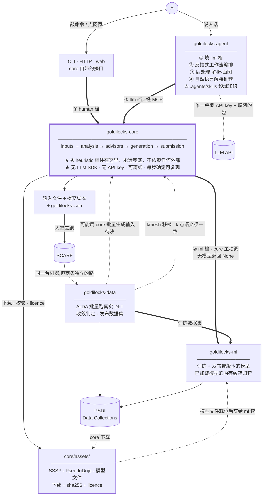

# goldilocks 生态设计

> **状态**：设计讨论中。活文档。
> **最后更新**：2026-09-17（补：生态门户 `goldilocks-web`，见「一」节末）
> **这份文档管什么**：**四个包之间**的事——边界、依赖方向、共享词汇、发布纪律。
> 单个包自己的设计各自成篇（见下表），**这里不重复，只留接缝**。

| 包 | 自己的设计文档 |
|---|---|
| goldilocks-core | [`goldilocks-core-design.md`](goldilocks-core-design.md) |
| goldilocks-ml | [`goldilocks-ml-design.md`](goldilocks-ml-design.md) |
| goldilocks-data | [`goldilocks-data-design.md`](goldilocks-data-design.md) |
| goldilocks-agent | [`goldilocks-agent-design.md`](goldilocks-agent-design.md) |

**这份文档最该读的两节：三（词汇归属表）、四（模型训在什么条件下）。**
它们是**只有站在生态层面才看得见**的问题——待在任何单个包里都发现不了。

---

## 一、四个包

| 包 | 干什么 | 产物流向谁 | 关键依赖 | 能离线吗 |
|---|---|---|---|---|
| **goldilocks-core** | 结构 → DFT 参数 → 输入文件 + 提交脚本 | 人 / agent | pymatgen · numpy · pydantic | ✅ |
| **goldilocks-ml** | 在数据集上训练模型 · 发布带版本的 artifact | **core** 和 **agent** ⚠️ | torch · …（base 极轻）| ✅（模型装好后）|
| **goldilocks-data** | **跑真实 DFT，产出收敛数据集** | **ml**（不是 core）| pandas（aiida / kmesh 是 extra）| ✅ |
| **goldilocks-agent** | LLM 编排 · 科学工作流 · 后处理 · 自然语言解释 | 人 | LLM 运行时（**本地为主**）· 云端 key **可选** | ⚠️ **可以**（见下）|

⚠️ **ml 那一行 2026-09-10 改了**：先前只写"流向 core"。**agent 的对话引擎
（本地 fine-tuned LLM）也由 ml 管理并发布到 PSDI**，所以 ml 有**两个**消费方。

⚠️⚠️ **agent 那一行 2026-09-10 也改了**（外部 review 后）：先前写"**必须 API key · 不能离线**"。
**那是"agent = 云端 LLM 客户端"年代的表述** —— 现在**主力是本地 fine-tuned 模型**
（agent 文档十一之一），云端接口是**保留项**，不是前提。

> ★ **而且"本地模型不可用"不等于"转云端"**：本地应用的用户**未必有 key，
> 也未必愿意把材料结构和对话发出去**。
> 已配置且**明确允许**才切云端；否则**保留表单、core 诊断与已有会话**，只提示模型不可用。
> ⚠️ **承诺 ① 保的是「诊断永远可得」，不是「LLM 对话始终可得」** —— core 本来就能给结构化诊断。
⚠️ 但两者性质不同：**core 拿的是「答某个量」的契约模型**（`ml` 档），
**agent 拿的是对话引擎**（它是 agent 的运行时，不是任何一档）。
见 [agent 文档](goldilocks-agent-design.md)「十一之一」。

⚠️ **data 那一行最容易读错**：`goldilocks-data` 的产物是**训练数据集**，
流向 goldilocks-ml，**不流向 core**。它**可能**会用 core 批量生成 DFT 输入（待决，见四），
但那是**手段**，不是它的目的。**别把 data 当成 core 的下游消费方。**

这一点在 data 自己的 `AGENTS.md` 里写得同样明确：

> `goldilocks-data` → `goldilocks-ml` → `goldilocks-core`
> Model training does not belong here. End-user input generation does not belong here.

### 图 1 · goldilocks 生态

**读法**：消费方在上，core 在中间，供给方在下。

**看粗箭头**：进 core 的三条粗箭头 ①②③ 就是四档解析里的前三档，
每一档都来自一个**外部**依赖。**第四档 `heuristic` 没有箭头——它住在 core 内部。**
这就是"为什么只有 heuristic 永远可用"的图形化解释。



> **画不出来？** 分清楚你开的是哪个视图，两个视图的行为完全不同：
> **① VSCode 自带的 Markdown Editor**（1.137+）**原生渲染 mermaid，不用装任何东西**——
> `⌘⇧P` → `Reopen Editor With…` → `Markdown Editor`；想让 `.md` 默认这样开，
> 设 `"workbench.editorAssociations": {"*.md": "vscode.markdown.editor"}`。
> 回源码视图同样是 `Reopen Editor With…` → `Text Editor`。
> **② `⇧⌘V` 的经典预览不带 mermaid 渲染器**，得装扩展 **`bierner.markdown-mermaid`**
> （Markdown Preview Mermaid Support），**装完要重载窗口**才生效。
> Typora · Obsidian · GitHub 网页都自带渲染，**不用改任何文档**。

⚠️ **core 自己从不上 SCARF**——它只生成给 SCARF 用的脚本，
自己跑在 STFC web team 的机器上。**data 会真的上 SCARF**（AiiDA 提交 WorkChain），
但那是另一条路，与 core 无关。

**图里最该记住的五件事**

| | |
|---|---|
| **①②③ 是三条外部依赖，④ 不是** | `human` 从接口层来 · `ml` 从 goldilocks-ml 来 · `llm` 从 agent 来。**`heuristic` 没有箭头，它在 core 里面**——所以只有它永远可用 |
| **data 不是 core 的消费方，它服务于 ml** | 产物是训练数据集，流向 ml。它**可能**用 core 批量生成输入（待决），但那是手段不是目的 |
| **四个包里只有 agent 需要联网** | core · ml · data 全部可离线；只有 `goldilocks-agent` 要 API key。这就是它**必须独立成包**而不是 `core[agent]` 的原因 |
| **agent 在 core 之上，core 不知道它存在** | 判据：**中间要不要看上一步结果再决定**。要看 → agent；开头就能全定 → core 的一个 task |
| **PSDI 是两个包各自的出口，不是共享的中转站** | **data 发数据集，ml 发模型**，两者都是不可变记录。**core 只下载，从不发布** |

⚠️ 图上那条虚线 **`kmesh 移植 · k 点语义须一致`** 是**代码移植关系，不是运行时依赖**：
`core/kmesh.py` 从 goldilocks-data 搬过来，两边同名同职责。
**data 定义了阶梯与 `MIN_K_DISTANCE` 的语义**（因为数据集是它生成的），
core 必须跟上——**这正是跨仓库漂移的高发区，见第三节**。

### 生态门户：goldilocks-web（不在图 1 里）

图 1 没有画它——它**不产生依赖边**，不属于上面这张"谁调用谁"的图。
它是**独立于四个包之外的第五个仓库**（`github.com/stfc/goldilocks-web`，静态站点，
GitHub Pages 部署），职责是**生态的门户/落地页**：一个入口，把访问者分流到
data / ml / core / agent 各自的 GitHub、docs，以及 core 的 Workbench 和 agent 的下载页。

⚠️ **别和图 1 里 core 节点上标的 `UI["CLI · HTTP · web"]` 搞混**——那是
**core 自己内嵌的 Workbench**（真的会调 core API 的 React 应用），是"四个包"依赖链的
一部分。`goldilocks-web` 在它**之外**：纯静态、不调用任何包的 API，只放链接。
两者只是名字都带"web"，职责完全不同。

现状（2026-09-17）：`stfc/goldilocks-web` 自 2025-04 起只有一个占位页
（"this is a placeholder"），一年多没人动过。落地页内容已经在
`junwen94/goldilocks-web` 的 `landing-page` 分支上补齐并推送，
还没有合并回 `stfc/goldilocks-web`——待有 push 权限的人开 PR。

---

## 二、一条链，四个包

```
data 定义 k 点阶梯语义 ─▶ 跑 DFT 生成数据集 ─▶ ml 训练模型 ─▶ core 调模型 ─▶ 向人解释
```

**这条链是整个生态最脆弱的地方**，因为它有三个性质，凑在一起就很危险：

| 性质 | 后果 |
|---|---|
| **单向** | 下游发现问题，改不动上游——数据集已经发布，不可变 |
| **跨四个仓库** | 没有编译器、没有类型检查器能横跨它们 |
| **失效完全静默** | 语义漂了，用户拿到的是"看起来合理但错误的 k 网格"，跑得完、收敛、数字正常 |

> ⚠️ **这就是 A3 那个坑的家族**（见 core 文档第十一节）。
> 它不会在任何一个仓库的测试里现形——**每个仓库自己都是自洽的**。

### 已经付过一次代价

data 的 `validate_dataset_record()` 里有一句话，是这条链最好的注脚：

> *"A dataset whose column semantics live only in prose cannot be reproduced.
> The `k_index` column in the first Goldilocks dataset **had to be recomputed
> wholesale** for exactly that reason."*

**第一个数据集的 k_index 列是整列重算的**——因为它的语义只写在散文里。
data 因此把 `dataset.json` 的若干字段从"建议"改成"必填"。**这是生态里第一次
用机制而不是记性去挡漂移**，ml 的 `target_contract` 是第二次。

---

## 三、★ 词汇归属表：每个共享概念，只能有一个定义之家

**这是这份文档存在的主要理由。** 下面每一行都对着源码核过（2026-09-09）。

> **规则**：一个概念的定义住在**最上游**——因为上游的产物已经发布、不可变，
> 下游改名是免费的，上游改名要重发记录。

| 概念 | 定义之家 | data | ml | core（v2 计划）| 状态 |
|---|---|---|---|---|---|
| **k 点阶梯整数** | data | **包内 `kindex`**<br>**发布列 `k_index`** | `k_index` | `k_index` | ⚠️ **data 包内代码是唯一不一致的一个** |
| **阶梯基数** | data | 1-based（rung 1 = Γ）| **两个契约并存**<br>0-based / 1-based | 只收 1-based | ⚠️ 见下 |
| **分辨率下限** | data | `MIN_K_DISTANCE = 0.03` Å⁻¹ | `ContractSpec.min_k_distance`（结构化字段，不进契约名）| 读 `ContractSpec.min_k_distance` 校验，不设每轴上限 | ✅ **已定：换发布模型**（2026-09-10 定，2026-09-11 核源码确认无 per-axis cap），见下 |
| **k 距离 2π 约定** | data（随 aiida-qe）| 含 2π | 写进契约名 `.2pi.` | `k_distance` 含 2π | ✅ 一致 |
| **DFT code 名** ⚠️ | core | `DftCode.QE = "qe"` | —（不涉及）| `quantum_espresso` | ⚠️ **漂了** |
| **任务名** ⚠️ | core | `CalculationIntent`<br>scf·nscf·relax·phonon·md·tddft·dft_u | —| `task`<br>scf·relax·bands·dos·phonon·md | ⚠️ **名字和成员都不同** |
| **精度档** | data | `medium/well/ultra`<br>（能量振荡阈值）| release 名里 `…_ultra` | 另有 `pseudo_accuracy`<br>（SSSP efficiency/precision）| ⚠️ **同一个"accuracy"两个意思** |
| **收敛判据** | data | `ConvergenceThresholds`<br>10 / 5 / 1 meV·atom⁻¹ | 继承（数据集里就是标签）| **无从得知** | ⚠️ core 说不清自己给的网格是什么精度 |
| **模型契约** | ml | — | `target_contract` 字符串 | 白名单校验 | ✅ 机制已建好 |
| **记录 schema 版本** | 各自 | `dataset.json` `schema_version: 1` | `SUPPORTED_RECORD_SCHEMA_VERSIONS={1}` | `goldilocks.json` `schema_version` | ✅ 三处独立，正确 |

> ⚠️ **标了 ⚠️ 的两行（DFT code 名、任务名）不是靠上面那条"最上游"规则站住的**
> （2026-09-11 补，先前没说清楚）——**「定义之家」这一列的理由其实分两种**：
> `k_index`/阶梯基数/分辨率下限/2π 约定四行，理由确实是"上游产物已发布、不可变，
> 重发贵"（五节表格：**core 从不发布任何东西**，这条理由对 core 天然不适用）。
> **DFT code 名、任务名这两行落在 core，理由是另一件事**——避免"一个词两种含义"
> 或"名字比缩写更无歧义"，具体见下方④⑤两小节。**两种理由都成立，但不是同一条规则**，
> 表格把它们放进同一列会让人误以为所有行都靠"最上游不可变"这条论证。

#### ⚠️ ① `kindex` vs `k_index` —— 漂移就在 data 内部

- data 的**包 API**：`SweepAxis.KINDEX = "kindex"`、`KMeshEntry.kindex`、
  `kindex_points()`、AiiDA extras 的键 `"kindex"`
- data **发布的数据集**：`convergence_summary.csv` 的列叫 **`k_index`**
- ml 与 core：**`k_index`**

→ **发布物已经对齐了，包内代码没有。** 主文档先前那条"命名在漂"的记录
被一次全局改名弄丢了证据（两边写成了同一个词），**这里补上真实现场**。

**已定（2026-09-11，用户拍板）**：data 包内改成 `k_index`，**但不迁移已有的上万个节点**——
旧记录永久保留 `kindex`/`qe`/`intent` 这几个旧键名，不做批量回改。**只有新写的代码和
新产出的记录一律用新名**（`k_index`/`quantum_espresso`/`task`）。**后果**：查询/消费
data 包内部 extras 的代码必须**永久**同时认新旧两套键名，不是过渡期的临时兼容——
这不是"先记着不急着动"的待办了，是长期状态。⚠️ **这条只影响 data 包内部的 AiiDA extras**，不影响已经对齐的**发布物**——
上一段已经说清楚：`convergence_summary.csv` 的 `k_index` 列本来就是新名，
ml/core 消费的是这份发布物，不是 data 包内部的 AiiDA extras，两边本来就不是同一套东西。

#### ⚠️ ② 阶梯基数：0-based 那条尾巴是永久的

data 说得很清楚：

> *"Record `d5ds2-64f16` was published before this and is 0-based.
> **A published record keeps the convention it was published with**, so a
> consumer must read the base from the record rather than assume it."*

**已发布记录不会变基数**，所以"废弃 0-based"只能是**模型层面**的事。

> **★★ 2026-09-10 已定：重发的 `qrf` 改训 [`52713-55d86`](https://data-collections.psdi.ac.uk/records/52713-55d86)** ——
> 它**本来就是 1-based + floor 0.03**。

★ **这个选择把整条风险消掉了，而不是绕过它**：
先前的方案是"从 `d5ds2-64f16` 的网格**重新导出** 1-based 阶梯"，
并反复警告**不能对旧整数 +1**（两条阶梯不是平移关系——1-based 枚举丢弃了重复网格，
差值在那些地方大于 1）。
**改训之后根本不做转换，那条警告失去对象。**

⚠️ **但 `d5ds2-64f16` 永远是 0-based 这条不变** ——
**消费者仍然必须从记录里读基数，不能假设**。

#### ✅ ③ `MIN_K_DISTANCE` 没有进契约 —— **已定：换发布的模型**（2026-09-10）

data 的原话（两处，措辞一致）：

> *"this value is part of every recorded `kindex`: a rung means nothing without it"*
> *"Any recomputation or published `k_index` column must state the floor it used;
> a `k_index` from a different floor is comparable only where the two ranges overlap."*

而 ml 的契约名 `goldilocks.k_index.ladder_1based.max50.v1` 里
**`max50` 是旧的每轴上限语义，不是分辨率下限**。

> ★ **说准一点：它不只是"缺了 floor"，是_名字宣称了一个不是它的边界_。**
> `max50` = v1 core 的 `max_kpoints_per_axis = 50`（每轴配额），
> 而实际生成这条阶梯的是 `MIN_K_DISTANCE = 0.03`。
> **这落在 core 那条判据的坏的一侧：文件撒谎 → 拦；文件诚实但不完整 → warning。**
>
> ✅ **2026-09-11 核源码坐实了这一条**：`goldilocks-data/kmesh.py` 里
> **只有 `MIN_K_DISTANCE`，没有任何 per-axis cap** —— 先前留的那条待决
> （"两者都生效 → 名字只是不完整；只有 floor → 名字是错的"）**答案是后者**。
> → **`ContractSpec` 只带 `min_k_distance`，不要再带每轴上限。**

**★★ 已定（2026-09-10）：换发布的模型。**

⚠️ `max50` **不是"还没改"，是"改不动"** —— 契约串已经发布、钉在 release 名与 artifact 里，
改它就得重发。**这正是本节开头那条规则（定义住在最上游，上游改名要重发不可变记录）
落在 ml 身上的样子。**

| | |
|---|---|
| **怎么改** | **`goldilocks.k_index.ladder_1based.v2`** + `ContractSpec.min_k_distance = 0.03` |
| **为什么不叫 `floor0.03`** | ★ **编进名字的永远只能编进一部分**（floor 塞进去了，单位、丢弃重复网格的规则、索引约定还是塞不进），而**每加一维都要重发一次**。→ **名字只做语义版本标识** |
| **搭哪趟车** | **与"重发 0-based"并成一趟** —— `k_points.k_index.qrf.d5ds2_64f16.v1` 本来就要重发 |
| ✅ **已核（2026-09-11）** | 只有 floor，**没有**每轴上限——`goldilocks-data/kmesh.py` 只有 `MIN_K_DISTANCE = 0.03`，`max_kpoints_per_axis` 不存在。**`max50` 是_错的_，不是不完整** |
| ⚠️ **过渡期** | 重发完成前 `k_index` **一个 core 可接受的契约都没有** → 走「ml 有模型但没有一个契约 core 接受」那条，**必须发 warning** |

#### ⚠️ ④ `qe` vs `quantum_espresso` —— 便宜的一条，现在改

data 用 `"qe"`，core 用 `"quantum_espresso"`（目录名、capabilities 的 `codes[].id`、
hpc profile 的 `[modules]` 键全都是）。两边目前**没有运行时接触**，所以现在改是免费的；
一旦 data 真的调 core，或者出现按 code 索引的联合表，就不免费了。

→ **建议向 core 看齐用 `quantum_espresso`**（全称无歧义，`qe` 在 DFT 圈外有别的意思），
data 侧是一个 `StrEnum` 的值 + extras 键。**趁便宜的时候改。**

#### ⚠️ ⑤ `intent` vs `task` —— 名字和成员都不同

| | data `CalculationIntent` | core `task` |
|---|---|---|
| 名字 | intent | task |
| 只在一边有 | `tddft` · `dft_u` | `bands` · `dos` |
| 两边都有 | scf · nscf · relax · phonon · md | |

⚠️ **core 的 `intent` 这个词已经被 v1 占用了**（`CalculationIntent` 是 v1 的输入契约，
指"用户想干什么"，与 data 的含义不同）。**三个词两种含义，最坏的情况。**

→ ✅ **已定：core 统一叫 `task`，data 也改叫 `task`**（2026-09-11 理清语气：
先前这里"建议"和"v2 已定"混在一句里，读不出到底是提议还是拍板——是后者）。
成员不必强行对齐——data 有 data 要扫的，core 有 core 能生成的，
**但同名的必须同义**。迁移动作（data 改名、core 停用 v1 的 `CalculationIntent`
一词）还没做，见本节末尾的待决清单。

#### ⚠️ ⑥ 两个 "accuracy"，指的不是一件事

| 词 | 谁的 | 意思 |
|---|---|---|
| `medium` / `well` / `ultra` | **data** | **k 点收敛程度**：能量振荡 < 10 / 5 / 1 meV·atom⁻¹ |
| `efficiency` / `precision` | **core**（SSSP 的分档）| **赝势表的精度档** |

两者都在被叫 "accuracy"，**而且 ml 的 release 名里已经出现了 `…_kdist_ultra`**——
即模型的目标是 data 那一套。

→ **规则：`ultra` 这类词永远带前缀**（`k_convergence_ultra`），
**`accuracy` 这个裸词不再单独使用**。core 面向用户展示时更要说清是哪一种。

---

## 四、★ 模型训在什么条件下：事实,以及它**不**触发什么

**这是这轮读 data 源码最重要的发现，也是先前完全没有表达过的一条。**

`data/aiida/builders/qe.py` 里，每一个训练点都是这么提交的：

```python
builder = PwBaseWorkChain.get_builder_from_protocol(
    code=code, structure=structure,
    protocol="moderate",                    # ← 截断能 · 收敛阈值 · 混合来自这里
    electronic_type=ElectronicType.METAL,   # ← 全部按金属处理
    spin_type=SpinType.NONE,                # ← 全部非自旋极化
    overrides={"pw": {"parameters": {"SYSTEM": {"degauss": config.degauss_ry}}}},
)                                           #   degauss 固定 0.01 Ry
```

于是**整个数据集的训练条件**是：

| 维度 | 数据集里的取值 |
|---|---|
| 泛函 / 赝势 | PBEsol，SSSP 或 PseudoDojo（一次 campaign 一个族）|
| 截断能 | aiida-qe `moderate` protocol 从赝势族取的推荐值 |
| 占据 | **一律 metal + smearing，`degauss = 0.01 Ry`** |
| 自旋 | **一律 `nspin = 1`** |
| 网格 | **一律不移位（Γ-inclusive）** |
| **Hubbard U** | ❌ **一律不带 +U**（`get_builder_from_protocol` 不设 Hubbard）—— 2026-09-10 补 |
| 收敛判据 | **只看总能，无受力判据**；阈值 1 meV·atom⁻¹ |
| 结构来源 | MC3D，17,757 条有答案 |
| **aiida-qe 版本** | ⚠️ **没有记录** —— 见下 |

⚠️⚠️ **2026-09-10 核 aiida-quantumespresso 源码后补两条：**

**① `degauss=0.01` 是有意偏离 protocol，不是跟随。**
`protocols/pw/base.yaml` 的 `default_inputs` 里 **`degauss: 0.02`**；
data 用 `overrides` 把它压到 0.01。**这是一个主动的科学决定**，值得记住。

**② ⚠️ 但 `smearing` 的「类型」不在 overrides 里，它继承自 aiida-qe 的版本默认：**

```yaml
# aiida_quantumespresso/workflows/protocols/pw/base.yaml · default_inputs
SYSTEM:
    nosym: False
    occupations: smearing
    smearing: cold          # ← 数据集的 smearing 类型来自这里,不是 data 定的
    degauss: 0.02           # ← 被 data override 成 0.01
```

`cold` 与 core heuristic 的 cold smearing **对得上**（✅ 这个洞是闭的）。
**但它是"碰巧对上"，不是"被约定对上"**——aiida-qe 换个默认值，
数据集的训练条件就变了，而**没有任何地方会发现**。

⚠️ 另外：**`protocol="moderate"` 这个名字已经是弃用别名**
（`protocols/utils.py`: `'moderate': 'balanced'`），现行三档是 `fast` / `balanced` / `stringent`。

→ **`conventions` 必须记 `aiida_qe_version` 和解析后的 protocol 名**（`balanced`，不是 `moderate`）。
**继承来的值和显式设定的值，风险完全不同**——这是 B 类漂移的又一个形状，
和 `k_index` 列整列重算那次同源。

### ⚠️ core 会在这些条件之外查询模型，而且现在没有任何东西会发现

举几个 core 一定会遇到的：

| core 的场景 | 数据集里有吗 | 后果 |
|---|---|---|
| 用户要**自旋极化** | ❌ 全是 `nspin=1` | AFM 拆种类后对称性更低、不可约 k 点更多，**模型没见过** |
| 用户选 **PBE / SCAN / HSE** | ❌ 全是 PBEsol | 截断能与收敛行为不同 |
| 用户是**绝缘体** | ⚠️ 全按 metal 提交 | 绝缘体本该 `occupations='fixed'`，收敛行为完全不同 |
| 用户要**移位网格** | ❌ 全不移位 | 阶梯语义就是不移位的 |
| 用户关心**受力收敛** | ❌ 只判能量 | **k 网格对力的收敛远慢于对能量**——这条最危险 |

> **最后一行单独强调**：数据集的 `ultra` 意思是"**总能**收敛到 1 meV/atom"。
> 用户拿它去做 relax 或声子，**受力还远没有收敛**。
> 跑得完、收敛、数字看着正常——**A2 家族的又一个成员**，而且是生态级的。

### ⚠️⚠️ 这条**不**要三个包一起解（2026-09-10 晚重写）

**先前这里是一张"三个包该做什么"的表**：data 把适用域写进 `conventions` ·
ml 让契约声明训练条件 · core 调模型前比对适用域、出域降级。**整张表作废。**

> **★★ 定：core 不判断模型出没出域。**
> **"这个模型在这个体系上答得准不准"是_模型质量问题_，而模型质量归 ml。**
> **修法是补数据、重训、发新 release —— 不是在下游加一道闸。**

完整论证在 [core「三、为什么这里没有第三道闸」](goldilocks-core-design.md)，三条：

| # | |
|---|---|
| **①** | **core 没有信息做这个判断** —— 与已定的 *"core 从不按 family 名挑模型，哪个 family 更好是 ml 的判断"* 是**同一条边界**，先前那张表越过了它 |
| **②** | **把"没验证过"当成了"一定不行"** —— 数据集全是 `nspin=1` **不等于**模型对磁性材料无效。**模型吃的是结构**，AFM 拆种类后那个更大、对称性更低的胞，**模型看得见** |
| **③** | **降级到 heuristic 很可能_更差_** —— 一个在 17,757 条真实 DFT 收敛结果上训出来的模型，用在铁磁体上几乎肯定强过 heuristic。**为"未验证"换一个更差的来源，是拿可靠性换一种安全的感觉** |

#### 那上面那些事实还算数吗——算，而且更有用了

**本节前面列的训练条件（PBEsol · 一律 metal · `nspin=1` · 不移位 · 只判总能）
一条都没变，它们仍然是真的。** 变的是**谁拿它们做什么**：

| | 先前 | 现在 |
|---|---|---|
| 用途 | core 拿去**否决模型** | **ml 拿去决定下一个数据集扫什么** |
| 落点 | `conventions` → `trained_on` → core 的闸 | **模型卡**（给人读）+ **data 的 campaign 计划** |

★ **磁性数据集的意义因此说清楚了**：它**不是"打开闸的一个维度"**，
**就是让模型在磁性材料上更准**。这是个更自然、也更可执行的目标。

⚠️ **这两句话（②"没验证过≠一定不行" 与这里的"能更准"）不冲突，但容易被读成冲突**
（2026-09-11 补一句桥接）：②反驳的是"模型对磁性材料完全无效、该拦"这个强命题；
"能更准"说的是弱得多的命题——**同一个结构，磁性 SCF 收敛所需的 k 密度可能和
`nspin=1` 假设下的不一样**（磁性改变电子结构、费米面形状，即使原子位置不变），
模型只吃结构不代表它已经学到了这个差异，只是不代表它学不到、也不代表它现在完全学错。
**"能用但有提升空间"和"暂不该用"是两回事**，前者才是这里的真实状态。

> ⚠️⚠️ **2026-09-11 用户定：goldilocks-data 永远不自建磁性数据集。**
> 磁性数据一律用 **Materials Project** 等现成数据集。
> ★ 上面那句结论不变，**变的是数据从哪来**——于是"补数据重训"在磁性这一维
> **是 ml 的选型问题（用哪个外部集、它的标签约定是什么），不是 data 的待办**。

#### ⚠️ 但有一件事仍然是真缺口 —— 它是**语义**，不是质量

**收敛判据必须进契约**：

```
第 12 级阶梯，判据 = 总能 1 meV/atom
第 12 级阶梯，判据 = 受力 10 meV/Å        ← 同一个整数，完全不同的东西
```

**受力收敛数据集一上线，两个模型会共用同一个 `target_contract`，而 core 分辨不出来**——
**这正是 A3 那类静默漂移**，与"两个数据集都叫 k-distance、差一个 2π"同形。
→ 归 [ml 第七节](goldilocks-ml-design.md)：**判据进 `ContractSpec`，搭重发那趟车**。
⚠️ **这一条与"core 不判断出域"不冲突**：白名单问的是**"我听不听得懂这个数字"**，
不是"模型好不好"。

## 四之二、★★ 建设顺序（2026-09-10 定）

> **`data` →（补数据集）→ `ml` →（改模型 · 补模型）→ `core` → `agent`（最终 desktop app）**

**这个顺序不是随手排的，它和第二节那条链同向**——
`data 定义语义 → ml 训练 → core 调用 → 向人解释`。
**沿着依赖方向建设，每一层动工时它的上游已经是确定的。**

### ★ 它顺带把一条已记在案的风险挪出了当前窗口（不是消除，是排期避开，见下）

这一点值得单独写下来，否则以后有人想调整顺序时会不知道自己在放弃什么：

| 风险（先前记的） | 为什么这个顺序解掉了它 |
|---|---|
| ⚠️ **`max50` 重发的过渡期**（第三节 ③）—— 重发完成前 `k_index` 一个 core 可接受的契约都没有 | **ml 排第二**，重发（`…ladder_1based.v2` + 0-based 废弃 + **收敛判据进契约**）**发生在 core 出生之前**。→ core 的 `ACCEPTED_CONTRACTS` 一开始就写 `v2`，那条过渡期 warning 变成**纯防御性代码，不是当前状态** |

★ **这一条不是"以后再说"，是"被排期解决了"** —— 但**只在这个顺序下成立**；
若有人把 core 提前，风险会回来。

⚠️⚠️ **先前这张表还有第一行「ml 档一律全空」，2026-09-10 晚删除** ——
那个风险是**适用域闸**的产物，而**闸整个作废了**（第四节）。
★ **它同时也是 data 阶段唯一阻塞下游的一条** —— 现在
**data 阶段不再阻塞任何人**，`conventions` 改必填也不必做了。

### ⚠️ 但它引入了一条新风险：**没有消费方的接口一定是错的**

`ml` 在 `core` 之前动工，而 **`serving.py` 是_为 core 设计的接缝_**——
写它的时候没有任何真实调用方。ml 自己的文档写着
*"serving 要**小、稳**、成为 core 唯一 import 的东西"*，而"小"恰恰是**没有消费方时最难守的**。

> **→ 对策：ml 阶段只写_已经有确定形状_的那部分，其余等 core 来要。**

| ml 阶段就写 | 等 core 真的要用时再写 |
|---|---|
| `releases()` · `load()` · `contracts()` · `vocabulary_version()` | ⚠️ **`requires_inputs` + `predict(structure, inputs)`** |
| ⛔ ~~`TrainingDomain` / `trained_on`~~ **已作废**（第四节）| `ContractSpec.labels`（多分类标签集合）|
| `ContractSpec` 的结构化字段（含 `min_k_distance`）| 逐种类 / 逐位点的索引约定 |

理由：右列三样**都是为_还不存在的消费方_设计的**——
`requires_inputs` 是为 `walltime` / `hubbard_u`（第三类消费方）；
`labels` 是为 `magnetism.ordering`（近期不训）；
索引约定是为 `hubbard_u`（core 侧的 structure→relabeled_structure 展开规则也还没定）。
**而 core 第一版只做 scf，`walltime` 走 heuristic。**

⚠️ **不是说这三样不重要**（ml 文档第七节把它们列为 ★★），
**是说它们的形状取决于第一个真实调用点长什么样**。
★ 这与 core 那条"**每删一个机制，都要说清原有保证由谁接手**"是同一种纪律的反面：
**每加一个接口，都要说清第一个调用方是谁。**

### desktop app 是终点，不是"以后再考虑"

agent 文档「九」已定**第一阶段做本地 server + 浏览器开 `127.0.0.1`**，
Tauri / Electron"以后再考虑"。**★ 2026-09-10 确认：desktop app 是最终形态。**

→ **这把「九之一」那条从"便宜的保险"升级成"已知的必经之路"**：

> 接口**传路径，不传内容**（`structure_path` 而非 `structure_content`）——
> *"用「内容」建起来的一整套接口，迁到 Tauri 时要全部重做；用「路径」建的不用。"*

⚠️ 同理 [agent 十七之七](goldilocks-agent-design.md)那条证伪条件
（"若第一个交付物变成终端对话，不用现成骨架的论证作废"）**更稳了**——
desktop app 确认了**表单**路线，不是终端对话路线。

---

## 五、发布纪律（PSDI）

| 谁 | 发什么 | 不可变吗 | 谁消费 |
|---|---|---|---|
| **goldilocks-data** | 数据集快照（CSV + 结构 + `README` + `dataset.json` + `SHA256SUMS`）| ✅ | ml 训练 · 人 |
| **goldilocks-ml** | 模型 artifact + manifest（`requires_artifacts` 按 record_id + sha256 钉死）| ✅ | core 下载 |
| **goldilocks-core** | ❌ **什么都不发** | — | — |

**三条共同纪律**（两个包各自实现，语义一致）：

1. **上传前全量校验**，不做半份记录——data 的 `load_deposit()` 在任何网络调用之前
   就校验 digest / 大小 / 列出但缺失 / 存在但未列出；失败则删掉草稿，
   *"a failure costs a draft rather than leaving a half-made record"*
2. **草稿由人提交**，程序只创建和填充。`create_deposit()` 明确不 submit
3. **token 的权限位比内容重要**——`read_token()` 对 group/other 可读的 token
   **直接拒绝而不是警告**，且从不记日志

> ⚠️ 第 1 条与 core 的"发布三条保证"（已有结果不覆盖 · 失败不留半份 ·
> 打包用本次确认过的字节）**是同一条原则在两个包里的两次实现**。
> **三个包在这件事上是一致的，这是生态里少数已经收敛的地方。**

---

## 六、共同的工程约定（多包间独立收敛，证据强度不一）

读完三个仓库的 `AGENTS.md`，下面这些看起来是**独立收敛**的：

| 约定 | 出处 | 证据强度（2026-09-11 补，先前标题笼统说"三个包一致"，逐行核对后发现没有一行真的三包都占）|
|---|---|---|
| **不建 `utils/` / `helpers/` / `processing/`**，只要领域模块 | core · data | ✅ 唯一核过**逐字相同**的一条；ml 未核 |
| `from __future__ import annotations` · `slots=True` · 不可变值对象 `frozen` | data · ml | 两包各自的写法接近，未核逐字；core 未核 |
| **不加兼容 shim / 别名 / 包装模块**，除非明确要求向后兼容 | data | ⚠️ **只有一个数据点，够不上"收敛"**——core/ml 的 `AGENTS.md` 没查到对应条款，不代表它们不同意，只是没证据 |
| 测试优先钉**科学行为**，不追行覆盖 | data · core 的 `physics/` | 两包，未核逐字；ml 未核 |
| 每个 PR 关一个 issue；**agent 不写 PR body** | data · core | 两包，未核逐字；ml 未核 |
| 用 `uv`，不用 pip | data · ml | 两包，未核逐字；core 未核 |

→ **新建 goldilocks-agent 时，直接继承这一套**，不要另起炉灶——这条建议不受上面
证据强度不均的影响，因为"继承一个多数包已经在用的约定"不需要它是全票通过的。

---

## 七、已定 / 待决

### 已定

- ✅ ★★ **建设顺序：`data` → `ml` → `core` → `agent`（最终 desktop app）**（2026-09-10，见四之二）——
      **沿依赖方向建设**，每一层动工时上游已确定。
      ★ **它顺带解掉一条已记的风险**：ml 先重发 → **core 的白名单一开始就写 `v2`**，
      `max50` 过渡期那条 warning 变成纯防御性代码。⚠️ **只在这个顺序下成立。**
      ⚠️ 先前还记着第二条（"data 先补全 `conventions` → 适用域闸第一天能跑"），
      **随闸一起作废** —— **data 阶段因此不再阻塞任何人**
- ✅ ⚠️ **但引入一条新风险：没有消费方的接口一定是错的**（四之二）——
      `serving.py` 是**为 core 设计的接缝**，而 ml 先动工时没有真实调用方。
      → **ml 阶段只写已有确定形状的**（`releases` / `load` / `TrainingDomain` / `ContractSpec` 字段）；
      **`requires_inputs` · `labels` · 索引约定等 core 真要用时再写** —— 它们都是为
      _还不存在的消费方_设计的（第三类消费方 · `ordering` · `hubbard_u`）。
      ★ 与 core 那条"每删一个机制要说清谁接手"是同一纪律的反面：**每加一个接口，要说清第一个调用方是谁**
- ✅ ★ **desktop app 是终点，不是"以后再考虑"**（2026-09-10 确认）——
      第一阶段仍是本地 server + `127.0.0.1`，但终态确定为桌面应用。
      → **agent「九之一」的"传路径不传内容"从"便宜的保险"升级为"已知的必经之路"**；
      **十七之七**那条证伪条件也更稳（**表单**路线，不是终端对话）
- ✅ **生态是四个包**：core · ml · data · agent
- ✅ **另有一个门户仓库 `goldilocks-web`，不算在"四个包"里**（2026-09-17）——
      静态落地页，不参与依赖链，也不是图 1 里 core 的 `UI` 节点（那是 core 自己的
      Workbench）。见「一」节末新增小节
- ✅ **依赖方向单向**：`data → ml → core`，agent 在 core 之上。
      ⚠️ **2026-09-10 补**：**`agent → ml` 也是一条真依赖边**（不只是"产物流向"）——
      agent 要调 `ml.serving.releases()` 拿对话引擎的文件与 digest。**仍然无环。**
      ★ 且**ml 对 agent 是可选依赖**：没装就降级到云端模型，agent 不能整个不可用
- ✅ ★★ **下载归_消费方_，ml 从不取字节**（agent 文档 11.2）——
      ml 只声明"有哪些文件、digest 是什么"；契约模型由 **core** 下载，
      对话引擎由 **agent 自己的 `assets/`** 下载。
      ⚠️ ml `AGENTS.md` 那句 *"Runtime downloading belongs in Core"* 读作"**不在 ml**"，
      **不是"永远在 core"**
- ✅ **data 只为 ml 服务**，产物是训练数据集，**不流向 core**
- ✅ **只有 agent 需要联网与 API key** → 它必须是独立包，不是 `core[agent]`
- ✅ **PSDI 是 data 和 ml 各自的出口**；**core 只下载，从不发布**
- ✅ **模型文件的下载归 core**（复用 `assets/` 的 flock + staging + 逐文件 sha256），
      **读取与内存缓存归 ml**——依据是 ml 自己的边界声明 *"Runtime downloading belongs in Core"*
- ✅ **共享概念的定义住在最上游**——上游改名要重发不可变记录，下游改名免费
- ✅ ★ **词汇归属表（第三节）是唯一的对照表**，四个包对不上时以它为准
- ✅ **`accuracy` 这个裸词不再单独使用**——data 的收敛档与 core 的赝势档是两回事
- ✅ **发布前全量校验、失败不留半份记录、草稿由人提交**——三个包语义一致

### 待决

- [x] ~~**适用域怎么表达**~~ → **不表达，问题取消**（第四节，2026-09-10 晚）。
      ⚠️⚠️ **这条待决前后被写错过三次落点**（`ContractSpec` → `ReleaseInfo` → core 的一张表），
      ★ **每次都是在给一个不该存在的机制找位置**。
      **"模型答得准不准"归 ml，修法是补数据重训发新 release，不是在 core 加闸。**
      → **连带取消：`conventions` 改必填、`TrainingDomain`、维度对照表、
      "沉默不等于通过"的维度级默认、以及"ml 档一律全空"那个后果**
- [x] ~~**收敛判据进契约**~~ → **已定**（第四节末 / [ml 4.5](goldilocks-ml-design.md)，2026-09-10）。
      `ConvergenceCriterion(metric, threshold, unit)` 进 `ContractSpec`，**搭重发那趟车**。
      ★ **它是语义不是质量** —— core 拿它问"**你答的是不是我问的那个问题**"，
      与刚作废的适用域闸（"你答得准不准"）**是两件事**。
      ⚠️ **`metric` 只标"哪个量在收敛"（`total_energy` | `force`，⚠️ **不叫 `max_force`**）；
      `threshold` 卡的是_尾巴振荡_，不是该量本身的大小。**
      ⚠️ **阈值记 float 不记档位名** —— core 的要求 3 要写出"总能 1 meV/atom"，
      **它得有那个数**；记标签的话 data 的档位定义就漏进了 core。
      ⚠️ **诚实后果**：**relax / phonon 在受力数据集出来之前拿不到 ml 值** ——
      **那是真的空**（没有模型在答这个问题），正好指向 data 的受力收敛数据集
- [x] ~~**`MIN_K_DISTANCE` 怎么进契约**~~ → **已定：换发布的模型**（第三节 ③，2026-09-10）。
      ★ `max50` **不是"还没改"，是"改不动"** —— 已发布契约串改名就得重发。
      → **`…ladder_1based.v2` + `ContractSpec.min_k_distance`，与"重发 0-based"并成一趟**；
      **名字只做语义版本标识，约定进结构化字段**。
      ✅ 已核（2026-09-11，见第三节③）：只有 floor，没有每轴上限，`max50` 是错的
- [ ] **`qe` → `quantum_espresso`**：现在改是免费的，什么时候改
- [x] ~~**`sampling` → `k_sampling`**~~ → **已改名（2026-09-10）**，core 全文 + ml/data/agent 的引用同步。
      ★ **同时把 `q_sampling` 这个名字占住**（声子 q 点 / 杂化泛函 `nqx1/2/3`）——
      "sampling" 在 DFT 里至少指三件事，**改名要趁没有用户之前**。
      ⚠️ 这条属于**共享词汇改名**：core 是 setting/fact 名的定义之家，
      `settings` schema 与 `--set` 的 key 一并生效
- [ ] **`intent` → `task`**：data 改名 + core 停用 v1 的 `CalculationIntent` 一词
- [x] **data 包内 `kindex` → `k_index`**：AiiDA extras 里已有上万个键，要不要带迁移 → **已定（2026-09-11，用户拍板）：不迁移**——旧记录永久保留 `kindex`，只有新写的代码/新记录用 `k_index`，见第三节①的详细说明
- [ ] ⚠️ **data 会不会用 core 批量生成输入**（core 文档十、23）——
      **第四节把这条的赌注抬高了**：目前 data 用 aiida-qe 的 `moderate` protocol，
      core 用自己的 advisor，**两套规则已经分叉，不是"将来可能分叉"**。
      要么让 data 走 core，要么明确接受分叉并**把两套规则的差别写进模型卡**
- [x] ~~**`vocabulary_version` 谁发、谁校验**~~ → ✅ **已定（2026-09-11，见 [ml 文档](goldilocks-ml-design.md) 第七节）**：
      词汇不是一份，不发明跨仓库单一版本号——`ml` 是 target/contract 名字的定义之家，
      `core` 是 setting/fact 名字的定义之家，各自发各自的版本（派生哈希，不手工递增）；
      谁消费谁的词汇就在自己那边钉期望值，不匹配就报错。agent 两套都用，两边都查
- [x] ~~⚠️ **"最终上传 STFC cloud 的 docker/部署配置放哪"**~~ → **已定（2026-09-24）**：放
      **`goldilocks-agent` 自己仓库的 `deploy/stfc-cloud/`**，不是 `goldilocks-web`（历史同名
      先例不适用）——理由是"部署配置跟着 app 走"，goldilocks-agent 是依赖 core 的那一方（不是
      反过来），goldilocks-web 继续保持纯静态门户，不背这份配置。
      **v1 有明确先例**：`old-goldilcoks-webapp/docs/stfc-deployment.md`，STFC cloud（VPN-only
      内网 beta）的部署模板（`vllm.service` / `goldilocks-api.service` / `nginx.conf` 等）
      放在 `goldilocks-web/deploy/stfc-cloud/`——**且 v1 那套完全不用 Docker**，是
      systemd + uv venv + 系统 nginx。**v1 的 `vllm.service` 值得作为这次 vLLM 部署的参考起点**。
      **v2 现状（2026-09-17）**：core 和 agent **各自有一个 Dockerfile**，互不相关，都不对应
      这件事——core 的 CI（`ci.yml`）只 build 来跑 e2e，**不 push 到任何 registry**；agent 的
      CI（`docker-publish.yml`）**会** push，但目标是 `ghcr.io/junwen94/goldilocks-agent`
      （个人 fork 命名空间，不是 `stfc`），且它的 `docker-compose.yml` 绑定 `127.0.0.1:8080`，
      是给**本地桌面**自跑用的，不是对外服务——这些描述仍然成立，只是"配置放哪个仓库"这一条
      已经定了。**Docker vs. systemd 已定（2026-09-25）：Docker**——延续 v2 agent 已有的
      Dockerfile 路线，`deploy/stfc-cloud/docker-compose.yml` 已经写出来了（agent + 可选
      vllm，只绑 `127.0.0.1:8080`）。⚠️ 范围只到 agent 自己这一块——域名级别的 nginx/TLS/
      certbot 不在这个 compose 文件里，`/agent/` 只是共享域名下的一段路径，参照 v1 的真实先例
      （后端只绑 `127.0.0.1`，域名级别的系统 nginx 配置放在 `goldilocks-web` 自己的 deploy
      目录），这次同理——见 `goldilocks-agent` 自己的 `docs/goldilocks-agent-design.md` §19.8。
